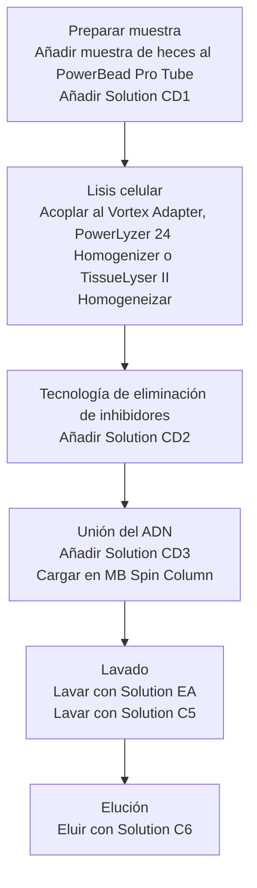

# Anexo: protocolo de extracción PowerFecal {#sec-appendix-powerfecal}

## PG/EXT/01/00

## Extracción de ADN genómico microbiano de heces y muestras intestinales con QIAamp® PowerFecal® Pro DNA Kit

### Control del documento

| Campo | Responsable | Firma | Fecha |
|---|---|---|---|
| Realizado por | Daniel Costas | Fdo.: | 04/07/2023 |
| Revisado por | Pep Rotllant | Fdo.: |  |
| Aprobado por | Pep Rotllant | Fdo.: |  |

### Índice

1. [Objeto](#objeto)
2. [Alcance o campo de aplicación](#alcance-o-campo-de-aplicación)
3. [Referencias](#referencias)
4. [General y definiciones](#general-y-definiciones)
5. [Materiales y productos](#materiales-y-productos)
6. [Procedimiento](#procedimiento)
   - [6.1 Metodología](#metodología)
   - [6.2 Diagrama de flujo](#diagrama-de-flujo)
7. [Cálculos e incertidumbres](#cálculos-e-incertidumbres)
8. [Interpretación de los resultados](#interpretación-de-los-resultados)
9. [Registro de cambios](#registro-de-cambios)
10. [Anexos](#anexos)

### 1. Objeto

El presente procedimiento tiene como finalidad la extracción de ADN genómico, tanto microbiano como del huésped, a partir de muestras de heces y de intestino empleando el kit ADN QIAamp PowerFecal Pro (cat. no. / ID: 51804).

### 2. Alcance o campo de aplicación

Este protocolo puede aplicarse para la extracción de muestras de heces y de intestino independientemente de la especie de origen. El kit está diseñado para extraer muestras que contienen sustancias inhibidoras encontradas normalmente en heces, como polisacáridos, compuestos hemo y sales biliares.

Hasta ahora, se ha aplicado en:

- Rodaballo (*Scophthalmus maximus*)

### 3. Referencias

1. [QIAamp® PowerFecal® Pro DNA Kit Handbook. For the isolation of microbial genomic. February 2020.](https://www.qiagen.com/us/Resources/ResourceDetail?id=8896817a-253f-4952-b845-0aab796813ce&lang=en)
2. [QIAamp® PowerFecal® Pro DNA Kit. Quick-Start Protocol. May 2019.](https://www.qiagen.com/us/Resources/ResourceDetail?id=8896817a-253f-4952-b845-0aab796813ce&lang=en)

### 4. General y definiciones

Las muestras se añaden a un tubo de agitación con esferas donde se lleva a cabo una homogeneización y lisis celular mediante métodos mecánicos y químicos. Una vez que se lisan las células, se utilizan una serie de reactivos que permiten eliminar los inhibidores presentes en las muestras. El ADN genómico total se captura en una membrana de sílice insertada en una columna de lavado. Finalmente, el ADN se lava y eluye de la membrana, de manera que queda preparado para aplicaciones posteriores como PCR, qPCR y NGS (16S y *whole-genome*).

### 5. Materiales y productos

| Material | Nº | Productos | Cantidad |
|---|---:|---|---:|
| Pipeta P1000 | 1 | QIAamp® PowerFecal® Pro DNA kit (cat no. 51804). Ver contenido en Anexo. | 1 |
| Pipeta P100 | 1 |  |  |
| Pipeta P10 |  |  |  |
| Puntas estériles con filtro 1000, 100 y 10 µL | *n* |  |  |
| Microcentrífuga | 1 |  |  |
| Vortex-Genie® 2 (cat. no. 15547335) | 1 |  |  |
| Vortex Adapter (cat. no. 13000-V1) | 1 |  |  |

### 6. Procedimiento

#### Almacenamiento de reactivos

- La *Solution CD2* debe almacenarse en nevera a 2-8 °C.
- El resto de componentes y reactivos se deben conservar a temperatura ambiente (15-25 °C).

#### Consideraciones importantes antes de empezar

- Asegurarse de que los *PowerBead Pro Tubes* giren libremente en la centrífuga sin tocarse.
- Si la *Solution CD3* está precipitada, calentar a 60 °C hasta que el precipitado se disuelva.
- Realizar todos los pasos de centrifugación a temperatura ambiente (15-25 °C).
- Realizar todos los pasos con guantes para evitar la contaminación de las muestras.

#### 6.1. Metodología

1. Centrifugar brevemente el *PowerBead Pro Tube* para asegurar que las esferas se depositen en el fondo. Añadir hasta **250 mg** de heces y **800 µL** de *Solution CD1*. Agitar en vórtex brevemente.

   > **Nota:** si se parte de una muestra tomada con hisopo, asegurarse de no introducir más de 250 mg o una cantidad apropiada que permita la correcta agitación de las esferas y la homogenización.

   Es posible echar directamente los 800 µL de *Solution CD1* al/los hisopo(s) en su Eppendorf. Esperar 2 min para que empape bien, vortear con suavidad y trasvasar la mezcla al *PowerBead Pro Tube*. Para asegurarse de que el hisopo queda limpio, centrifugar brevemente y recoger lo obtenido.

2. Fijar el *PowerBead Pro Tube* horizontalmente en un adaptador Vortex para tubos de 1,5-2 mL (n.º de cat. 13000-V1). Agitar a máxima velocidad durante **10 min**.

   > **Nota:** si se usa el *Vortex Adapter* para más de 12 muestras simultáneamente, aumentar el tiempo de agitación de 5 a 10 min más.

   > **Nota:** para utilizar otros métodos de agitación con esferas, consultar la sección 2 del Anexo.

3. Centrifugar el *PowerBead Pro Tube* a **15 000 × g** durante **1 min**.

4. Transferir el sobrenadante, aproximadamente **500-600 µL**, a un nuevo *Microcentrifuge Tube* suministrado.

   > **Nota:** el sobrenadante aún puede contener algunas partículas de heces.

5. Añadir **200 µL** de *Solution CD2* y mezclar en vórtex durante **5 s**.

6. Centrifugar a **15 000 × g** durante **1 min** a temperatura ambiente. Evitando el pellet, transferir hasta un máximo de **700 µL** de sobrenadante a un *Microcentrifuge Tube* de 2 mL nuevo suministrado.

   > **Nota:** volumen aproximado de 500-600 µL.

7. Añadir **600 µL** de *Solution CD3* y agitar en vórtex durante **5 s**.

8. Cargar **650 µL** del lisado en una *MP Spin Column* y centrifugar a **15 000 × g** durante **1 min**. Reservar el lisado restante, que se usará en el paso 9.

9. Desechar el líquido filtrado y repetir el paso 8 para asegurarse de que todo el lisado haya pasado por la *MB Spin Column*.

10. Colocar cuidadosamente la *MB Spin Column* en un nuevo *Collection Tube* de 2 mL suministrado. Evitar salpicaduras del líquido en la *MB Spin Column*.

11. Añadir **500 µL** de *Solution EA* a la *MB Spin Column*. Centrifugar a **15 000 × g** durante **1 min**.

12. Desechar el líquido filtrado y volver a colocar la *MB Spin Column* en el mismo *Collection Tube* de 2 mL.

13. Añadir **500 µL** de *Solution C5* a la *MB Spin Column*. Centrifugar a **15 000 × g** durante **1 min**.

14. Desechar el líquido filtrado y colocar la *MB Spin Column* en un nuevo *Collection Tube* de 2 mL suministrado.

15. Centrifugar a **16 000 × g** durante **2 min**. Colocar cuidadosamente la *MB Spin Column* dentro de un *Elution Tube* de 1,5 mL nuevo suministrado.

16. Añadir **50-100 µL** de *Solution C6* en el centro del filtro blanco de la membrana.

17. Centrifugar a **15 000 × g** durante **1 min**. Desechar la *MB Spin Column*. El ADN ya estaría preparado para las aplicaciones posteriores.

> **Nota:** dado que la *Solution C6* no contiene EDTA, se recomienda almacenar el ADN congelado entre -15 y -30 °C o entre -65 y -90 °C. Para concentrar el ADN, consultar la Guía de resolución de problemas.

#### 6.2. Diagrama de flujo

### 7. Cálculos e incertidumbres

No aplican.

### 8. Interpretación de los resultados

No aplica.

### 9. Registro de cambios

| Ver. | Fecha | Responsable | Comentarios |
|---|---|---|---|
| 00 | 05/07/2023 | Daniel Costas | Creación del PNT |

### 10. Anexos

#### 1. Contenido del QIAamp® PowerFecal® Pro DNA kit (cat no. 51804)

| Componente | Cantidad |
|---|---:|
| QIAamp PowerFecal Pro DNA Kit | 50 |
| Catalog no. | 51804 |
| Number of preps | 50 |
| PowerBead Pro Tubes | 50 |
| MB Spin Columns | 50 |
| Solution CD1 | 40 mL |
| Solution CD2 | 15 mL |
| Solution CD3 | 35 mL |
| Solution EA | 36 mL |
| Solution C5 | 30 mL |
| Solution C6 | 9 mL |
| Microcentrifuge Tubes (2 mL) | 100 |
| Elution Tubes (1,5 mL) | 50 |
| Collection Tubes (2 mL) | 100 |
| Quick-Start Protocol | 1 |

#### 2. Métodos de homogeneización de las muestras

Las muestras pueden homogeneizarse empleando uno de los siguientes métodos:

**A) Vortex Adapter para tubos de 1,5-2 mL**  
Cat. no. 13000-V1-24. Agitación a máxima velocidad durante 10 min, tal y como se indicó anteriormente en el protocolo.

**B) PowerLyzer 24 Homogenizer**  
Se recomienda homogeneizar el tejido a 2000 rpm durante 30 s, hacer una pausa de 30 s y volver a homogeneizar a 2000 rpm durante 30 s.

> **Nota:** la homogeneización de muestras a velocidades más altas, hasta 4000 rpm, puede aumentar el rendimiento de la extracción, pero como resultado se obtiene un ADN más fragmentado.

**C) TissueLyser II**  
Se coloca el *PowerBead Pro Tube* en el *TissueLyser Adapter Set* 2 × 24 (cat. no. 69982) o en el *2 ml Tube Holder* (cat. no. 11993) y el *Plate Adapter Set* (cat. no. 1190). Se fija el adaptador al equipo y se agitan las muestras durante 5 min a 25 Hz. Se vuelve a orientar el adaptador de modo que el lado que estaba más cerca de la máquina ahora esté más alejado de él. Se agita de nuevo durante 5 min a una velocidad de 25 Hz.

#### 3. Guía de resolución de problemas

##### Procesamiento de muestras: heces

| Problema | Comentarios y sugerencias |
|---|---|
| Cantidad de muestra a procesar | El kit QIAGEN QIAamp PowerFecal Pro está diseñado para procesar 0,25 gramos de heces. Para mayores cantidades de muestra, contactar con el soporte técnico. |
| La muestra de heces tiene un alto contenido en agua | Extraer el contenido del *PowerBead Pro Tube* (esferas) y transferirlo a un tubo de microcentrífuga estéril no proporcionado. Agregar la muestra de heces al *PowerBead Pro Tube* y centrifugar a temperatura ambiente (15-25 °C) durante 30 s a 10 000 × g. Retirar la mayor cantidad de líquido posible con una punta de pipeta. Añadir las esferas al *PowerBead Pro Tube* y continuar el protocolo desde el paso 2. |

##### ADN

| Problema | Comentarios y sugerencias |
|---|---|
| El ADN no amplifica | Verificar los rendimientos de ADN mediante electroforesis en gel o espectrofotometría. Una cantidad excesiva de ADN puede inhibir la reacción de PCR. Diluir el ADN molde en caso de ser necesario. Si después de estos pasos el ADN aún no amplifica, puede ser necesario realizar una optimización de la PCR. |
| El ADN eluido es marrón | Contactar con el soporte técnico si se observa coloración en las muestras. |
| Concentrar el ADN eluido | El volumen final del ADN eluido debería ser 50-100 µL. El ADN puede concentrarse añadiendo 5-10 µL de NaCl 3 M y mezclando mediante inversión del tubo unas 3-5 veces. A continuación, añadir 100 µL de etanol 100 % frío e invertir el tubo 3-5 veces para mezclar. Incubar entre -15 y -30 °C durante 30 min y centrifugar a 10 000 × g durante 5 min a temperatura ambiente. Decantar todo el líquido. Secar brevemente el etanol residual mediante vacío o secado al aire. Evitar el secado excesivo para no dificultar la resuspensión del pellet. Resuspender el ADN precipitado en el volumen deseado de Tris 10 mM (*Solution C6*). |
| El ADN flota en el pocillo cuando se carga en el gel | Esto suele ocurrir cuando quedan restos de *Solution C5* en el ADN eluido. Esto se puede prevenir teniendo cuidado en el paso 15 del protocolo, evitando transferir líquido al fondo de la columna y no transferir líquido al filtro de la columna. La precipitación con etanol descrita en el apartado “Concentrar el ADN eluido” es la mejor manera para eliminar la *Solution C5* residual. |
| Conservación del ADN | El ADN se eluye en *Solution C6* (Tris 10 mM) y debe conservarse entre -15 y -30 °C o entre -65 y -90 °C para evitar su degradación. El ADN también podría eluirse en TE sin que se produzca una disminución del rendimiento, pero el EDTA puede inhibir las reacciones que tienen lugar en aplicaciones posteriores como la PCR y la secuenciación automática. El ADN también puede eluirse en agua estéril libre de ADN, de grado PCR (cat no. 17000-10). |

##### Métodos de lisis alternativos

| Método | Comentarios y sugerencias |
|---|---|
| Células difíciles de lisar | Después de añadir la *Solution CD1*, y antes del paso de agitación con esferas, incubar la muestra a 65 °C durante 10 min. Luego, continuar el protocolo desde el paso 2. |
| Reducción de la fragmentación del ADN | Después de añadir la *Solution CD1*, agitar en vórtex durante 3-4 s y luego calentar a 70 °C durante 5 min. Repetir este paso una vez más. Este procedimiento alternativo reducirá la fragmentación del ADN, pero también disminuirá su rendimiento. |
