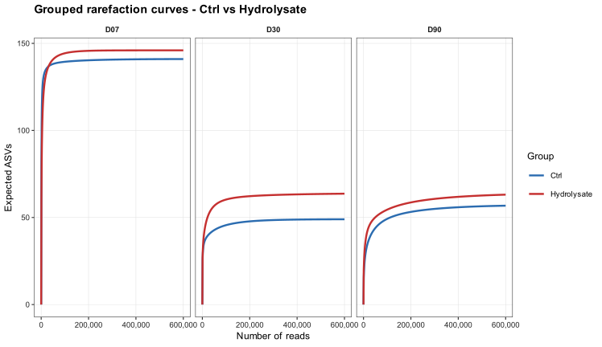
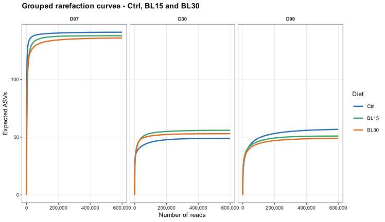
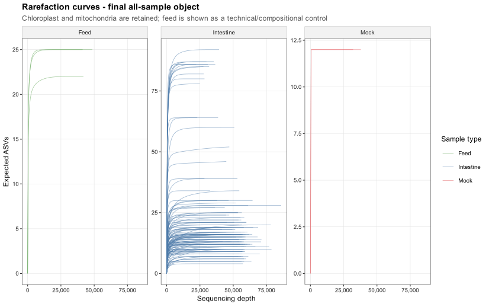
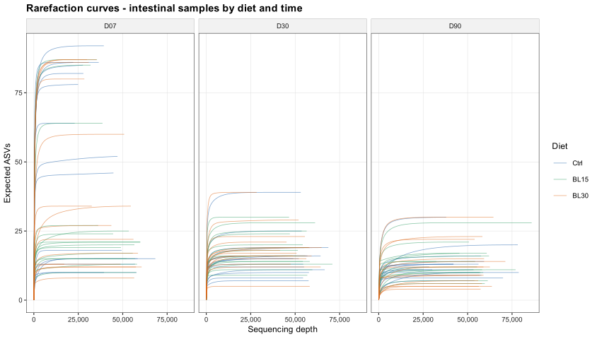
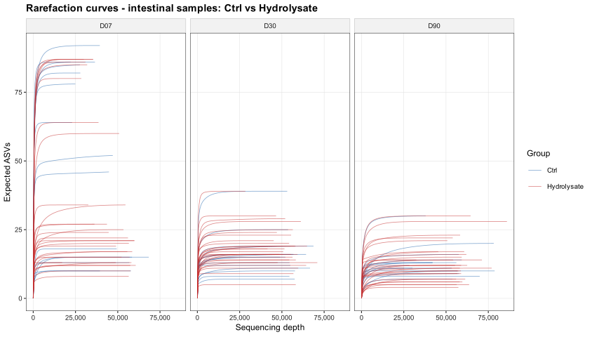
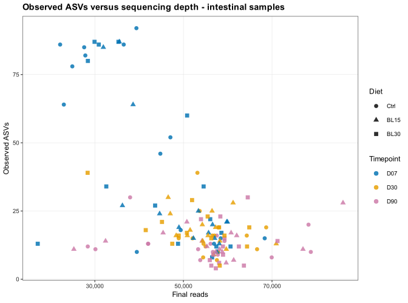

# 04. Rarefaction QC

Base de datos taxonómica: `silva_138_2`

## 1. Objetivo

Este bloque evalúa si la profundidad de secuenciación es suficiente para describir la riqueza observada de ASVs y para sostener los análisis de diversidad alfa. Las curvas de rarefacción son un control de calidad de profundidad, no una prueba estadística de diferencias biológicas entre dietas.

## 2. Objetos analizados

-   `raw_all_samples`: matriz importada antes del filtrado downstream.
-   `final_all_samples`: matriz global filtrada, incluyendo intestino, feed y mock.
-   `final_biological_intestine`: matriz filtrada usada para análisis biológicos de intestino.

## 3. Métodos

Las curvas se calcularon con rarefacción esperada (`vegan::rarefy`) a nivel ASV sobre matrices de conteos filtradas. Para cada muestra se estimó el número esperado de ASVs a profundidades crecientes hasta su profundidad final, usando una resolución de 500 lecturas. Las curvas agrupadas se calcularon como rarefacción de ensamblajes pooled: dentro de cada grupo se agregaron los conteos ASV de sus muestras y se estimó la riqueza esperada del grupo sobre una malla común de profundidad. Este enfoque evita promediar curvas individuales con conjuntos de muestras que cambian a medida que aumenta la profundidad. También se calculó una pendiente final aproximada, expresada como ASVs ganadas por 1,000 lecturas en el último 10% de la curva; valores bajos sugieren mayor aproximación a la saturación. El aviso interno de `vegan::rarefy` sobre ausencia de cuentas muy bajas se silencia porque es esperable tras el filtrado de prevalencia y abundancia media; por ello, la interpretación se restringe a riqueza post-filtrado.

## 4. Resultados principales

-   Objeto global filtrado: 138 muestras, profundidad mínima 17,111, mediana 55,392 y máxima 86,030 lecturas.
-   Objeto intestinal filtrado: 133 muestras, profundidad mínima 17,111, mediana 55,673 y máxima 86,030 lecturas.
-   En intestino, la mediana de ASVs observadas es 16.00 y la mediana esperada a la profundidad común mínima es 15.47.
-   La pendiente final mediana en intestino es 0.00000 ASVs por 1,000 lecturas en el tramo final de la curva.

## 5. Tablas generadas

-   [`rarefaction_curve_points.csv`](../assets/results/04_rarefaction_qc/tables/rarefaction_curve_points.csv): puntos de las curvas por muestra y profundidad.
-   [`rarefaction_sample_summary.csv`](../assets/results/04_rarefaction_qc/tables/rarefaction_sample_summary.csv): resumen por muestra, incluyendo reads, ASVs observadas, ASVs esperadas a profundidad común y pendiente final.
-   [`rarefaction_object_summary.csv`](../assets/results/04_rarefaction_qc/tables/rarefaction_object_summary.csv): resumen por objeto.
-   [`rarefaction_sample_type_summary.csv`](../assets/results/04_rarefaction_qc/tables/rarefaction_sample_type_summary.csv): resumen por objeto y tipo de muestra.
-   [`rarefaction_grouped_ctrl_vs_hydro_time.csv`](../assets/results/04_rarefaction_qc/tables/rarefaction_grouped_ctrl_vs_hydro_time.csv): curvas pooled por tiempo para `Ctrl` frente a `Hydrolysate`.
-   [`rarefaction_grouped_diet_time.csv`](../assets/results/04_rarefaction_qc/tables/rarefaction_grouped_diet_time.csv): curvas pooled por tiempo para `Ctrl`, `BL15` y `BL30`.

## 6. Figuras

**Figura 1. Curvas de rarefacción agrupadas comparando `Ctrl` frente a `Hydrolysate`.** Cada línea representa la riqueza ASV esperada tras agregar los conteos de las muestras pertenecientes a cada grupo y tiempo. La visualización prioriza legibilidad de tendencias grupales por tiempo.

**Figura 2. Curvas de rarefacción agrupadas por dieta (`Ctrl`, `BL15`, `BL30`).** Esta versión permite revisar si el patrón global de cobertura cambia al separar los dos niveles de hidrolizado usando abundancias pooled por grupo y tiempo.

**Figura 3. Curvas de rarefacción del objeto global filtrado.** Las muestras se separan por tipo (`Intestine`, `Feed`, `Mock`). Cloroplasto y mitocondria se conservan en esta versión del filtrado, por lo que feed debe interpretarse como control composicional ampliado.

**Figura 4. Curvas de rarefacción de muestras intestinales por dieta y tiempo.** Cada curva representa una muestra intestinal filtrada a nivel ASV.

**Figura 5. Curvas de rarefacción de muestras intestinales comparando `Ctrl` frente a `Hydrolysate`.** La figura permite revisar si los grupos comparados tienen coberturas de riqueza similares dentro de cada tiempo.

**Figura 6. ASVs observadas frente a profundidad final en muestras intestinales.** Este gráfico ayuda a detectar si la riqueza observada está dominada por profundidad de secuenciación.

## 7. Interpretación

Las curvas deben usarse como evidencia de QC para interpretar riqueza observada. Si las curvas se aproximan a una meseta, la profundidad es razonable para comparar riqueza dentro de los límites del filtrado. Si algunas muestras siguen creciendo de forma marcada al final, su riqueza observada puede estar subestimada y debe interpretarse con cautela.

En este proyecto, la profundidad mínima del objeto intestinal filtrado es suficientemente alta para sostener análisis comparativos conservadores. Aun así, Observed richness debe interpretarse como riqueza tras filtrado y no como riqueza ecológica absoluta.

## 8. Uso downstream

Este bloque debe citarse en el report de diversidad alfa para justificar la interpretación de Observed richness y Shannon index. Las tablas de rarefacción también permiten identificar muestras concretas con menor profundidad o menor aproximación a saturación.