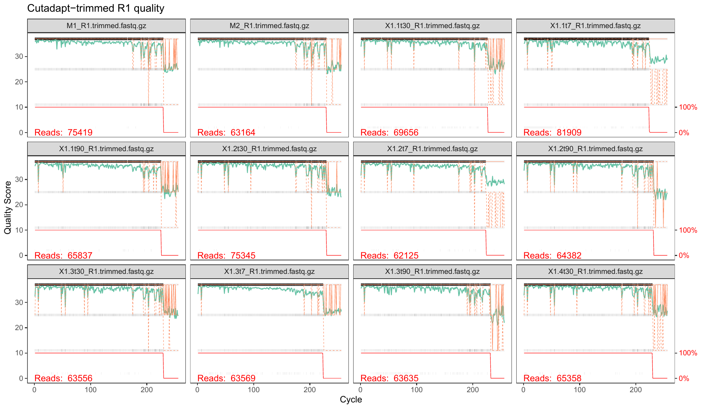
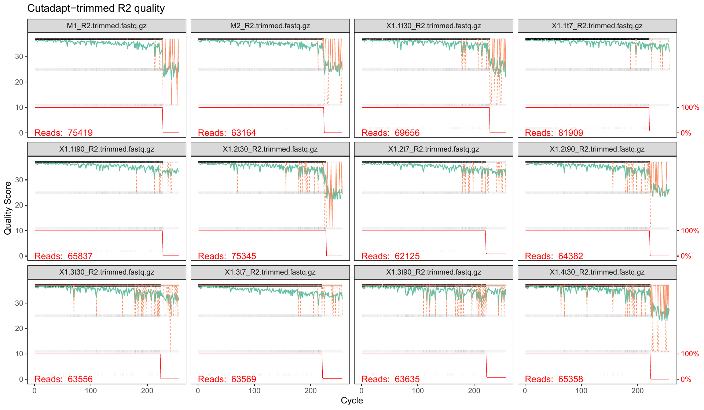
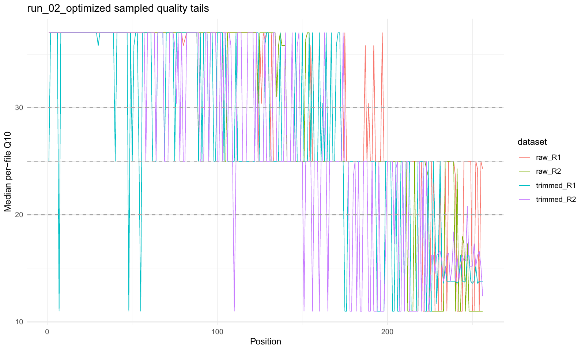
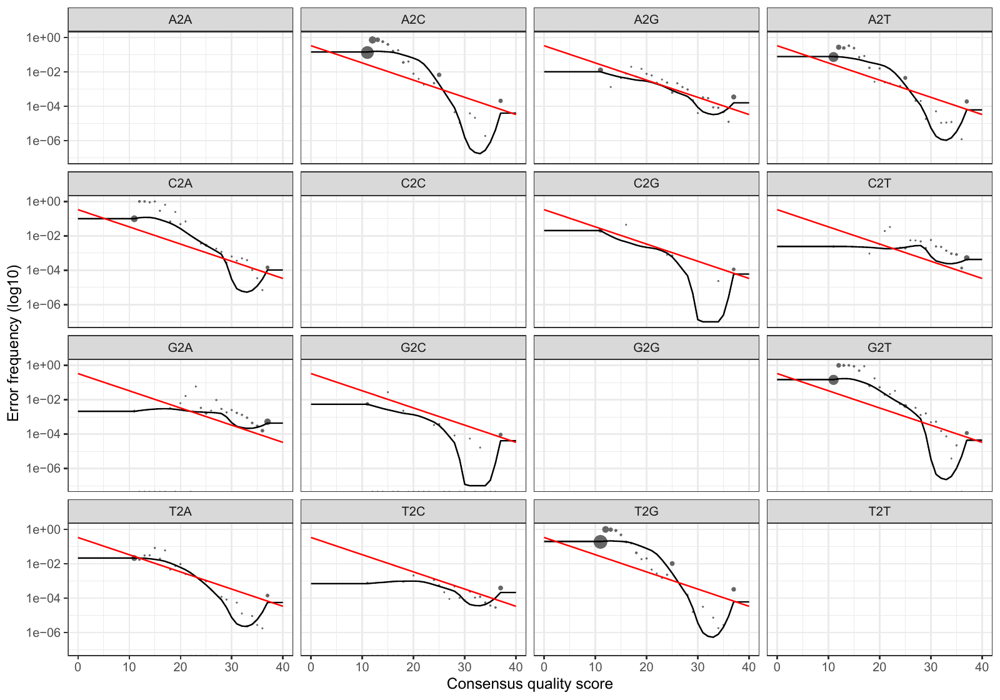
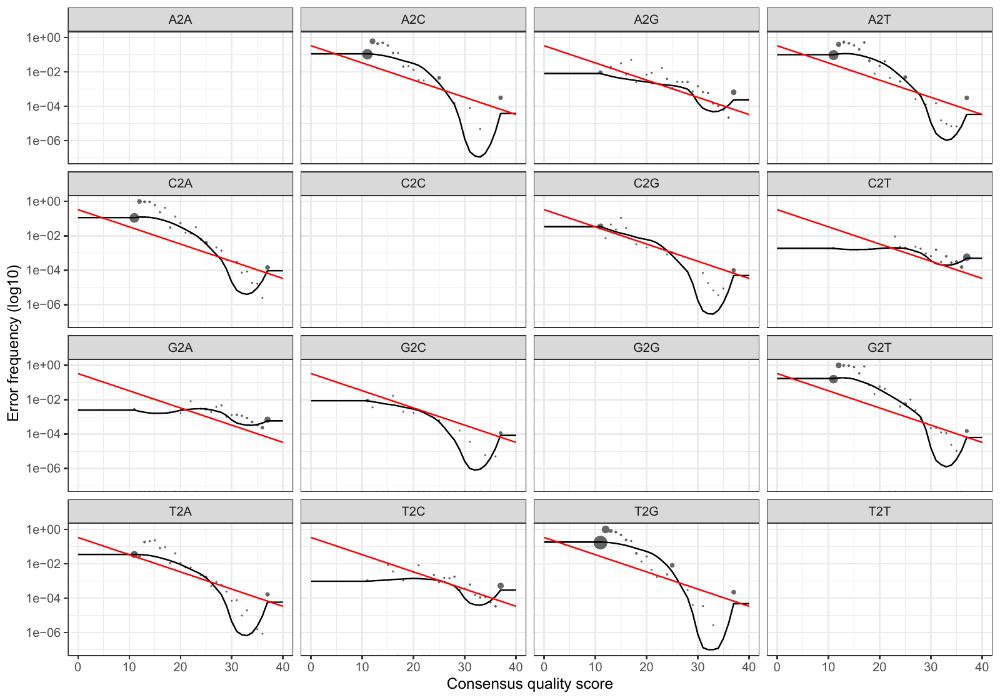

# Preprocesamiento de lecturas 16S

## Objetivo del bloque

Este bloque documenta el preprocesamiento bioinformático aplicado a las lecturas 16S recibidas de Novogene hasta generar la **tabla de ASVs**, las **secuencias representativas** y la **asignación taxonómica primaria con SILVA 138.2**. El flujo corresponde al run final `run_02_optimized`, seleccionado como entrada para los análisis downstream posteriores.

El objetivo metodológico fue obtener una matriz de ASVs reproducible y trazable a partir de lecturas paired-end de la región **16S V3-V4**, manteniendo un equilibrio entre retención de lecturas, calidad de secuencia, éxito de fusión de pares, eliminación de quimeras y resolución taxonómica. El preprocesamiento incluyó retirada de primers con `cutadapt` [@martin2011cutadapt], modelado de errores e inferencia de ASVs con `DADA2` [@callahan2016dada2], y asignación taxonómica con la base de datos `SILVA 138.2` [@quast2013silva].

::: {.callout-note title="Alcance de este bloque"}
Este capítulo cubre **cutadapt + DADA2 + asignación taxonómica SILVA**. El filtrado downstream posterior de ASVs por prevalencia, abundancia y criterios taxonómicos se documenta en un bloque separado.
:::

## Inputs y organización

El preprocesamiento se realizó a partir de las lecturas paired-end brutas ya desmultiplexadas por Novogene. La carpeta fuente fue `result_X204SC25103850-Z01-F001/01.RawData/`. Novogene organizó los datos en una subcarpeta por muestra, con la convención `sample_id/sample_id.raw_1.fastq.gz` para la lectura forward y `sample_id/sample_id.raw_2.fastq.gz` para la lectura reverse. La entrega incluyó además el archivo `Rawdata_MD5.txt`, usado para conservar la trazabilidad de integridad de los FASTQ.

El conjunto de entrada incluyó **138 muestras observadas**: **133 intestinales**, **3 piensos** y **2 controles mock**. El diseño experimental esperaba 135 muestras intestinales, pero dos muestras del tratamiento `BL30/Z` no llegaron al preprocesamiento por ausencia de pares de lectura observados: **`Z1.5t90`** y **`Z2.1t30`**.

::: {.callout-note title="Trazabilidad de datos crudos"}
Los FASTQ crudos no se copian dentro de este repositorio Quarto. La web incorpora tablas resumidas, figuras QC y scripts del bloque como anexos, pero los datos crudos permanecen en la estructura original del proyecto para no duplicar archivos pesados ni romper la trazabilidad de Novogene.
:::

La estructura lógica del bloque se resume en la @tbl-preprocessing-workflow. Los scripts completos usados para cada paso se recogen en el anexo @sec-preprocessing-scripts.

| Paso | Script principal | Objetivo | Output principal |
|---|---|---|---|
| 1 | `01_build_metadata.R` | Construir inventario de lecturas, comprobar pares FASTQ y preparar metadatos. | `sample_metadata_run_02_optimized.tsv`, `raw_read_inventory_run_02_optimized.tsv`. |
| 2 | `02_run_cutadapt.R` | Retirar primers/barcodes técnicos manteniendo auditoría por muestra. | FASTQ recortados y `cutadapt_stats.tsv`. |
| 3 | `03_quality_profiles.R` | Evaluar calidad por posición antes y después del recorte. | Figuras de perfiles de calidad y tabla de umbrales. |
| 4 | `04_filter_trim.R` | Filtrar lecturas con parámetros DADA2 optimizados. | FASTQ filtrados y `dada2_filter_stats.tsv`. |
| 5 | `05_learn_errors.R` | Aprender modelos de error forward/reverse. | `errF.rds`, `errR.rds`. |
| 6 | `06_denoise_merge_chimera.R` | Inferir ASVs, fusionar pares y retirar quimeras. | `seqtab_nochim.rds`, estadísticas de fusión/quimeras. |
| 7 | `07_assign_taxonomy.R` | Asignar taxonomía primaria con SILVA 138.2. | `taxonomy_silva_138_2.tsv`. |
| 8 | `08_export_outputs.R` | Exportar ASV table, secuencias y trazabilidad. | `asv_table.tsv`, `asv_sequences.fasta`, `track_reads.tsv`. |
| 9 | `09_evaluate_run.R` | Generar QC y comparación de runs. | Reportes y tablas QC. |
| 10 | `10_prepare_downstream_inputs.R` | Preparar inputs para análisis downstream. | `otu_table`, `tax_table`, `rep_seqs.fasta` y metadatos. |

: Flujo general del preprocesamiento de lecturas 16S {#tbl-preprocessing-workflow}

## Software y bases de datos

Las versiones principales usadas en el run final se resumen en la @tbl-preprocessing-software. Se muestran solo los programas y recursos necesarios para interpretar el método; la información de entorno conda queda conservada en los scripts y logs, pero no es el foco del informe.

| Recurso | Versión / recurso usado | Uso | Referencia | Repositorio o documentación |
|---|---|---|---|---|
| R | `4.5.3` | Ejecución de scripts y generación de tablas QC. | [R Project](https://www.r-project.org/) | [r-project.org](https://www.r-project.org/) |
| cutadapt | `5.2` | Retirada de primers de las lecturas paired-end. | @martin2011cutadapt | [cutadapt.readthedocs.io](https://cutadapt.readthedocs.io/) |
| DADA2 | `1.38.0` | Filtrado, aprendizaje de errores, inferencia de ASVs, fusión y quimeras. | @callahan2016dada2 | [github.com/benjjneb/dada2](https://github.com/benjjneb/dada2) |
| SILVA | `138.2` | Base taxonómica primaria para asignación 16S. | @quast2013silva | [arb-silva.de](https://www.arb-silva.de/) |
| Training set SILVA para DADA2 | `silva_nr99_v138.2_toSpecies_trainset.fa.gz` | Referencia usada por `assignTaxonomy(minBoot = 80)`. | @quast2013silva | [Zenodo 14169026](https://zenodo.org/records/14169026) |
| Species set SILVA para DADA2 | `silva_v138.2_assignSpecies.fa.gz` | Referencia usada por `addSpecies(allowMultiple = TRUE)`. | @quast2013silva | [Zenodo 14169026](https://zenodo.org/records/14169026) |

: Recursos de software y bases de datos usados en el preprocesamiento {#tbl-preprocessing-software}

La asignación taxonómica no se hizo contra la base `full` de SILVA directamente. Para `DADA2` se utilizó un **training set SILVA 138.2 ya preparado en formato compatible con `assignTaxonomy`**, derivado de la base SILVA y distribuido como recurso específico para flujos DADA2. Conceptualmente, este paso equivale a trabajar con una referencia curada y organizada para la región y jerarquía taxonómica que necesita el clasificador: evita usar una base completa sin formatear, reduce problemas de nomenclatura y facilita la asignación reproducible de ASVs. Si se parte de una base `full` sin preparar, una alternativa habitual es extraer o adaptar la referencia al amplicón de interés mediante los primers y generar un training set específico; en este run no fue necesario porque se usó el recurso SILVA 138.2 ya preformateado para DADA2.

## Optimización de parámetros de preprocesamiento

Se comparó un run inicial (`run_01_default`) frente al run optimizado (`run_02_optimized`). La comparación se resume en la @tbl-run-comparison. El run optimizado mantuvo el mismo número de pares crudos, aumentó la retención tras cutadapt y filtrado DADA2, recuperó **662,626 lecturas no quiméricas adicionales** y generó un mayor número de ASVs no quiméricas. La ligera subida de pérdida por quimeras fue aceptable porque la fusión de pares siguió siendo muy alta.

| Métrica | `run_01_default` | `run_02_optimized` |
|---|---:|---:|
| Muestras | 138 | 138 |
| Pares crudos | 9,191,390 | 9,191,390 |
| Pares retenidos por cutadapt | 8,867,098 | 9,191,390 |
| Mediana de retención cutadapt | 99.0% | **100.0%** |
| Mediana de retención DADA2 filter | 85.57% | **91.43%** |
| Lecturas fusionadas | 7,484,395 | **8,236,246** |
| Mediana merge / reads filtradas | 99.70% | 99.59% |
| Lecturas no quiméricas | 7,005,295 | **7,667,921** |
| Mediana raw-to-nonchim | 80.34% | **88.17%** |
| Mediana de pérdida por quimeras | 2.40% | 3.00% |
| ASVs no quiméricas | 13,130 | **14,652** |
| ASVs con género asignado | 8,845 | 6,595 |
| ASVs con especie asignada por `addSpecies` | 916 | 921 |

: Comparación entre el run inicial y el run final seleccionado {#tbl-run-comparison}

::: {.callout-tip title="Decisión metodológica"}
Se seleccionó `run_02_optimized` porque recuperó más lecturas no quiméricas de alta confianza y mejoró la profundidad final por muestra sin comprometer de forma relevante el éxito de fusión de pares. El resultado clave fue pasar de **7.01 M** a **7.67 M** lecturas no quiméricas.
:::

La optimización se centró en dos puntos: la retirada de primers y el filtrado por calidad en DADA2. En `cutadapt`, el cambio más relevante fue `discard_untrimmed = FALSE`. Esto evita descartar prematuramente pares en los que el primer no se detecta de forma perfecta, algo especialmente sensible cuando el extremo reverse muestra peor calidad o cuando hay ambigüedad en los primers. En DADA2, el parámetro más influyente fue `maxEE = c(3, 3)`, que controla el número máximo esperado de errores por lectura. Relajar moderadamente `maxEE` recupera lecturas que todavía pueden ser informativas, mientras que mantener `maxN = 0` impide conservar secuencias con bases ambiguas. También se mantuvo `truncLen = c(0, 0)`, de modo que no se impuso un corte fijo de longitud y el control de calidad quedó gobernado por errores esperados y calidad terminal (`truncQ = 2`). La fusión se mantuvo estricta con `maxMismatch = 0` porque el éxito de merging ya era alto y permitir mismatches habría reducido confianza más que resolver un cuello de botella real.

## Parámetros finales

Los parámetros finales se muestran en la @tbl-final-preprocessing-params. El cambio clave frente al run inicial fue no descartar lecturas sin primer detectado en cutadapt y relajar moderadamente el filtro de errores esperados de DADA2 (`maxEE = c(3, 3)`) sin permitir bases ambiguas ni mismatches en la fusión.

| Etapa | Parámetro | Valor |
|---|---|---|
| cutadapt | Forward primer | `CCTAYGGGRBGCASCAG` |
| cutadapt | Reverse primer | `GGACTACNNGGGTATCTAAT` |
| cutadapt | Error rate | `0.1` |
| cutadapt | Minimum overlap | `3` |
| cutadapt | Minimum length | `1` |
| cutadapt | Match read wildcards | `TRUE` |
| cutadapt | Quality trimming | `-q 0,0` |
| cutadapt | `discard_untrimmed` | `FALSE` |
| DADA2 `filterAndTrim` | `truncLen` | `c(0, 0)` |
| DADA2 `filterAndTrim` | `trimLeft` | `c(0, 0)` |
| DADA2 `filterAndTrim` | `maxN` | `0` |
| DADA2 `filterAndTrim` | `maxEE` | `c(3, 3)` |
| DADA2 `filterAndTrim` | `truncQ` | `2` |
| DADA2 `filterAndTrim` | `rm.phix` | `TRUE` |
| DADA2 `learnErrors` | `randomize` | `TRUE` |
| DADA2 `learnErrors` | `nbases` | `100000000` |
| DADA2 `dada` | `pool` | `FALSE` |
| DADA2 `dada` | `selfConsist` | `FALSE` |
| DADA2 `mergePairs` | `minOverlap` | `12` |
| DADA2 `mergePairs` | `maxMismatch` | `0` |
| DADA2 `removeBimeraDenovo` | `method` | `consensus` |
| Taxonomía | Base primaria | `SILVA 138.2` |
| Taxonomía | `assignTaxonomy(minBoot)` | `80` |
| Taxonomía | `tryRC` | `FALSE` |
| Taxonomía | `addSpecies` | `allowMultiple = TRUE` |

: Parámetros finales del run `run_02_optimized` {#tbl-final-preprocessing-params}

::: {.callout-note title="Sin truncado fijo"}
No se aplicó truncado fijo (`truncLen = c(0, 0)`) porque la fusión de pares era alta y la distribución de longitudes del amplicón se mantuvo coherente. Esta decisión evita perder lecturas por una longitud de truncado demasiado agresiva en un amplicón V3-V4 con calidad variable hacia el final de las lecturas.
:::

## Control de calidad de lecturas

Los perfiles de calidad crudos y recortados se revisaron antes de fijar los parámetros finales. La @fig-raw-r1-quality y la @fig-raw-r2-quality muestran los perfiles de calidad de las lecturas crudas R1 y R2, mientras que la @fig-trimmed-r1-quality y la @fig-trimmed-r2-quality muestran el estado tras la retirada de primers. Como patrón general, R2 presentó una caída de calidad más marcada que R1 hacia posiciones finales, un comportamiento habitual en lecturas paired-end y una razón para evitar un truncado fijo demasiado conservador.

{#fig-raw-r1-quality fig-align="center" width="90%"}

{#fig-raw-r2-quality fig-align="center" width="90%"}

{#fig-trimmed-r1-quality fig-align="center" width="90%"}

{#fig-trimmed-r2-quality fig-align="center" width="90%"}

La tabla de umbrales de calidad (@tbl-quality-thresholds) resume las posiciones en las que el percentil 10 de calidad cae por debajo de Q30, Q25 y Q20. Esta lectura apoyó mantener `truncLen = c(0, 0)` y controlar la calidad mediante `maxEE`, en lugar de cortar todas las muestras a una posición fija.

| Dataset | Primer Q10 < Q30 | Primer Q10 < Q25 | Primer Q10 < Q20 | Q10 mediana desde posición 200 | Última posición |
|---|---:|---:|---:|---:|---:|
| `raw_R1` | 89 | 221 | 221 | 25.0 | 256 |
| `raw_R2` | 104 | 212 | 212 | 17.3 | 256 |
| `trimmed_R1` | 1 | 7 | 7 | 13.8 | 256 |
| `trimmed_R2` | 58 | 110 | 110 | 15.7 | 256 |

: Umbrales de calidad por posición usados para evaluar los perfiles FASTQ {#tbl-quality-thresholds}

La @fig-quality-q10-position resume gráficamente esos umbrales por posición. La figura debe leerse como un diagnóstico global: el eje X representa la posición dentro de la lectura y el eje Y el percentil 10 de calidad. Las curvas de lecturas crudas y recortadas pueden solaparse parcialmente porque el recorte desplaza el inicio efectivo de algunas lecturas; por eso la interpretación principal no es comparar punto a punto, sino localizar dónde cae la cola de calidad de R1 y R2. La señal más importante es que **R2 pierde calidad antes que R1**, pero la estrategia de `maxEE = c(3, 3)` permitió conservar lecturas útiles sin imponer un corte fijo.

{#fig-quality-q10-position fig-align="center" width="90%"}

## Modelos de error, inferencia de ASVs y fusión

DADA2 aprendió modelos de error independientes para lecturas forward y reverse. Los modelos resultantes se muestran en la @fig-error-forward y la @fig-error-reverse. En estos gráficos, los puntos representan las tasas de error observadas para cada tipo de sustitución nucleotídica y las líneas representan el modelo de error aprendido. Un modelo adecuado muestra una relación decreciente entre calidad y probabilidad de error, con las tasas observadas próximas a las curvas ajustadas. Esta comprobación es importante porque la inferencia de ASVs de DADA2 depende de distinguir errores de secuenciación frente a variantes biológicas reales.

{#fig-error-forward fig-align="center" width="90%"}

{#fig-error-reverse fig-align="center" width="90%"}

La retención de lecturas a lo largo del preprocesamiento se resume en la @tbl-read-tracking-summary. El run final procesó **9.19 millones de pares crudos**, retuvo **8.39 millones** tras filtrado DADA2, fusionó **8.24 millones** y conservó **7.67 millones de lecturas no quiméricas**.

| Métrica | Valor |
|---|---:|
| Muestras procesadas | 138 |
| Muestras intestinales | 133 |
| Pares crudos | 9,191,390 |
| Pares retenidos tras cutadapt | 9,191,390 |
| Mediana de retención cutadapt | 100.00% |
| Lecturas tras `filterAndTrim` | 8,387,911 |
| Mediana de retención `filterAndTrim` | 91.43% |
| Lecturas fusionadas | 8,236,246 |
| Mediana de fusión sobre lecturas filtradas | 99.59% |
| Lecturas no quiméricas | 7,667,921 |
| Mediana raw-to-nonchim | 88.17% |
| Mediana de pérdida por quimeras | 3.00% |
| ASVs no quiméricas | 14,652 |

: Resumen de retención de lecturas en `run_02_optimized` {#tbl-read-tracking-summary}

Todas las muestras intestinales quedaron por encima de **20,000 lecturas no quiméricas**; 2/133 quedaron por debajo de 30,000 y 10/133 por debajo de 40,000. Por tanto, el preprocesamiento generó profundidades suficientes para los análisis posteriores, aunque las decisiones de rarefacción y filtrado se tratan en bloques específicos.

## Longitud de ASVs y eliminación de quimeras

La distribución de longitudes de ASVs antes y después de retirar quimeras se resume en la @tbl-asv-length-summary. La mediana de longitud no quimérica fue **406 nt**, dentro del rango esperado para el amplicón V3-V4 procesado con pares solapados.

| Etapa | ASVs | Reads | Mín. | Q25 | Mediana | Q75 | Máx. |
|---|---:|---:|---:|---:|---:|---:|---:|
| Merged | 34,452 | 8,236,246 | 229 | 404 | 424 | 429 | 499 |
| Nonchim | 14,652 | 7,667,921 | 229 | 404 | 406 | 429 | 499 |

: Distribución de longitud de ASVs antes y después de retirar quimeras {#tbl-asv-length-summary}

La retirada de quimeras redujo el número de ASVs de 34,452 a 14,652. Este descenso fuerte en número de variantes, acompañado de una retención alta de lecturas, es compatible con un escenario habitual de amplicones: muchas variantes candidatas son de baja abundancia o artefactuales, mientras que la señal dominante queda representada por ASVs no quiméricas.

## Asignación taxonómica con SILVA 138.2

La asignación taxonómica primaria se realizó con `assignTaxonomy` usando SILVA 138.2 y `minBoot = 80`. La asignación a especie se intentó después con `addSpecies(..., allowMultiple = TRUE)`. La completitud taxonómica tras el preprocesamiento se resume en la @tbl-taxonomy-completeness.

| Rango | ASVs asignadas | % ASVs asignadas | Reads asignados | % reads asignados |
|---|---:|---:|---:|---:|
| Kingdom | 13,020 | 88.9% | 7,490,974 | 97.7% |
| Phylum | 12,461 | 85.0% | 7,481,712 | 97.6% |
| Class | 12,220 | 83.4% | 7,479,028 | 97.5% |
| Order | 11,424 | 78.0% | 7,467,160 | 97.4% |
| Family | 10,593 | 72.3% | 7,383,870 | 96.3% |
| Genus | 6,595 | 45.0% | 5,412,322 | 70.6% |
| Species | 444 | 3.0% | 3,540,804 | 46.2% |
| Species by `addSpecies` | 921 | 6.3% | 4,512,751 | 58.9% |

: Completitud de asignación taxonómica sobre ASVs no quiméricas {#tbl-taxonomy-completeness}

La asignación fue robusta a niveles altos y medios de la jerarquía taxonómica, especialmente en términos de lecturas asignadas. La resolución a especie fue limitada, como es esperable en amplicones 16S V3-V4, y se interpreta de forma exploratoria.

## Tablas descargables y vistas previas

Los outputs principales que tienen un tamaño razonable para la web se incorporan como archivos TSV descargables. En una página Quarto estática, la forma más limpia de "clicar y ver" una tabla sin cargar ficheros enormes es usar desplegables: el nombre de cada tabla abre una vista previa embebida, y el enlace `Descargar TSV` permite bajar el archivo completo.

::: {.callout-note title="Tablas grandes"}
Las matrices completas de abundancia (`otu_table_*`), las secuencias representativas (`rep_seqs.fasta`) y el mapa completo ASV-secuencia no se embeben en la web para evitar un repositorio innecesariamente pesado. Se conservan en el proyecto de análisis original y pueden incorporarse bajo demanda si se necesita una descarga pública específica.
:::

| Archivo | Contenido | Enlace |
|---|---|---|
| `raw_read_inventory_run_02_optimized.tsv` | Inventario de FASTQ brutos, rutas y MD5 esperados. | <a href="../assets/results/04_preprocessing/tables/raw_read_inventory_run_02_optimized.tsv" download>Descargar TSV</a> |
| `missing_expected_samples_run_02_optimized.tsv` | Muestras esperadas que no tuvieron FASTQ observado. | <a href="../assets/results/04_preprocessing/tables/missing_expected_samples_run_02_optimized.tsv" download>Descargar TSV</a> |
| `run_01_vs_run_02_comparison.tsv` | Comparación resumida entre el run inicial y el run optimizado. | <a href="../assets/results/04_preprocessing/tables/run_01_vs_run_02_comparison.tsv" download>Descargar TSV</a> |
| `run_02_optimized_quality_threshold_positions.tsv` | Posiciones de caída de calidad por dataset FASTQ. | <a href="../assets/results/04_preprocessing/tables/run_02_optimized_quality_threshold_positions.tsv" download>Descargar TSV</a> |
| `run_02_optimized_asv_length_summary.tsv` | Resumen de longitud de ASVs antes/después de quimeras. | <a href="../assets/results/04_preprocessing/tables/run_02_optimized_asv_length_summary.tsv" download>Descargar TSV</a> |
| `run_02_optimized_cutadapt_stats.tsv` | Estadísticas de cutadapt por muestra. | <a href="../assets/results/04_preprocessing/tables/run_02_optimized_cutadapt_stats.tsv" download>Descargar TSV</a> |
| `run_02_optimized_dada2_filter_stats.tsv` | Estadísticas de filtrado DADA2 por muestra. | <a href="../assets/results/04_preprocessing/tables/run_02_optimized_dada2_filter_stats.tsv" download>Descargar TSV</a> |
| `run_02_optimized_dada2_merge_chimera_stats.tsv` | Estadísticas de fusión de pares y eliminación de quimeras. | <a href="../assets/results/04_preprocessing/tables/run_02_optimized_dada2_merge_chimera_stats.tsv" download>Descargar TSV</a> |
| `run_02_optimized_optimization_track_reads.tsv` | Trazabilidad por muestra para evaluar el run optimizado. | <a href="../assets/results/04_preprocessing/tables/run_02_optimized_optimization_track_reads.tsv" download>Descargar TSV</a> |
| `preprocessing_track_reads.tsv` | Trazabilidad final de lecturas por muestra y etapa. | <a href="../assets/results/04_preprocessing/tables/preprocessing_track_reads.tsv" download>Descargar TSV</a> |
| `sample_data.tsv` | Metadatos finales para downstream. | <a href="../assets/results/04_preprocessing/tables/sample_data.tsv" download>Descargar TSV</a> |
| `tax_table_silva_138_2.tsv` | Taxonomía SILVA lista para importación downstream. | <a href="../assets/results/04_preprocessing/tables/tax_table_silva_138_2.tsv" download>Descargar TSV</a> |

: Tablas TSV disponibles para descarga desde la web {#tbl-preprocessing-downloads}

<strong>run_01_vs_run_02_comparison.tsv</strong>: vista previa embebida

| Métrica | `run_01_default` | `run_02_optimized` |
|---|---:|---:|
| Muestras | 138 | 138 |
| Pares crudos | 9,191,390 | 9,191,390 |
| Pares retenidos por cutadapt | 8,867,098 | 9,191,390 |
| Mediana de retención DADA2 filter | 85.57% | 91.43% |
| Lecturas no quiméricas | 7,005,295 | 7,667,921 |
| Mediana raw-to-nonchim | 80.34% | 88.17% |
| ASVs no quiméricas | 13,130 | 14,652 |

<strong>preprocessing_track_reads.tsv</strong>: vista previa embebida de columnas clave

| sample_id | sample_type | group | pairs_processed | reads.out | merged | nonchim | raw_to_nonchim_pct |
|---|---|---|---:|---:|---:|---:|---:|
| M1 | Mock | Mock | 75,419 | 68,966 | 64,545 | 38,031 | 50.43 |
| M2 | Mock | Mock | 63,164 | 58,158 | 54,709 | 32,235 | 51.03 |
| X1.1t30 | Intestine | X.t30 | 69,656 | 64,833 | 64,786 | 55,037 | 79.01 |
| X1.1t7 | Intestine | X.t7 | 81,909 | 77,144 | 70,326 | 70,309 | 85.84 |
| X1.1t90 | Intestine | X.t90 | 65,837 | 61,410 | 61,212 | 59,048 | 89.69 |

<strong>tax_table_silva_138_2.tsv</strong>: vista previa embebida de las primeras ASVs

| asv_id | Kingdom | Phylum | Class | Order | Family | Genus | Species_addSpecies |
|---|---|---|---|---|---|---|---|
| ASV00002 | Bacteria | Bacillota | Bacilli | Mycoplasmatales | Mycoplasmataceae | NA | NA |
| ASV00008 | Bacteria | Pseudomonadota | Gammaproteobacteria | Enterobacterales | Vibrionaceae | Vibrio | renipiscarius |
| ASV00004 | Bacteria | Pseudomonadota | Gammaproteobacteria | Enterobacterales | Vibrionaceae | Vibrio | scophthalmi |
| ASV00001 | Bacteria | Pseudomonadota | Gammaproteobacteria | Enterobacterales | Vibrionaceae | Vibrio | ichthyoenteri/scophthalmi |
| ASV00009 | Bacteria | Pseudomonadota | Gammaproteobacteria | Enterobacterales | Vibrionaceae | Photobacterium | phosphoreum/piscicola |

## Outputs para análisis downstream

El preprocesamiento produjo una carpeta de exportación completa y una carpeta lista para downstream. Los archivos principales se resumen en la @tbl-downstream-outputs. La matriz completa de ASVs y las secuencias representativas permanecen en la carpeta de análisis para preservar reproducibilidad sin sobrecargar la web.

| Archivo | Descripción | Uso posterior |
|---|---|---|
| `asv_table.tsv` | Tabla de abundancias ASV por muestra. | Importación a phyloseq y filtrado downstream. |
| `asv_sequences.fasta` / `rep_seqs.fasta` | Secuencias representativas de ASVs. | BLAST, PICRUSt2 y trazabilidad de ASVs. |
| `taxonomy_silva_138_2.tsv` | Taxonomía primaria SILVA 138.2. | Composición taxonómica y agregación por rangos. |
| `taxonomy_bootstraps_silva_138_2.tsv` | Soporte bootstrap por rango. | Auditoría de confianza taxonómica. |
| `preprocessing_track_reads.tsv` | Trazabilidad de lecturas por muestra y etapa. | QC y reporte de retención. |
| `sample_data.tsv` | Metadatos finales para downstream. | Diseño experimental en análisis posteriores. |
| `otu_table_taxa_are_rows.tsv` | Tabla de abundancias con ASVs en filas. | Herramientas que esperan formato taxa x muestra. |
| `otu_table_samples_are_rows.tsv` | Tabla de abundancias con muestras en filas. | Herramientas que esperan formato muestra x taxa. |
| `tax_table_silva_138_2.tsv` | Taxonomía lista para importar. | Construcción de objetos downstream. |

: Outputs principales generados por el preprocesamiento {#tbl-downstream-outputs}

## Scripts reproducibles

La trazabilidad del bloque queda respaldada por los scripts del anexo @sec-preprocessing-scripts. La @tbl-preprocessing-scripts enlaza cada etapa metodológica con su script renderizado.

| Etapa | Script | Anexo |
|---|---|---|
| Metadatos | `01_build_metadata.R` | @sec-script-01-build-metadata-r |
| cutadapt | `02_run_cutadapt.R` | @sec-script-02-run-cutadapt-r |
| Perfiles de calidad | `03_quality_profiles.R` | @sec-script-03-quality-profiles-r |
| Filtrado DADA2 | `04_filter_trim.R` | @sec-script-04-filter-trim-r |
| Modelos de error | `05_learn_errors.R` | @sec-script-05-learn-errors-r |
| Inferencia, fusión y quimeras | `06_denoise_merge_chimera.R` | @sec-script-06-denoise-merge-chimera-r |
| Taxonomía SILVA | `07_assign_taxonomy.R` | @sec-script-07-assign-taxonomy-r |
| Exportación | `08_export_outputs.R` | @sec-script-08-export-outputs-r |
| Evaluación QC | `09_evaluate_run.R` | @sec-script-09-evaluate-run-r |
| Inputs downstream | `10_prepare_downstream_inputs.R` | @sec-script-10-prepare-downstream-inputs-r |
| Ejecución completa | `run_all.R` | @sec-script-run-all-r |
| Funciones auxiliares | `lib_pipeline.R` | @sec-script-lib-pipeline-r |

: Scripts del bloque de preprocesamiento y anexos correspondientes {#tbl-preprocessing-scripts}

## Interpretación metodológica

El preprocesamiento final genera una base sólida para los análisis de microbiota: las lecturas se retienen de forma eficiente, la fusión paired-end es muy alta, la profundidad no quimérica por muestra es suficiente y la distribución de longitudes de ASV es compatible con el amplicón esperado. La decisión más importante fue conservar lecturas sin primer detectado en cutadapt (`discard_untrimmed = FALSE`) para evitar pérdidas prematuras, especialmente en muestras con detección subóptima del reverse primer, y delegar el control de calidad principal a DADA2 mediante `maxEE`.

Desde el punto de vista biológico, este bloque no interpreta diferencias entre dietas ni tiempos. Su función es fijar el punto de partida técnico: una matriz de **138 muestras**, **14,652 ASVs no quiméricas** y **7,667,921 lecturas no quiméricas**, con taxonomía primaria SILVA 138.2 y secuencias representativas listas para filtrado downstream, composición taxonómica, diversidad, abundancia diferencial y predicción funcional.

