# 05. Composición taxonómica

## 1. Objetivo

Este bloque describe la composición taxonómica del experimento tras el filtrado
downstream. El objetivo es responder tres preguntas principales:

1. Cómo cambia la microbiota intestinal entre dietas (`Ctrl`, `BL15`, `BL30`)
   y tiempos (`D07`, `D30`, `D90`).
2. Si la señal composicional del pienso aparece en el intestino de los peces.
3. Si los controles mock recuperan la composición esperada del estándar
   ZymoBIOMICS.

Los barplots se interpretan como composición relativa media, no como test
estadístico. La inferencia formal se complementa con diversidad alfa/beta y
otros análisis downstream.

## 2. Inputs y outputs

Inputs principales:

- Objeto filtrado intestinal a nivel ASV:
  [`ps_biological_final_silva_138_2.rds`](../../02_filtering/objects/ps_biological_final_silva_138_2.rds)
- Objetos agregados por rango taxonómico:
  [`ps_biological_phylum_silva_138_2.rds`](../../02_filtering/objects/ps_biological_phylum_silva_138_2.rds),
  [`ps_biological_family_silva_138_2.rds`](../../02_filtering/objects/ps_biological_family_silva_138_2.rds) y
  [`ps_biological_genus_silva_138_2.rds`](../../02_filtering/objects/ps_biological_genus_silva_138_2.rds)
- Objeto global filtrado, incluyendo intestino, pienso y mock:
  [`ps_final_silva_138_2.rds`](../../02_filtering/objects/ps_final_silva_138_2.rds)

Outputs principales:

- Figuras de barplots:
  [`../assets/results/05_taxonomic_composition/figures/barplots/`](../assets/results/05_taxonomic_composition/figures/barplots/)
- Tablas fuente de barplots:
  [`../assets/results/05_taxonomic_composition/tables/barplots/`](../assets/results/05_taxonomic_composition/tables/barplots/)
- Figuras Venn/UpSet:
  [`../assets/results/05_taxonomic_composition/figures/venn/`](../assets/results/05_taxonomic_composition/figures/venn/) y
  [`../assets/results/05_taxonomic_composition/figures/upset/`](../assets/results/05_taxonomic_composition/figures/upset/)
- Tablas de overlap:
  [`../assets/results/05_taxonomic_composition/tables/overlap/`](../assets/results/05_taxonomic_composition/tables/overlap/)
- Script:
  [`../../../scripts/05_taxonomic_composition.R`](../../../scripts/05_taxonomic_composition.R)

## 3. Organización de barplots

Los barplots de medias están organizados en:

- `01_panels_by_treatment_ctrl_vs_hydrolysate/`: paneles por grupo
  (`Ctrl`, `Hydrolysate`); barras por tiempo.
- `02_panels_by_treatment_ctrl_bl15_bl30/`: paneles por dieta
  (`Ctrl`, `BL15`, `BL30`); barras por tiempo.
- `03_panels_by_time_ctrl_vs_hydrolysate/`: paneles por tiempo; barras por
  grupo (`Ctrl`, `Hydrolysate`).
- `04_panels_by_time_ctrl_bl15_bl30/`: paneles por tiempo; barras por dieta
  (`Ctrl`, `BL15`, `BL30`).
- `05_ctrl_hydrolysate_feed/`: comparación global `Ctrl`,
  `Hydrolysate` y `Feed`.

La antigua serie plana `diet_time` se eliminó porque era redundante con los
paneles y aportaba menos claridad visual.

## 4. Composición intestinal por tratamiento y tiempo

### 4.1. Paneles por tratamiento

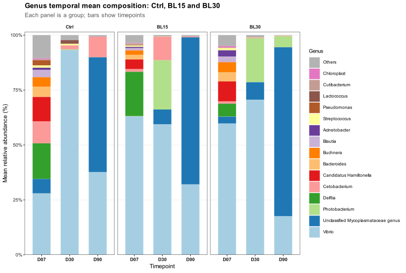

**Figura 1. Composición media a nivel de género por tratamiento.** Cada panel
corresponde a una dieta (`Ctrl`, `BL15`, `BL30`) y las barras muestran la
evolución temporal.

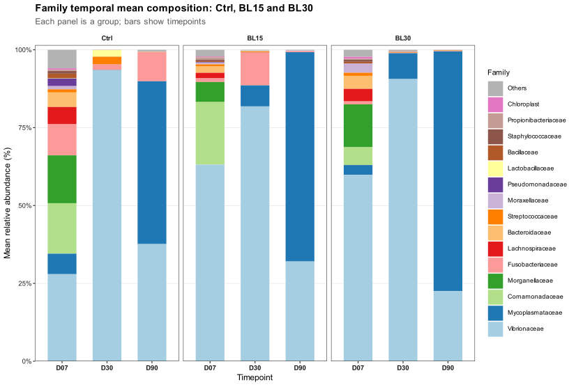

**Figura 2. Composición media a nivel de familia por tratamiento.** Esta vista
resume el mismo patrón con mayor robustez taxonómica.

La trayectoria temporal es el patrón dominante. En `D07`, la comunidad es más
repartida y contiene `Vibrio`, `Delftia`, `Candidatus Hamiltonella`,
`Cetobacterium`, `Photobacterium` y otros taxones. En `D30`, la comunidad se
simplifica y queda fuertemente dominada por `Vibrio`/`Vibrionaceae`. En `D90`,
la señal dominante pasa a `Unclassified Mycoplasmataceae genus` /
`Mycoplasmataceae`, especialmente en los grupos con hidrolizado.

Principales géneros por tratamiento y tiempo:

| Tratamiento | Tiempo | Género principal 1 | % | Género principal 2 | % | Género principal 3 | % |
|---|---|---|---:|---|---:|---|---:|
| Ctrl | D07 | Vibrio | 28.0 | Delftia | 16.2 | Candidatus Hamiltonella | 11.1 |
| Ctrl | D30 | Vibrio | 93.1 | Others | 2.2 | Cetobacterium | 1.9 |
| Ctrl | D90 | Unclassified Mycoplasmataceae genus | 52.3 | Vibrio | 37.6 | Cetobacterium | 9.3 |
| BL15 | D07 | Vibrio | 63.0 | Delftia | 20.2 | Candidatus Hamiltonella | 4.4 |
| BL15 | D30 | Vibrio | 59.4 | Photobacterium | 22.4 | Cetobacterium | 10.7 |
| BL15 | D90 | Unclassified Mycoplasmataceae genus | 66.9 | Vibrio | 32.0 | Others | 0.5 |
| BL30 | D07 | Vibrio | 59.8 | Candidatus Hamiltonella | 9.1 | Delftia | 5.8 |
| BL30 | D30 | Vibrio | 70.6 | Photobacterium | 20.0 | Unclassified Mycoplasmataceae genus | 7.9 |
| BL30 | D90 | Unclassified Mycoplasmataceae genus | 76.9 | Vibrio | 17.5 | Photobacterium | 5.0 |

La lectura a nivel de familia confirma el mismo patrón:

| Tratamiento | Tiempo | Familia principal 1 | % | Familia principal 2 | % | Familia principal 3 | % |
|---|---|---|---:|---|---:|---|---:|
| Ctrl | D07 | Vibrionaceae | 28.0 | Comamonadaceae | 16.2 | Morganellaceae | 15.4 |
| Ctrl | D30 | Vibrionaceae | 93.4 | Streptococcaceae | 2.4 | Lactobacillaceae | 2.1 |
| Ctrl | D90 | Mycoplasmataceae | 52.3 | Vibrionaceae | 37.6 | Fusobacteriaceae | 9.3 |
| BL15 | D07 | Vibrionaceae | 63.1 | Comamonadaceae | 20.2 | Morganellaceae | 6.4 |
| BL15 | D30 | Vibrionaceae | 81.8 | Fusobacteriaceae | 10.7 | Mycoplasmataceae | 6.7 |
| BL15 | D90 | Mycoplasmataceae | 67.2 | Vibrionaceae | 32.0 | Fusobacteriaceae | 0.4 |
| BL30 | D07 | Vibrionaceae | 59.8 | Morganellaceae | 13.7 | Comamonadaceae | 5.8 |
| BL30 | D30 | Vibrionaceae | 90.6 | Mycoplasmataceae | 8.3 | Others | 0.4 |
| BL30 | D90 | Mycoplasmataceae | 76.9 | Vibrionaceae | 22.6 | Fusobacteriaceae | 0.1 |

### 4.2. Paneles por tiempo

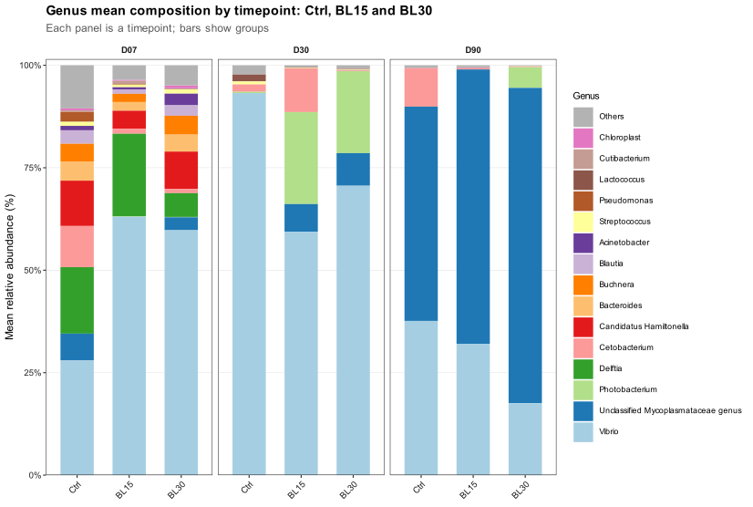

**Figura 3. Composición media a nivel de género por tiempo.** Cada panel es un
tiempo y las barras comparan `Ctrl`, `BL15` y `BL30`.

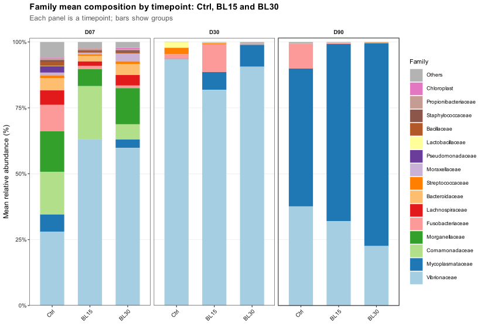

**Figura 4. Composición media a nivel de familia por tiempo.** Esta orientación
facilita comparar dietas dentro de cada día.

La vista por tiempo muestra mejor el efecto relativo de la dieta:

- En `D07`, los hidrolizados presentan mayor dominancia de `Vibrio`
  (`BL15` 63.0%; `BL30` 59.8%) que el control (`Ctrl` 28.0%).
- En `D30`, `Ctrl` es el grupo más dominado por `Vibrio` (93.1%). En
  hidrolizados, `Vibrio` sigue siendo dominante, pero aparece una fracción
  relevante de `Photobacterium` (`BL15` 22.4%; `BL30` 20.0%).
- En `D90`, aumenta claramente `Unclassified Mycoplasmataceae genus`, con una
  posible relación dosis-respuesta: `Ctrl` 52.3%, `BL15` 66.9% y `BL30` 76.9%.

La interpretación biológica más parsimoniosa es una sucesión temporal desde una
comunidad inicial relativamente heterogénea hacia una comunidad dominada por
pocos taxones. El hidrolizado parece modular esa sucesión: favorece mayor
dominancia temprana de `Vibrio`, mantiene `Photobacterium` en la fase intermedia
y se asocia a una mayor dominancia tardía de Mycoplasmataceae, especialmente en
`BL30`.

## 5. Comparación Ctrl, Hydrolysate y Feed

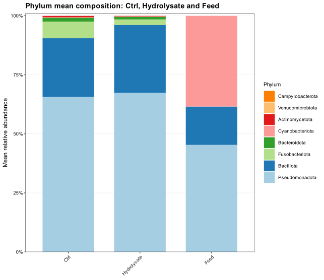

**Figura 5. Composición media a nivel de filo en `Ctrl`, `Hydrolysate` y
`Feed`.** Esta figura permite evaluar si la señal del pienso aparece en el
intestino.

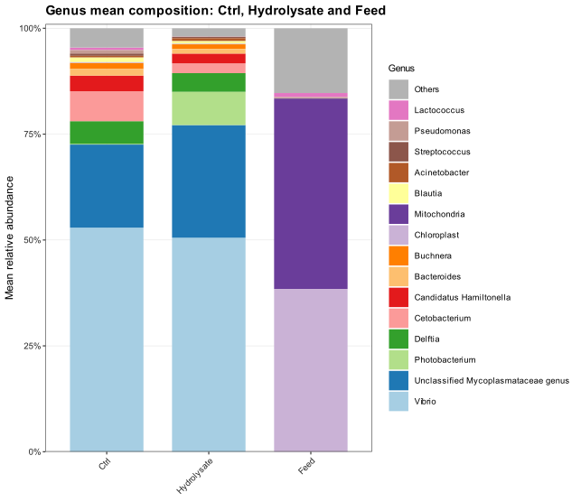

**Figura 6. Composición media a nivel de género/categoría final identificada en
`Ctrl`, `Hydrolysate` y `Feed`.**

La composición global del intestino (`Ctrl` y `Hydrolysate`) es muy distinta de
la del pienso. En intestino predominan `Pseudomonadota` y `Bacillota`, mientras
que el pienso contiene una proporción muy elevada de señales eucariotas o
derivadas de ingredientes: `Mitochondria`, compatible con material animal como
hidrolizado de pescado, y `Chloroplast`, compatible con componentes vegetales.

Composición global a nivel de filo:

| Grupo | Pseudomonadota (%) | Bacillota (%) | Fusobacteriota (%) | Cyanobacteriota / Chloroplast (%) |
|---|---:|---:|---:|---:|
| Ctrl | 65.65 | 24.82 | 7.07 | 0.19 |
| Hydrolysate | 67.38 | 28.75 | 2.32 | 0.17 |
| Feed | 45.33 | 16.24 | 0.00 | 38.43 |

Composición global a nivel de familia/género:

| Grupo | Taxón principal 1 | % | Taxón principal 2 | % | Taxón principal 3 | % |
|---|---|---:|---|---:|---|---:|
| Ctrl | Vibrio | 52.91 | Unclassified Mycoplasmataceae genus | 19.63 | Cetobacterium | 7.07 |
| Hydrolysate | Vibrio | 50.54 | Unclassified Mycoplasmataceae genus | 26.60 | Photobacterium | 7.84 |
| Feed | Mitochondria | 44.98 | Chloroplast | 38.43 | Others | 15.29 |

### 5.1. Cloroplasto, mitocondria y posible transferencia del pienso al intestino

El cloroplasto y la mitocondria son muy abundantes en el pienso, pero casi
ausentes en el intestino. Esto es importante porque en este proyecto se decidió
no eliminar cloroplasto ni mitocondria para poder evaluar explícitamente si la
señal del feed aparece en las muestras intestinales. En este contexto,
`Chloroplast` se interpreta como señal compatible con ingredientes vegetales,
mientras que `Mitochondria` es compatible con material eucariota/animal, incluido
el hidrolizado de pescado.

Porcentaje medio global:

| Grupo | Chloroplast (%) | Mitochondria (%) | Chloroplast + Mitochondria (%) |
|---|---:|---:|---:|
| Ctrl | 0.186 | 0.032 | 0.218 |
| Hydrolysate | 0.169 | 0.006 | 0.176 |
| Feed | 38.431 | 44.976 | 83.407 |

Porcentaje medio por tiempo para `Ctrl` y `Hydrolysate`:

| Tiempo | Grupo | Chloroplast (%) | Mitochondria (%) |
|---|---|---:|---:|
| D07 | Ctrl | 0.479 | 0.003 |
| D07 | Hydrolysate | 0.478 | 0.006 |
| D30 | Ctrl | 0.002 | 0.003 |
| D30 | Hydrolysate | 0.000 | 0.000 |
| D90 | Ctrl | 0.079 | 0.088 |
| D90 | Hydrolysate | 0.019 | 0.013 |

Porcentaje medio por tiempo y nivel de hidrolizado:

| Tiempo | Dieta | Chloroplast (%) | Mitochondria (%) |
|---|---|---:|---:|
| D07 | Ctrl | 0.479 | 0.003 |
| D07 | BL15 | 0.270 | 0.002 |
| D07 | BL30 | 0.686 | 0.010 |
| D30 | Ctrl | 0.002 | 0.003 |
| D30 | BL15 | 0.001 | 0.000 |
| D30 | BL30 | 0.000 | 0.000 |
| D90 | Ctrl | 0.079 | 0.088 |
| D90 | BL15 | 0.010 | 0.011 |
| D90 | BL30 | 0.028 | 0.016 |

La señal de cloroplasto y mitocondria en intestino es dos órdenes de magnitud
menor que en el pienso. Aunque en `D07` aparece una señal intestinal de
cloroplasto alrededor de 0.48% en `Ctrl` y `Hydrolysate`, sigue siendo muy baja
frente al 38.43% del pienso. La señal mitocondrial es aún menor en intestino
(`Ctrl` 0.032%; `Hydrolysate` 0.006%) frente al 44.98% del feed. Por tanto,
estos datos no apoyan una transferencia masiva de material vegetal ni animal del
pienso a las lecturas intestinales retenidas. La fracción dominante del pienso
tampoco reproduce la estructura intestinal, lo que sugiere que los barplots
intestinales reflejan principalmente comunidad asociada al intestino y no
arrastre directo del feed.

## 6. Barplots por muestra

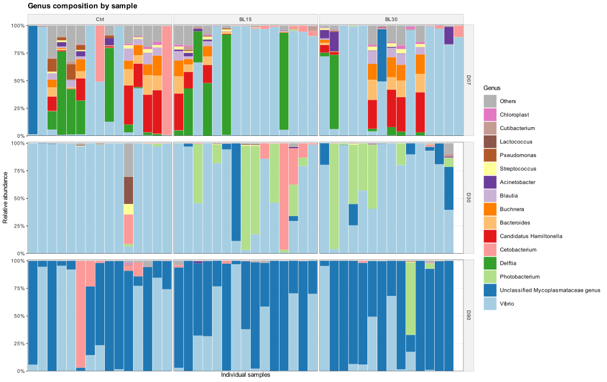

**Figura 7. Composición individual por muestra a nivel de género.** Los nombres
de muestra se eliminan del eje para evitar ilegibilidad; la trazabilidad queda
en las tablas fuente mediante `sample_id` y `sample_index`.

Los barplots individuales muestran que el patrón medio no está producido por una
única muestra aislada. Aun así, se observa variabilidad individual dentro de cada
grupo, especialmente en `D07`, donde la comunidad está menos dominada por un solo
taxón. En `D30` y `D90`, la variabilidad visual disminuye porque la comunidad se
vuelve más dominada por `Vibrio` o Mycoplasmataceae, respectivamente.

Tabla fuente:
[`genus_relative_abundance_by_sample.csv`](../assets/results/05_taxonomic_composition/tables/barplots/samples/genus_relative_abundance_by_sample.csv)

## 7. Controles mock ZymoBIOMICS

Para el mock se usa la composición teórica **16S Only** del estándar
ZymoBIOMICS Microbial Community Standard D6300. Esa columna es la referencia
adecuada para amplicones 16S. Las levaduras del estándar tienen valor `NA` en la
columna 16S-only, por lo que no se incluyen en la barra esperada bacteriana.

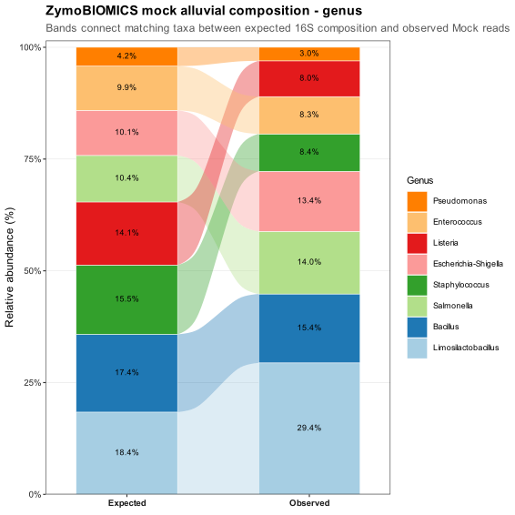

**Figura 8. Mock a nivel de género, comparación expected vs observed con
conexión alluvial.**

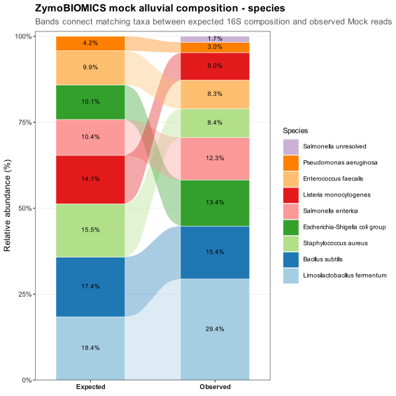

**Figura 9. Mock a nivel de especie, comparación expected vs observed con
conexión alluvial.**

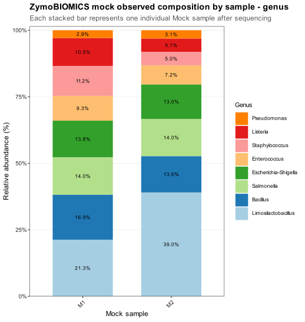

**Figura 10. Composición observada por muestra mock a nivel de género.**

El mock recupera los ocho géneros bacterianos esperados:
`Limosilactobacillus`, `Bacillus`, `Staphylococcus`, `Listeria`, `Salmonella`,
`Escherichia-Shigella`, `Enterococcus` y `Pseudomonas`. La recuperación no es
perfectamente proporcional: `Limosilactobacillus` aparece sobrerrepresentado
(18.4% esperado frente a 29.4% observado), mientras que `Staphylococcus`,
`Listeria` y `Pseudomonas` aparecen por debajo de la abundancia esperada.

Resumen del mock a nivel de género:

| Género | Esperado 16S (%) | Observado (%) |
|---|---:|---:|
| Limosilactobacillus | 18.4 | 29.4 |
| Bacillus | 17.4 | 15.4 |
| Staphylococcus | 15.5 | 8.4 |
| Listeria | 14.1 | 8.0 |
| Salmonella | 10.4 | 14.0 |
| Escherichia-Shigella | 10.1 | 13.4 |
| Enterococcus | 9.9 | 8.3 |
| Pseudomonas | 4.2 | 3.0 |

Esta desviación es compatible con sesgos habituales de extracción, amplificación
16S, número de copias ribosomales y asignación taxonómica. Aun así, la señal
global del mock es coherente con el estándar y no apunta a un fallo general de
secuenciación o asignación.

Notas de nomenclatura aplicadas:

- `Lactobacillus fermentum` se normaliza como
  `Limosilactobacillus fermentum`.
- `Escherichia` se interpreta como `Escherichia-Shigella`.
- `Bacillus subtilis group` se reporta como `Bacillus subtilis`.

Tablas fuente:

- [`mock_genus_expected_vs_observed.csv`](../assets/results/05_taxonomic_composition/tables/barplots/mock/mock_genus_expected_vs_observed.csv)
- [`mock_species_expected_vs_observed.csv`](../assets/results/05_taxonomic_composition/tables/barplots/mock/mock_species_expected_vs_observed.csv)
- [`mock_genus_expected_vs_observed_alluvial.csv`](../assets/results/05_taxonomic_composition/tables/barplots/mock/mock_genus_expected_vs_observed_alluvial.csv)
- [`mock_species_expected_vs_observed_alluvial.csv`](../assets/results/05_taxonomic_composition/tables/barplots/mock/mock_species_expected_vs_observed_alluvial.csv)

## 8. Venn y UpSet

Los análisis de Venn y UpSet resumen taxones compartidos y exclusivos entre
grupos a partir de presencia/ausencia. Se usan como análisis descriptivo
complementario a los barplots de abundancia relativa, porque indican qué
componentes forman parte del core de cada grupo aunque no necesariamente sean
los más abundantes.

Se definió como core aquel taxón presente en al menos el 50 % de las muestras
del grupo. El análisis se realiza a dos niveles: género y ASV. Los Venn se
redibujaron con fondo blanco, círculos translúcidos y estética limpia tipo
publicación. Para conservar una lectura clara, los círculos mantienen la
geometría clásica de Venn y sus radios se escalan suavemente según el tamaño de
cada conjunto. Las etiquetas muestran el número de taxones y, entre paréntesis,
el porcentaje respecto al total representado en ese Venn.

Los resultados se guardan en subcarpetas separadas:

- Género: [`../assets/results/05_taxonomic_composition/figures/venn/genus/`](../assets/results/05_taxonomic_composition/figures/venn/genus/),
  [`../assets/results/05_taxonomic_composition/figures/upset/genus/`](../assets/results/05_taxonomic_composition/figures/upset/genus/) y
  [`../assets/results/05_taxonomic_composition/tables/overlap/genus/`](../assets/results/05_taxonomic_composition/tables/overlap/genus/).
- ASV: [`../assets/results/05_taxonomic_composition/figures/venn/asv/`](../assets/results/05_taxonomic_composition/figures/venn/asv/),
  [`../assets/results/05_taxonomic_composition/figures/upset/asv/`](../assets/results/05_taxonomic_composition/figures/upset/asv/) y
  [`../assets/results/05_taxonomic_composition/tables/overlap/asv/`](../assets/results/05_taxonomic_composition/tables/overlap/asv/).

Las etiquetas y porcentajes representados en los Venn quedan documentados en
[`core_genus_venn_region_labels.csv`](../assets/results/05_taxonomic_composition/tables/overlap/genus/core_genus_venn_region_labels.csv)
y
[`core_asv_venn_region_labels.csv`](../assets/results/05_taxonomic_composition/tables/overlap/asv/core_asv_venn_region_labels.csv).

Las comparaciones seleccionadas para Venn fueron las que responden de
forma más directa al diseño experimental:

| Contraste | Grupos | Motivo |
|---|---|---|
| Global por dieta | `Ctrl`, `BL15`, `BL30` | Evalúa el core específico de cada dieta considerando todo el experimento. |
| Global Ctrl vs Hydrolysate | `Ctrl`, `Hydrolysate` | Integra `BL15` y `BL30` para responder a la pregunta global control frente a hidrolizado. |
| Global Ctrl vs Hydrolysate vs Feed | `Ctrl`, `Hydrolysate`, `Feed` | Evalúa si el core del pienso aparece también como core intestinal en control o hidrolizado. |
| Por día, dieta completa | `Ctrl`, `BL15`, `BL30` en `D07`, `D30`, `D90` | Permite identificar géneros core compartidos/exclusivos dependientes del tiempo. |
| Por día, Ctrl vs Hydrolysate | `Ctrl`, `Hydrolysate` en `D07`, `D30`, `D90` | Resume el efecto global del hidrolizado en cada tiempo. |

Los contrastes temporales dentro de una dieta (`D07`, `D30`, `D90` dentro de
`Ctrl`, `BL15` o `BL30`) se conservan como UpSet y tablas, pero no como Venn,
porque una figura de tres tiempos tiende a ser menos legible y aporta menos que
la matriz de intersecciones para este caso. Esta decisión queda recogida en
[`core_genus_overlap_comparison_plan.csv`](../assets/results/05_taxonomic_composition/tables/overlap/genus/core_genus_overlap_comparison_plan.csv)
y
[`core_asv_overlap_comparison_plan.csv`](../assets/results/05_taxonomic_composition/tables/overlap/asv/core_asv_overlap_comparison_plan.csv).

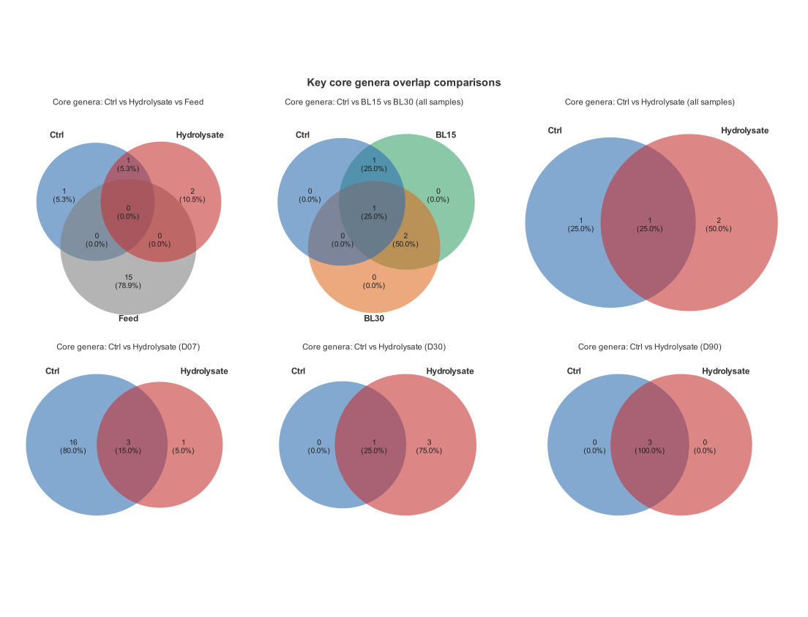

**Figura 11. Panel compuesto de los Venn más informativos a nivel de género.**
El panel integra la comparación global `Ctrl`-`Hydrolysate`-`Feed`, los
contrastes globales por dieta y por hidrolizado, y los contrastes temporales
`Ctrl` frente a `Hydrolysate` en `D07`, `D30` y `D90`. Esta figura resume de
forma compacta qué géneros forman parte del core compartido o exclusivo en las
comparaciones biológicamente más relevantes.

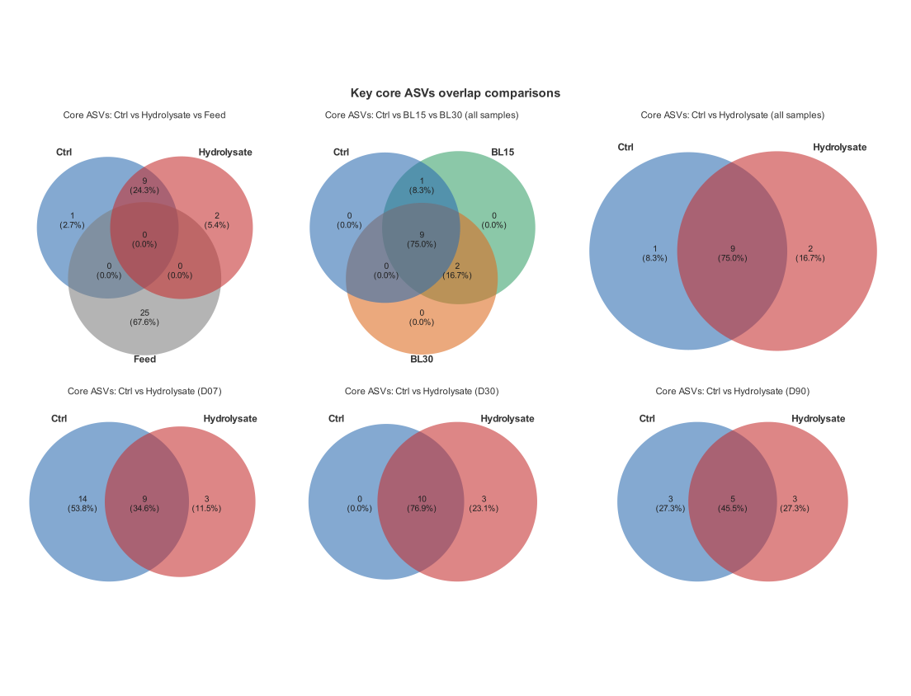

**Figura 12. Panel compuesto de los Venn más informativos a nivel de ASV.**
La misma selección de contrastes se representa a resolución de ASV para
comprobar si los patrones observados a nivel de género se mantienen cuando no
se agregan variantes de secuencia.

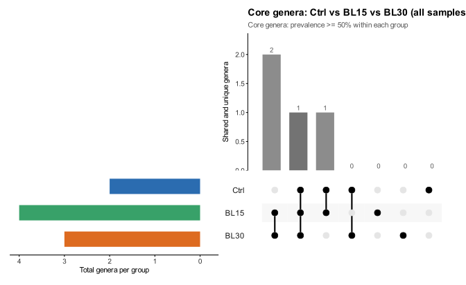

**Figura 13. UpSet global de géneros core por dieta.**

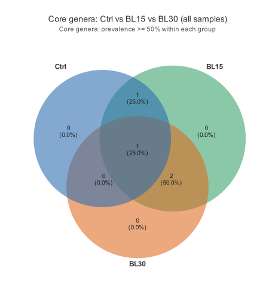

**Figura 14. Venn global de géneros core por dieta.** Los círculos representan
los conjuntos de géneros core de `Ctrl`, `BL15` y `BL30`; las etiquetas indican
el número real de géneros y su porcentaje dentro del Venn.

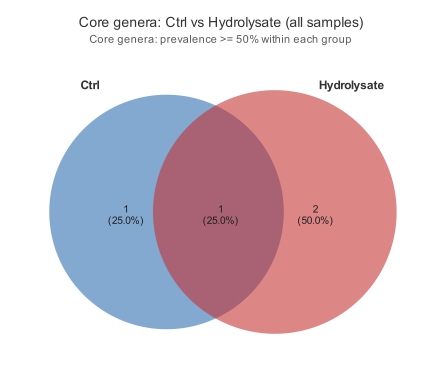

**Figura 15. Venn global de géneros core comparando `Ctrl` e `Hydrolysate`.**
Esta figura resume la pregunta global de control frente a hidrolizado agrupando
`BL15` y `BL30`.

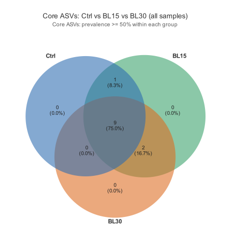

**Figura 16. Venn global de ASVs core por dieta.** Esta versión conserva la
resolución de ASV y permite comprobar si el patrón observado a nivel de género
se mantiene a mayor resolución.

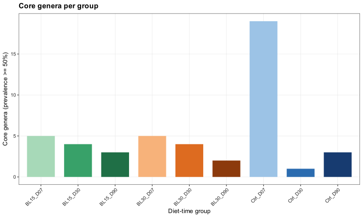

**Figura 17. Resumen del número de géneros core por grupo dieta-tiempo.**

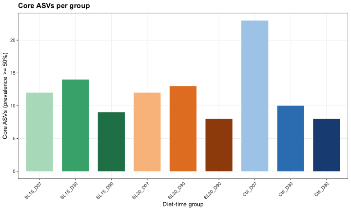

**Figura 18. Resumen del número de ASVs core por grupo dieta-tiempo.**

Estos gráficos deben interpretarse junto con las listas de géneros comunes y
ASVs comunes y exclusivos en [`../assets/results/05_taxonomic_composition/tables/overlap/genus/`](../assets/results/05_taxonomic_composition/tables/overlap/genus/)
y [`../assets/results/05_taxonomic_composition/tables/overlap/asv/`](../assets/results/05_taxonomic_composition/tables/overlap/asv/), ya que el tamaño de las
intersecciones depende del umbral de prevalencia usado para definir core.

En la comparación global `Ctrl`-`Hydrolysate`-`Feed`, el core del pienso queda
separado del core intestinal: con el umbral de prevalencia del 50 %, no se
detectan géneros ni ASVs core compartidos entre `Feed` y los grupos intestinales.
A nivel de género, la mayor parte del core representado corresponde a taxones
exclusivos de `Feed` (15 géneros; 78.9 % del Venn), mientras que `Ctrl` e
`Hydrolysate` comparten solo un género core. A nivel de ASV ocurre el mismo
patrón: 25 ASVs exclusivos de `Feed` (67.6 %), 9 ASVs compartidos por `Ctrl` e
`Hydrolysate` (24.3 %) y ausencia de intersecciones core con `Feed`. Esto apoya
que la microbiota intestinal core no es una simple traslación del core
detectado en el pienso.

## 9. Interpretación integrada

Los barplots apoyan una dinámica sucesional fuerte de la microbiota intestinal:

1. `D07`: comunidad más heterogénea, con `Vibrio` como componente importante
   pero acompañado por otros géneros.
2. `D30`: fase de alta dominancia de `Vibrio`/`Vibrionaceae`, especialmente en
   `Ctrl`.
3. `D90`: desplazamiento hacia `Mycoplasmataceae`, más intenso en hidrolizados
   y especialmente en `BL30`.

El hidrolizado no parece producir un cambio composicional simple, sino modificar
la trayectoria temporal: mayor dominancia temprana de `Vibrio`, presencia de
`Photobacterium` en la fase intermedia y mayor peso tardío de
Mycoplasmataceae.

La comparación con pienso indica que, aunque el feed contiene mucha señal de
cloroplasto y mitocondria, ambas señales apenas aparecen en intestino. Por
tanto, no hay evidencia fuerte de que la composición intestinal observada sea un
reflejo directo de la composición del pienso o de arrastre masivo de material
vegetal/animal de la dieta.

## 10. Verificación

El bloque se regeneró con el entorno conda `r45`. Los outputs de figuras se
guardaron exclusivamente en formato `SVG` y `PDF`. La versión actual conserva
cloroplasto y mitocondria en el filtrado para permitir la comparación explícita
con el pienso.
