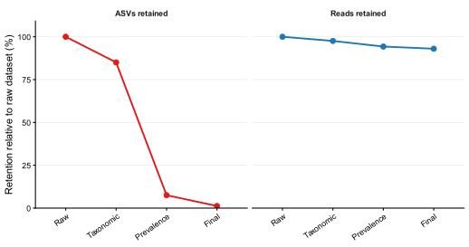

# Filtrados del conjunto de datos

## Objetivo del bloque

En este capítulo se documenta el filtrado aplicado a la tabla de ASVs generada en el preprocesamiento. Aquí se define el **set de ASVs que alimenta los análisis posteriores**. El filtrado parte del objeto importado con todas las muestras y genera dos tipos de salida: un objeto global filtrado, útil para mock/feed/composición, y un subconjunto intestinal para diversidad, abundancia diferencial y análisis funcional.

El run documentado es `run_02_optimized` con taxonomía primaria `silva_138_2`. El filtrado se aplicó a **todas las muestras importadas**: intestino, mock y pienso. Esta decisión mejora la trazabilidad porque los controles técnicos y las muestras de pienso no quedan fuera de la auditoría, aunque los análisis biológicos principales de peces se ejecutan con los objetos intestinales `ps_biological_*`.

::: {.callout-important title="Decisión específica de este proyecto"}
En esta versión **no se eliminan cloroplastos ni mitocondrias**. Aunque suele hacerse en análisis bacterianos estándar, aquí se conserva esa señal porque las muestras de pienso contienen componentes vegetales y derivados de pescado, y esa información es necesaria para interpretar si parte de la señal del feed aparece o no en intestino.
:::

## Inputs y organización

Los inputs del bloque se resumen en la @tbl-filtering-inputs. El script principal es `02_filter_and_summarize.R`, incluido en el anexo @sec-filtering-scripts.

| Input | Descripción | Uso |
|------------------------|------------------------|------------------------|
| `ps_all_silva_138_2.rds` | Objeto phyloseq global importado tras el preprocesamiento y la asignación taxonómica SILVA. | Punto de partida del filtrado downstream. |
| `sample_metadata_standardized.tsv` | Metadatos estandarizados con tipo de muestra, dieta, tiempo y grupos derivados. | Definir grupos de prevalencia y subconjuntos biológicos. |
| `downstream_params.yaml` | Configuración del análisis downstream. | Fijar umbrales de prevalencia, abundancia y criterios taxonómicos. |

: Inputs principales del bloque de filtering {#tbl-filtering-inputs}

Los parámetros relevantes del bloque se muestran en la @tbl-filtering-params. El filtrado se aplica a nivel de ASV, antes de generar objetos agregados a género, familia y filo.

| Parámetro | Valor | Interpretación |
|----------------------|---------------------------:|----------------------|
| `remove_eukaryota` | `TRUE` | Elimina ASVs asignadas a Eukaryota o no asignadas como señal bacteriana útil. |
| `remove_unclassified_all_ranks` | `TRUE` | Elimina ASVs sin asignación en todos los rangos disponibles. |
| `remove_kingdom_only` | `TRUE` | Elimina ASVs clasificadas solo a nivel de reino. |
| `remove_mitochondria_chloroplast` | `FALSE` | Conserva cloroplasto y mitocondria por interés específico en feed. |
| `min_prevalence_fraction_within_diet_time` | `0.10` | Requiere presencia en al menos el 10% del grupo de prevalencia. |
| `min_prevalence_absolute` | `2` | Requiere al menos 2 muestras, salvo grupos con n menor. |
| `min_mean_relative_abundance` | `0.0001` | Retiene ASVs con abundancia relativa media global \>= 0.01%. |

: Parámetros principales del filtrado downstream {#tbl-filtering-params}

## Diseño del filtrado

El filtrado sigue tres pasos secuenciales. Primero se aplica un filtro taxonómico, después un filtro de prevalencia dentro de grupos comparables y finalmente un filtro de abundancia relativa media global. Esta estructura evita que una ASV rara o mal clasificada distorsione análisis downstream, pero conserva ASVs específicas de dieta, tiempo, feed o mock si son reproducibles dentro de su grupo.

### Filtro taxonómico

El filtro taxonómico elimina ASVs asignadas a `Eukaryota` o `Unassigned`, ASVs sin clasificación en todos los rangos disponibles, y ASVs clasificadas únicamente a nivel de reino. En cambio, cloroplasto y mitocondria quedan retenidos. Esta diferencia es clave: se elimina señal taxonómicamente inutilizable para microbiota bacteriana, pero se conserva señal organelar interpretable en el contexto del pienso, ya que estas muestras poseen componentes vegetales y animales que determinan esta composición.

### Filtro de prevalencia

La prevalencia se calcula dentro de grupos definidos por el diseño experimental, no sobre todo el dataset mezclado. Esto evita penalizar ASVs que son reproducibles dentro de un contexto concreto, por ejemplo una dieta-tiempo, un tipo de pienso o el mock, pero que no tienen por qué aparecer en grupos biológicamente distintos. Si la prevalencia se calculara sobre todas las muestras a la vez, se favorecerían taxones ubicuos y se perdería señal específica de tratamiento, tiempo o control técnico. Los grupos y umbrales aplicados se resumen en la @tbl-prevalence-groups. Para intestino se usa `diet_time`, para feed se usa el tipo de pienso y para mock se usa el grupo técnico `Mock`.

| Grupo | n muestras | Fracción mínima | Umbral absoluto configurado | Umbral aplicado |
|---------------|--------------:|--------------:|--------------:|--------------:|
| BL15_D07 | 15 | 0.10 | 2 | 2 |
| BL15_D30 | 15 | 0.10 | 2 | 2 |
| BL15_D90 | 15 | 0.10 | 2 | 2 |
| BL30_D07 | 15 | 0.10 | 2 | 2 |
| BL30_D30 | 14 | 0.10 | 2 | 2 |
| BL30_D90 | 14 | 0.10 | 2 | 2 |
| Ctrl_D07 | 15 | 0.10 | 2 | 2 |
| Ctrl_D30 | 15 | 0.10 | 2 | 2 |
| Ctrl_D90 | 15 | 0.10 | 2 | 2 |
| Feed_BL15 | 1 | 0.10 | 2 | 1 |
| Feed_BL30 | 1 | 0.10 | 2 | 1 |
| Feed_Ctrl | 1 | 0.10 | 2 | 1 |
| Mock | 2 | 0.10 | 2 | 2 |

: Grupos de prevalencia y umbral aplicado {#tbl-prevalence-groups}

::: {.callout-warning title="Umbral especial en feed"}
Las muestras de pienso (`Feed`) tienen una única muestra por dieta. Por eso el umbral absoluto se limita al tamaño real del grupo: si se exigieran 2 muestras, todas las ASVs específicas de feed quedarían artificialmente eliminadas por diseño, no por ausencia biológica.
:::

### Filtro de abundancia media

Después de taxonomía y prevalencia, se retienen solo ASVs con abundancia relativa media global \>= `0.0001` (**0.01%**). Este paso reduce ruido residual de ASVs muy raras que sobreviven a la prevalencia pero aportan poca señal cuantitativa al conjunto global.

## Resultados principales

El dataset bruto contiene **138 muestras**, **14,652 ASVs** y **7,667,921 lecturas**. Tras el filtrado final quedan **175 ASVs** y **7,133,190 lecturas** en el objeto global. El subconjunto intestinal final conserva **133 muestras**, **169 ASVs** y **6,931,390 lecturas**.

La @tbl-filtering-summary muestra el efecto de cada paso. El filtro más restrictivo en número de ASVs es el de prevalencia: reduce la matriz de 12,461 a 1,101 ASVs, pero elimina relativamente pocas lecturas. Esto indica que la mayoría de ASVs eliminadas son raras, poco reproducibles o de baja contribución cuantitativa.

| Paso | Muestras | ASVs | Reads | Reads mín. | Reads mediana | Reads máx. | ASVs eliminadas vs paso previo |
|---------|--------:|--------:|--------:|--------:|--------:|--------:|--------:|
| Raw all samples | 138 | 14,652 | 7,667,921 | 28,400 | 56,881 | 86,842 | NA |
| Taxonomic filter | 138 | 12,461 | 7,481,712 | 17,587 | 56,361 | 86,359 | 2,191 |
| Prevalence filter | 138 | 1,101 | 7,230,537 | 17,336 | 55,616.5 | 86,087 | 11,360 |
| Mean abundance filter | 138 | 175 | 7,133,190 | 17,111 | 55,392 | 86,030 | 926 |

: Resumen global del filtrado {#tbl-filtering-summary}

La @fig-filtering-retention-asvs-reads resume visualmente el efecto del filtrado: el objeto final conserva **93.0% de las lecturas brutas**, pero solo **1.2% de las ASVs iniciales**. Este desacoplamiento es importante porque indica que el filtrado elimina sobre todo variantes raras o de bajo soporte, no la señal cuantitativa dominante.

{#fig-filtering-retention-asvs-reads fig-align="center" width="85%"}

La retención por tipo de muestra se resume en la @tbl-filtering-by-sample-type. La señal de mock se conserva casi íntegramente y el feed pierde pocas lecturas en el filtro taxonómico, precisamente porque cloroplasto y mitocondria no se eliminan.

| Paso | Tipo de muestra | n | Reads | Reads mín. | Reads mediana | Reads máx. |
|-----------|-----------|----------:|----------:|----------:|----------:|----------:|
| Raw all samples | Intestine | 133 | 7,452,457 | 28,400 | 56,945 | 86,842 |
| Raw all samples | Feed | 3 | 145,198 | 44,535 | 48,092 | 52,571 |
| Raw all samples | Mock | 2 | 70,266 | 32,235 | 35,133 | 38,031 |
| Taxonomic filter | Intestine | 133 | 7,266,286 | 17,587 | 56,568 | 86,359 |
| Taxonomic filter | Feed | 3 | 145,162 | 44,526 | 48,080 | 52,556 |
| Taxonomic filter | Mock | 2 | 70,264 | 32,233 | 35,132 | 38,031 |
| Final global | Intestine | 133 | 6,931,390 | 17,111 | 55,673 | 86,030 |
| Final global | Feed | 3 | 131,830 | 41,298 | 41,892 | 48,640 |
| Final global | Mock | 2 | 69,970 | 32,060 | 34,985 | 37,910 |

: Reads retenidos por tipo de muestra {#tbl-filtering-by-sample-type}

La @tbl-asv-counts-by-filter-step resume las ASVs retenidas y eliminadas por motivo. Aunque se eliminan muchas ASVs, el número de lecturas afectadas es proporcionalmente bajo. La señal dominante queda conservada mientras la dimensionalidad baja de forma drástica.

| Paso | Motivo | ASVs | Reads brutos asociados |
|------------------|------------------|------------------:|------------------:|
| Retenidas finales | Retenidas | 175 | 7,133,190 |
| Filtro taxonómico | Sin asignación en todos los rangos | 1,632 | 176,947 |
| Filtro taxonómico | Solo reino | 559 | 9,262 |
| Filtro de prevalencia | Baja prevalencia | 11,360 | 251,175 |
| Filtro de abundancia media | Baja abundancia media | 926 | 97,347 |

: ASVs por paso y motivo de filtrado {#tbl-asv-counts-by-filter-step}

## Taxones eliminados y trazabilidad

La tabla `removed_asvs.csv` permite revisar ASVs concretas que desaparecen. Entre las ASVs eliminadas por abundancia media hay ASVs asignadas a géneros como `Photobacterium`, `Delftia`, `Companilactobacillus`, `Bacillus`, `Staphylococcus`, `Serratia` o `Bacteroides`. Por ejemplo, **`ASV00214`**, asignada a `Photobacterium`, supera el filtro de prevalencia pero se elimina en el filtro final de abundancia media con **639 lecturas brutas**.

::: {.callout-warning title="Ausencia en plots no equivale a ausencia en bruto"}
Que un taxón no aparezca en los plots finales no significa necesariamente que esté completamente ausente del dataset bruto. Puede estar presente, pero no superar los criterios de prevalencia o abundancia definidos para el objeto final.
:::

## Tablas descargables y vistas previas

Las tablas principales están incluidas como CSV descargables en el repositorio Quarto. Las tablas pequeñas se resumen en el texto; para tablas grandes, la web incluye enlace de descarga y una vista previa breve para evitar páginas demasiado pesadas.

| Archivo | Contenido | Enlace |
|------------------------|------------------------|------------------------|
| `filtering_summary.csv` | Resumen global por paso de filtrado. | <a href="../assets/results/02_filtering/tables/filtering_summary.csv" download>Descargar CSV</a> |
| `filtering_summary_by_sample_type.csv` | Retención de reads por paso y tipo de muestra. | <a href="../assets/results/02_filtering/tables/filtering_summary_by_sample_type.csv" download>Descargar CSV</a> |
| `prevalence_filter_groups.csv` | Grupos y umbrales usados para prevalencia. | <a href="../assets/results/02_filtering/tables/prevalence_filter_groups.csv" download>Descargar CSV</a> |
| `sample_filtering_groups.csv` | Asignación de cada muestra a su grupo de prevalencia. | <a href="../assets/results/02_filtering/tables/sample_filtering_groups.csv" download>Descargar CSV</a> |
| `asv_counts_by_filter_step.csv` | Conteo de ASVs por paso/motivo de filtrado. | <a href="../assets/results/02_filtering/tables/asv_counts_by_filter_step.csv" download>Descargar CSV</a> |
| `filtering_retention_asvs_reads.csv` | Datos resumidos usados para representar la retención relativa de ASVs y lecturas. | <a href="../assets/results/02_filtering/tables/filtering_retention_asvs_reads.csv" download>Descargar CSV</a> |
| `retained_asvs.csv` | ASVs retenidas en el objeto final. | <a href="../assets/results/02_filtering/tables/retained_asvs.csv" download>Descargar CSV</a> |
| `removed_asvs.csv` | ASVs eliminadas, con taxonomía y motivo. | <a href="../assets/results/02_filtering/tables/removed_asvs.csv" download>Descargar CSV</a> |
| `asv_filtering_status.csv` | Auditoría completa por ASV y paso de filtrado. | <a href="../assets/results/02_filtering/tables/asv_filtering_status.csv" download>Descargar CSV</a> |
| `final_sample_depths.csv` | Profundidades finales de todas las muestras. | <a href="../assets/results/02_filtering/tables/final_sample_depths.csv" download>Descargar CSV</a> |
| `final_biological_sample_depths.csv` | Profundidades finales del subconjunto intestinal. | <a href="../assets/results/02_filtering/tables/final_biological_sample_depths.csv" download>Descargar CSV</a> |

: Tablas descargables del bloque de filtering {#tbl-filtering-downloads}

<strong>removed_asvs.csv</strong>: vista previa de ASVs eliminadas por abundancia media

| ASV | Reads brutos | Filtro taxonómico | Filtro prevalencia | Filtro abundancia | Filo | Familia | Género | Motivo |
|--------|-------:|--------|--------|--------|--------|--------|--------|--------|
| ASV00197 | 720 | TRUE | TRUE | FALSE | Bacillota | Enterococcaceae | Enterococcus | mean_abundance_filter |
| ASV00214 | 639 | TRUE | TRUE | FALSE | Pseudomonadota | Vibrionaceae | Photobacterium | mean_abundance_filter |
| ASV00219 | 633 | TRUE | TRUE | FALSE | Bacillota | Lactobacillaceae | Periweissella | mean_abundance_filter |
| ASV00227 | 600 | TRUE | TRUE | FALSE | Pseudomonadota | Comamonadaceae | Delftia | mean_abundance_filter |
| ASV00233 | 584 | TRUE | TRUE | FALSE | Bacillota | Lactobacillaceae | Companilactobacillus | mean_abundance_filter |

## Outputs para downstream

El filtrado exporta objetos globales y objetos intestinales. Los análisis de composición que comparan intestino con feed pueden usar el objeto global filtrado. En cambio, diversidad alfa, diversidad beta, abundancia diferencial y predicción funcional deben usar los objetos intestinales `ps_biological_*`, porque mock y feed no son muestras biológicas equivalentes a intestino.

| Objeto | Contenido | Uso recomendado |
|------------------------|------------------------|------------------------|
| `ps_final_silva_138_2.rds` | Objeto global filtrado a nivel ASV. | Composición global, mock/feed, trazabilidad. |
| `ps_genus_silva_138_2.rds` | Objeto global agregado a género. | Barplots y comparaciones descriptivas globales. |
| `ps_biological_final_silva_138_2.rds` | Subconjunto intestinal filtrado a nivel ASV. | Diversidad alfa/beta y abundancia diferencial. |
| `ps_biological_genus_silva_138_2.rds` | Subconjunto intestinal agregado a género. | Diversidad y abundancia diferencial a género. |
| `filtering_steps_silva_138_2.rds` | Trayectoria completa del filtrado. | Auditoría y reproducibilidad. |

: Objetos principales generados por el filtrado {#tbl-filtering-objects}

## Scripts reproducibles

La trazabilidad del bloque queda respaldada por el script principal `02_filter_and_summarize.R` y las funciones auxiliares de `lib_downstream.R`, incluidos en el anexo @sec-filtering-scripts. La @tbl-filtering-scripts enlaza cada pieza con su anexo renderizado.

| Componente | Script | Anexo |
|------------------------|------------------------|------------------------|
| Filtrado y exportación de tablas/objetos | `02_filter_and_summarize.R` | @sec-script-02-filter-and-summarize-r |
| Funciones auxiliares downstream | `lib_downstream.R` | @sec-script-lib-downstream-filtering-r |

: Scripts del bloque de filtering {#tbl-filtering-scripts}

## Interpretación metodológica

El filtrado produce un objeto final muy reducido en número de ASVs, pero con **alta retención de lecturas**. Este comportamiento es esperable en datos 16S: muchas ASVs aparecen con baja abundancia, baja prevalencia o asignación taxonómica débil, mientras que pocas ASVs concentran la mayor parte de la señal cuantitativa.

La decisión de aplicar el filtrado a todas las muestras mejora la trazabilidad: mock y feed ya no quedan fuera de la auditoría. Aun así, los análisis biológicos de peces deben usar los objetos intestinales `ps_biological_*`. La señal de feed requiere una lectura específica porque conserva cloroplasto y mitocondria; esto permite estudiar si componentes del pienso se detectan en intestino, pero obliga a distinguir señal microbiana bacteriana de señal derivada de ingredientes vegetales o material eucariota procedente de mitocondrias, principalmente.

## Consecuencias para los bloques siguientes

Los análisis de diversidad alfa, beta y abundancia diferencial deben partir de `ps_biological_final` o sus agregados taxonómicos. Los análisis de composición que comparen intestino con feed pueden usar el objeto global filtrado, manteniendo claro que cloroplasto y mitocondria están conservados. Los análisis de mock deben interpretarse como control técnico de recuperación taxonómica y composición esperada, no como grupo biológico.