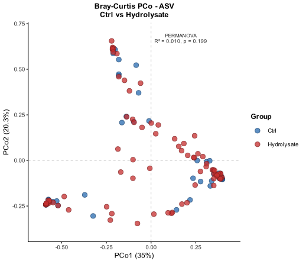
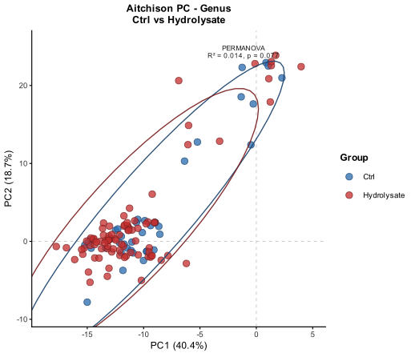
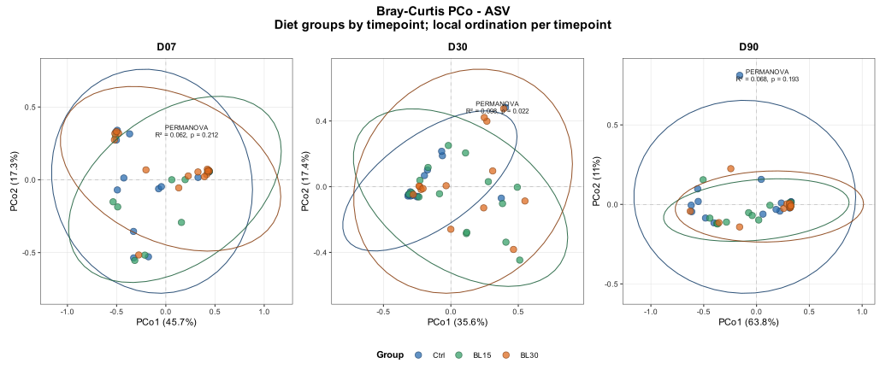
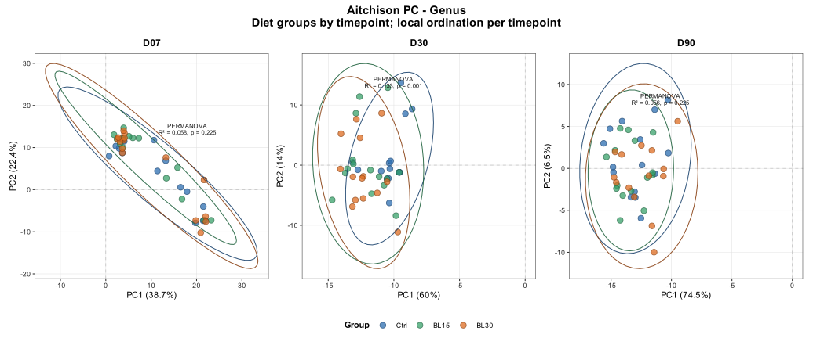
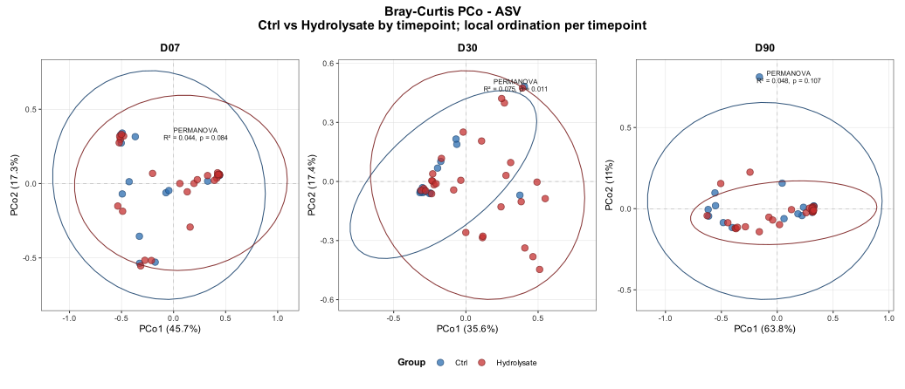
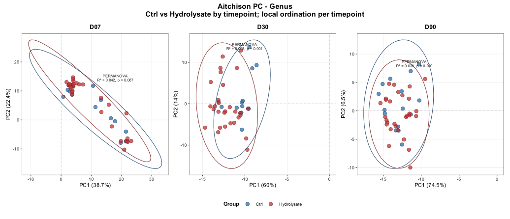
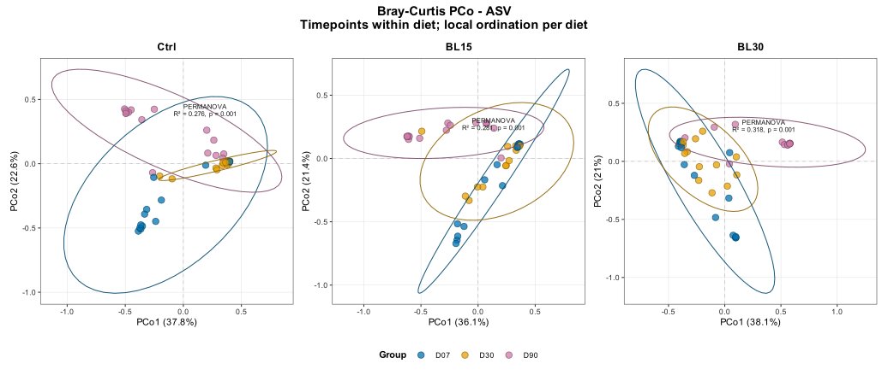
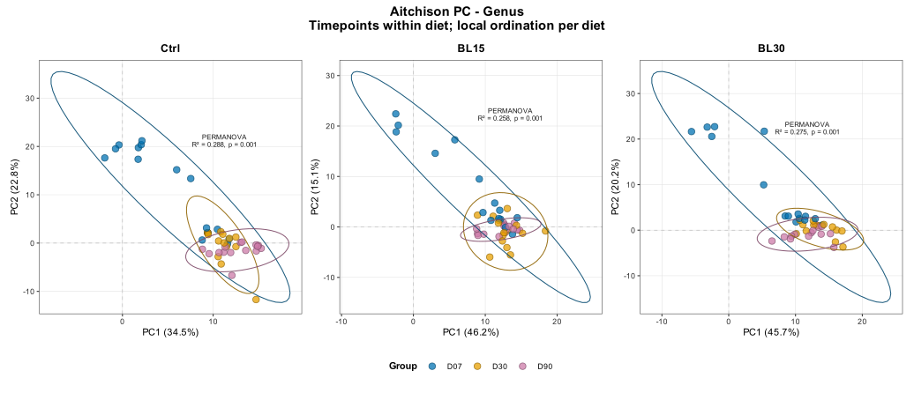
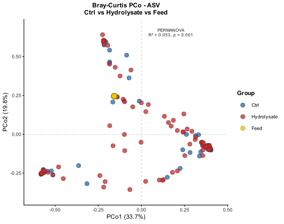
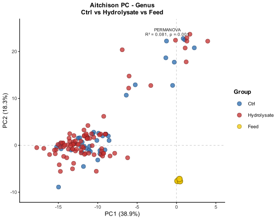

# Informe de diversidad beta

## 1. Objetivo del bloque

Este bloque evalúa si la estructura global de la microbiota intestinal cambia
en función de la dieta, del tiempo de muestreo y de la presencia de
hidrolizado. A diferencia de la diversidad alfa, que resume cada muestra con
índices univariantes, la diversidad beta compara la composición completa entre
muestras. Por tanto, este análisis responde a si las comunidades se agrupan,
se separan o siguen trayectorias distintas en el espacio composicional.

Las preguntas principales son:

1. si `BL15` y `BL30` separan la microbiota intestinal respecto a `Ctrl`;
2. si el contraste agregado `Hydrolysate = BL15 + BL30` muestra un patrón
   global frente a `Ctrl`;
3. si el efecto del hidrolizado depende del tiempo experimental;
4. si el pienso (`Feed`) ocupa una posición composicional próxima o separada
   del intestino.

Los análisis se realizaron a nivel de ASV y género, usando dos distancias
complementarias. Bray-Curtis se interpreta principalmente como diferencia en
abundancia relativa, con mucho peso de los taxones dominantes. Aitchison se
calcula sobre datos CLR y es más apropiada para leer los datos como
composicionales.

## 2. Inputs y métodos

Los contrastes biológicos principales usan solo muestras intestinales del
objeto filtrado. Mock y feed no entran en los análisis intestinales estándar.
La única excepción es la comparación específica `Ctrl`-`Hydrolysate`-`Feed`,
diseñada para evaluar si la composición del pienso se aproxima a la microbiota
observada en peces.

**Tabla 1. Objetos de entrada usados en diversidad beta.**

| Nivel | Objeto intestinal | Objeto con todas las muestras | Uso |
|---|---|---|---|
| ASV | `ps_biological_final` | `ps_final` | Resolución de variante de secuencia. |
| Género | `ps_biological_genus` | `ps_genus` | Resolución taxonómica agregada. |

La ordenación se calculó como PCoA para Bray-Curtis y como PCA sobre CLR para
Aitchison. En los plots, los ejes aparecen como `PCo1/PCo2` para Bray-Curtis y
`PC1/PC2` para Aitchison. La estadística se evaluó con PERMANOVA (`adonis2`,
999 permutaciones, semilla 123). Los contrastes estratificados por tiempo o
dieta se recalcularon como ordenaciones locales; es decir, cada panel usa solo
las muestras de ese estrato y tiene sus propios ejes y su propia PERMANOVA.

También se calculó `betadisper` para los PERMANOVA significativos. Este control
es importante porque PERMANOVA puede detectar diferencias por desplazamiento
del centroide, por diferencias de dispersión intra-grupo o por ambas cosas.

## 3. Organización de outputs

Las figuras se guardan por distancia:

- [`../assets/results/07_beta_diversity/figures/bray/`](../assets/results/07_beta_diversity/figures/bray/)
- [`../assets/results/07_beta_diversity/figures/aitchison/`](../assets/results/07_beta_diversity/figures/aitchison/)

Cada distancia contiene subcarpetas equivalentes: `diet_global`,
`hydro_global`, `diet_by_time`, `hydro_by_time`, `time_by_diet` y
`ctrl_hydro_feed`.

Las tablas principales son:

- [`../assets/results/07_beta_diversity/tables/permanova.csv`](../assets/results/07_beta_diversity/tables/permanova.csv)
- [`../assets/results/07_beta_diversity/tables/pairwise_permanova.csv`](../assets/results/07_beta_diversity/tables/pairwise_permanova.csv)
- [`../assets/results/07_beta_diversity/tables/betadisper_significant_permanova.csv`](../assets/results/07_beta_diversity/tables/betadisper_significant_permanova.csv)
- [`../assets/results/07_beta_diversity/tables/betadisper_group_dispersion_summary.csv`](../assets/results/07_beta_diversity/tables/betadisper_group_dispersion_summary.csv)

## 4. Resultados globales

La lectura global es muy clara: la dieta no explica de forma robusta la
estructura beta cuando se combinan todos los tiempos, mientras que el tiempo
experimental sí lo hace. Esto ocurre tanto a nivel de ASV como de género y en
ambas distancias. Por tanto, el efecto principal del experimento no es una
separación estable y constante entre dietas, sino una trayectoria temporal de la
microbiota.

**Tabla 2. PERMANOVA globales para dieta, hidrolizado, tiempo, interacción y comparación con pienso.**

| Distancia | Nivel | Comparación | R² | p |
|---|---|---|---:|---:|
| Bray-Curtis | ASV | Dieta global (`Ctrl`, `BL15`, `BL30`) | 0.016 | 0.375 |
| Bray-Curtis | ASV | `Ctrl` vs `Hydrolysate` | 0.010 | 0.199 |
| Bray-Curtis | ASV | Tiempo global | 0.247 | 0.001 |
| Bray-Curtis | ASV | Dieta x tiempo | 0.303 | 0.001 |
| Bray-Curtis | ASV | `Ctrl`-`Hydrolysate`-`Feed` | 0.053 | 0.001 |
| Bray-Curtis | Género | Dieta global (`Ctrl`, `BL15`, `BL30`) | 0.013 | 0.549 |
| Bray-Curtis | Género | `Ctrl` vs `Hydrolysate` | 0.010 | 0.246 |
| Bray-Curtis | Género | Tiempo global | 0.288 | 0.001 |
| Bray-Curtis | Género | Dieta x tiempo | 0.351 | 0.001 |
| Bray-Curtis | Género | `Ctrl`-`Hydrolysate`-`Feed` | 0.060 | 0.001 |
| Aitchison | ASV | Dieta global (`Ctrl`, `BL15`, `BL30`) | 0.020 | 0.165 |
| Aitchison | ASV | `Ctrl` vs `Hydrolysate` | 0.013 | 0.084 |
| Aitchison | ASV | Tiempo global | 0.177 | 0.001 |
| Aitchison | ASV | Dieta x tiempo | 0.230 | 0.001 |
| Aitchison | ASV | `Ctrl`-`Hydrolysate`-`Feed` | 0.067 | 0.001 |
| Aitchison | Género | Dieta global (`Ctrl`, `BL15`, `BL30`) | 0.020 | 0.151 |
| Aitchison | Género | `Ctrl` vs `Hydrolysate` | 0.014 | 0.077 |
| Aitchison | Género | Tiempo global | 0.235 | 0.001 |
| Aitchison | Género | Dieta x tiempo | 0.289 | 0.001 |
| Aitchison | Género | `Ctrl`-`Hydrolysate`-`Feed` | 0.081 | 0.001 |

El tiempo explica una fracción de variabilidad mucho mayor que la dieta global:
aproximadamente 18-29% según distancia y nivel, frente a alrededor de 1-2% para
la dieta o el contraste global `Ctrl` frente a `Hydrolysate`. La interacción
dieta-tiempo también es significativa, lo que indica que la dieta puede modular
la trayectoria temporal, aunque no genere por sí sola una separación estable al
mezclar todos los tiempos.

## 5. Comparación global `Ctrl` frente a `Hydrolysate`

La comparación global agrupando `BL15` y `BL30` como `Hydrolysate` no muestra
separación significativa frente a `Ctrl`. Este resultado es importante porque
evita sobredimensionar el efecto del hidrolizado: si se mezclan `D07`, `D30` y
`D90`, la señal queda diluida por el fuerte cambio temporal.

**Figura 1. Ordenación Bray-Curtis a nivel de ASV para `Ctrl` frente a `Hydrolysate`.**

En Bray-Curtis, el contraste global tiene R² = 0.010 y p = 0.199 a nivel de ASV.
La distribución de puntos refleja más variabilidad interna que separación clara
entre grupos. Esto encaja con la idea de que los cambios dominantes en
abundancia relativa están asociados sobre todo al tiempo.

**Figura 2. Ordenación Aitchison a nivel de género para `Ctrl` frente a `Hydrolysate`.**

En Aitchison a nivel de género, el resultado se acerca más al umbral
convencional, pero sigue sin ser significativo (R² = 0.014, p = 0.077). Esta
tendencia sugiere que puede existir una señal composicional débil, pero no un
desplazamiento global robusto. La interpretación correcta, por tanto, es
estratificar por tiempo.

## 6. Dieta dentro de cada tiempo

Al analizar cada tiempo por separado aparece el patrón biológico más
informativo: la señal de dieta se concentra en `D30`. En `D07`, las comunidades
todavía no muestran una separación clara por dieta. En `D90`, pese a que la
composición ha cambiado mucho respecto al inicio, la separación por dieta vuelve
a ser débil o no significativa.

**Figura 3. Ordenaciones Bray-Curtis locales comparando `Ctrl`, `BL15` y `BL30` dentro de cada tiempo a nivel de ASV.**

**Figura 4. Ordenaciones Aitchison locales comparando `Ctrl`, `BL15` y `BL30` dentro de cada tiempo a nivel de género.**

**Tabla 3. Comparación de las tres dietas dentro de cada tiempo.**

| Distancia | Nivel | D07 R²/p | D30 R²/p | D90 R²/p |
|---|---|---|---|---|
| Bray-Curtis | ASV | 0.062 / 0.192 | 0.098 / 0.016 | 0.068 / 0.193 |
| Bray-Curtis | Género | 0.077 / 0.119 | 0.132 / 0.009 | 0.070 / 0.188 |
| Aitchison | ASV | 0.061 / 0.172 | 0.093 / 0.006 | 0.044 / 0.452 |
| Aitchison | Género | 0.058 / 0.241 | 0.119 / 0.003 | 0.053 / 0.286 |

La coincidencia entre Bray-Curtis y Aitchison refuerza que `D30` es el punto
temporal donde la dieta tiene mayor influencia sobre la estructura comunitaria.
La señal es visible tanto en ASVs como en géneros, por lo que no parece depender
solo de variantes muy finas ni solo de agregación taxonómica.

## 7. `Ctrl` frente a `Hydrolysate` dentro de cada tiempo

Al agrupar `BL15` y `BL30`, el contraste `Ctrl` frente a `Hydrolysate` confirma
la misma conclusión: el hidrolizado se detecta principalmente en `D30`. En `D07`
aparecen tendencias próximas al umbral en algunos casos, pero no son robustas.
En `D90` la señal desaparece o queda claramente debilitada.

**Figura 5. Ordenaciones Bray-Curtis locales comparando `Ctrl` frente a `Hydrolysate` dentro de cada tiempo a nivel de ASV.**

**Figura 6. Ordenaciones Aitchison locales comparando `Ctrl` frente a `Hydrolysate` dentro de cada tiempo a nivel de género.**

**Tabla 4. Contraste `Ctrl` frente a `Hydrolysate` dentro de cada tiempo.**

| Distancia | Nivel | D07 R²/p | D30 R²/p | D90 R²/p |
|---|---|---|---|---|
| Bray-Curtis | ASV | 0.044 / 0.098 | 0.075 / 0.011 | 0.048 / 0.105 |
| Bray-Curtis | Género | 0.061 / 0.044 | 0.108 / 0.004 | 0.047 / 0.119 |
| Aitchison | ASV | 0.045 / 0.068 | 0.058 / 0.007 | 0.023 / 0.375 |
| Aitchison | Género | 0.042 / 0.074 | 0.086 / 0.002 | 0.029 / 0.232 |

El resultado de `D30` es consistente en los cuatro escenarios principales. Esto
apoya que el hidrolizado afecta a una fase concreta de reorganización de la
microbiota, más que producir un cambio permanente durante todo el ensayo.

## 8. Cambio temporal dentro de cada dieta

El tiempo separa de forma significativa las comunidades dentro de cada dieta.
Esta es la señal más robusta del bloque de beta diversidad. Se observa en
`Ctrl`, `BL15` y `BL30`, y se mantiene tanto con Bray-Curtis como con Aitchison.

**Figura 7. Ordenaciones Bray-Curtis locales comparando `D07`, `D30` y `D90` dentro de cada dieta a nivel de ASV.**

**Figura 8. Ordenaciones Aitchison locales comparando `D07`, `D30` y `D90` dentro de cada dieta a nivel de género.**

**Tabla 5. Comparación temporal dentro de cada dieta.**

| Distancia | Nivel | Ctrl R²/p | BL15 R²/p | BL30 R²/p |
|---|---|---|---|---|
| Bray-Curtis | ASV | 0.276 / 0.001 | 0.281 / 0.001 | 0.318 / 0.001 |
| Bray-Curtis | Género | 0.326 / 0.001 | 0.313 / 0.001 | 0.391 / 0.001 |
| Aitchison | ASV | 0.248 / 0.001 | 0.177 / 0.001 | 0.213 / 0.001 |
| Aitchison | Género | 0.289 / 0.001 | 0.257 / 0.001 | 0.274 / 0.001 |

Estos resultados encajan con los barplots de composición taxonómica: el sistema
no permanece estático, sino que sigue una sucesión temporal marcada. La dieta
parece modular algunos momentos de esa sucesión, especialmente `D30`, pero no
anula la dinámica temporal general.

## 9. Comparación con el pienso

La comparación con `Feed` se incluye para evaluar si la microbiota intestinal
se aproxima composicionalmente al pienso. El resultado indica que el pienso
ocupa un espacio separado del intestino. Esto es relevante porque en el bloque
de composición se detectó una señal importante de cloroplasto y mitocondria en
el feed; sin embargo, esa señal no implica que la comunidad intestinal sea una
copia directa de la composición del pienso.

**Figura 9. Ordenación Bray-Curtis a nivel de ASV comparando `Ctrl`, `Hydrolysate` y `Feed`.**

En Bray-Curtis, la comparación `Ctrl`-`Hydrolysate`-`Feed` es significativa a
nivel de ASV y género. No obstante, `betadisper` también es significativo para
Bray, de modo que parte de la señal puede estar asociada a diferencias de
dispersión entre grupos.

**Figura 10. Ordenación Aitchison a nivel de género comparando `Ctrl`, `Hydrolysate` y `Feed`.**

La lectura de Aitchison es especialmente útil en este contraste. El PERMANOVA
es significativo y `betadisper` no detecta dispersión heterogénea para
`Ctrl`-`Hydrolysate`-`Feed` a nivel de ASV ni de género. Por tanto, la
separación del pienso respecto al intestino es compatible con un desplazamiento
composicional real, no solo con diferencias de variabilidad intra-grupo.

## 10. Homogeneidad de dispersión

El control de dispersión obliga a interpretar con cuidado los PERMANOVA
significativos. De 37 contrastes significativos evaluados, 31 presentan también
heterogeneidad de dispersión (`betadisper p < 0.05`). Esto no invalida los
resultados, pero cambia la lectura: en muchos casos la diferencia entre grupos
puede combinar desplazamiento del centroide y cambios en la variabilidad
intra-grupo.

**Tabla 6. Control `betadisper` para contrastes representativos.**

| Distancia | Nivel | Contraste | PERMANOVA p | Betadisper p | Interpretación |
|---|---|---|---:|---:|---|
| Bray-Curtis | ASV | `Ctrl`-`Hydrolysate`-`Feed` | 0.001 | 0.001 | Significativo con dispersión heterogénea. |
| Bray-Curtis | Género | `Ctrl`-`Hydrolysate`-`Feed` | 0.001 | 0.003 | Significativo con dispersión heterogénea. |
| Aitchison | ASV | `Ctrl`-`Hydrolysate`-`Feed` | 0.001 | 0.119 | Compatible con cambio de centroide. |
| Aitchison | Género | `Ctrl`-`Hydrolysate`-`Feed` | 0.001 | 0.116 | Compatible con cambio de centroide. |
| Bray-Curtis | ASV | `Ctrl` vs `Hydrolysate` en `D30` | 0.011 | 0.008 | Significativo con dispersión heterogénea. |
| Aitchison | ASV | `Ctrl` vs `Hydrolysate` en `D30` | 0.007 | 0.030 | Significativo con dispersión heterogénea. |
| Aitchison | Género | Dietas en `D30` | 0.003 | 0.104 | Compatible con cambio de centroide. |

Tablas completas:

- [`../assets/results/07_beta_diversity/tables/betadisper_significant_permanova.csv`](../assets/results/07_beta_diversity/tables/betadisper_significant_permanova.csv)
- [`../assets/results/07_beta_diversity/tables/betadisper_group_dispersion_summary.csv`](../assets/results/07_beta_diversity/tables/betadisper_group_dispersion_summary.csv)
- [`../assets/results/07_beta_diversity/tables/bray/permanova/bray_betadisper_significant_permanova.csv`](../assets/results/07_beta_diversity/tables/bray/permanova/bray_betadisper_significant_permanova.csv)
- [`../assets/results/07_beta_diversity/tables/aitchison/permanova/aitchison_betadisper_significant_permanova.csv`](../assets/results/07_beta_diversity/tables/aitchison/permanova/aitchison_betadisper_significant_permanova.csv)

## 11. Interpretación biológica integrada

La diversidad beta indica que la microbiota intestinal está dominada por una
dinámica temporal fuerte. Esta conclusión es coherente con la composición
taxonómica: los perfiles cambian de forma marcada entre `D07`, `D30` y `D90`,
con una fase intermedia donde la dieta/hidrolizado muestra mayor capacidad de
separar comunidades.

El hidrolizado no actúa como un factor que desplace de forma estable toda la
microbiota durante el ensayo. Su efecto parece dependiente del momento: se
detecta especialmente en `D30`, cuando la comunidad está en una fase de
reorganización composicional. En `D90`, las comunidades vuelven a estar más
dominadas por la trayectoria temporal general que por el tratamiento dietario.

La comparación con el pienso sugiere que los perfiles intestinales no son una
simple transferencia directa de la composición del feed. Esto es importante
para interpretar las señales de cloroplasto y mitocondria: son informativas en
el pienso y deben conservarse para composición taxonómica, pero no parecen
dominar la estructura beta intestinal.

## 12. Conclusiones

1. El tiempo experimental es el principal estructurador de la beta diversidad.
2. La dieta no separa globalmente las comunidades cuando se combinan todos los
   tiempos.
3. El efecto del hidrolizado aparece principalmente en `D30`.
4. El pienso ocupa un espacio composicional separado del intestino, sobre todo
   de forma clara en Aitchison.
5. Muchos PERMANOVA significativos van acompañados de dispersión heterogénea,
   por lo que deben interpretarse como cambios globales de estructura
   comunitaria y no siempre como desplazamientos puros de centroide.
6. El siguiente paso interpretativo debe integrar composición taxonómica y
   abundancia diferencial para identificar qué taxones impulsan la señal de
   `D30` y la sucesión temporal.
