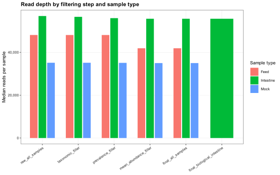
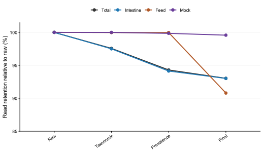
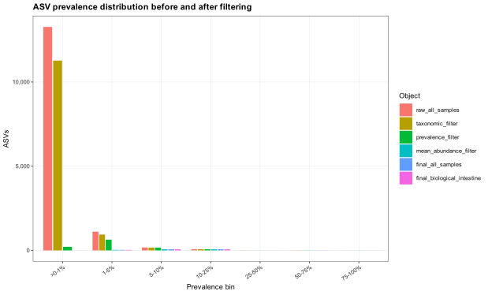
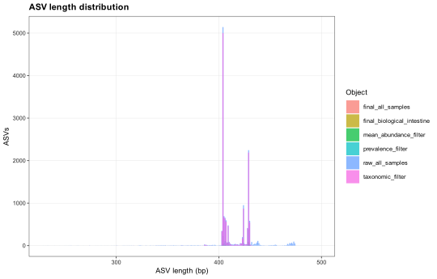
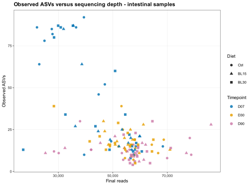

# Estadísticas generales

## Objetivo del bloque

Este capítulo resume el tamaño, profundidad, retención y estructura del dataset antes y después del filtrado downstream. Su función es reunir los números que normalmente se reportan en métodos/resultados: número de muestras, lecturas por muestra, ASVs retenidas, prevalencia, completitud taxonómica y controles de rarefacción. A diferencia de los capítulos de diversidad o composición, aquí el foco no es probar hipótesis biológicas, sino documentar si el dataset final es suficientemente consistente y trazable para los análisis posteriores.

## Inputs, outputs y organización

### 2.1. Objetos analizados

-   `raw_all_samples`: objeto importado con todas las muestras: intestino, mock y feed.
-   `taxonomic_filter`: objeto tras retirar ASVs taxonómicamente no deseadas.
-   `prevalence_filter`: objeto tras aplicar prevalencia por grupo.
-   `mean_abundance_filter`: objeto tras aplicar abundancia relativa media mínima.
-   `final_all_samples`: objeto global filtrado final.
-   `final_biological_intestine`: subconjunto filtrado usado para análisis biológicos de intestino.

### 2.2. Tablas generadas

-   [`sample_counts_by_design.csv`](../assets/results/03_dataset_stats/tables/sample_counts_by_design.csv): número de muestras por tipo, dieta y tiempo.
-   [`sample_read_stats_overall.csv`](../assets/results/03_dataset_stats/tables/sample_read_stats_overall.csv): estadísticos de lecturas por objeto.
-   [`sample_read_stats_by_sample_type.csv`](../assets/results/03_dataset_stats/tables/sample_read_stats_by_sample_type.csv): estadísticos de lecturas por tipo de muestra.
-   [`read_retention_by_sample_type_lines.csv`](../assets/results/03_dataset_stats/tables/read_retention_by_sample_type_lines.csv): retención relativa de lecturas por tipo de muestra y paso de filtrado.
-   [`sample_read_stats_by_group.csv`](../assets/results/03_dataset_stats/tables/sample_read_stats_by_group.csv): estadísticos de lecturas por grupo experimental.
-   [`asv_abundance_prevalence_summary.csv`](../assets/results/03_dataset_stats/tables/asv_abundance_prevalence_summary.csv): resumen de abundancia y prevalencia de ASVs.
-   [`asv_abundance_prevalence_by_object.csv`](../assets/results/03_dataset_stats/tables/asv_abundance_prevalence_by_object.csv): una fila por ASV y objeto, con lecturas, prevalencia y abundancia media.
-   [`asv_prevalence_distribution.csv`](../assets/results/03_dataset_stats/tables/asv_prevalence_distribution.csv): distribución de ASVs por rangos de prevalencia.
-   [`taxonomy_assignment_summary.csv`](../assets/results/03_dataset_stats/tables/taxonomy_assignment_summary.csv): completitud de asignación taxonómica por rango.
-   [`top50_asvs_raw_all_samples.csv`](../assets/results/03_dataset_stats/tables/top50_asvs_raw_all_samples.csv) y [`top50_asvs_final_all_samples.csv`](../assets/results/03_dataset_stats/tables/top50_asvs_final_all_samples.csv): ASVs más abundantes antes y después del filtrado.

## Diseño muestral

El dataset global contiene 138 muestras: 133 muestras intestinales, 3 muestras de pienso y 2 mocks. Las muestras intestinales se distribuyen entre tres dietas (`Ctrl`, `BL15`, `BL30`) y tres tiempos (`D07`, `D30`, `D90`).

La distribución muestral se resume en la @tbl-sample-counts-design.

| Tipo de muestra | Dieta | Grupo hidro | Tiempo | Grupo dieta-tiempo |   n |
|-----------------|-------|-------------|--------|--------------------|----:|
| Intestine       | Ctrl  | Ctrl        | D07    | Ctrl_D07           |  15 |
| Intestine       | Ctrl  | Ctrl        | D30    | Ctrl_D30           |  15 |
| Intestine       | Ctrl  | Ctrl        | D90    | Ctrl_D90           |  15 |
| Intestine       | BL15  | Hydrolysate | D07    | BL15_D07           |  15 |
| Intestine       | BL15  | Hydrolysate | D30    | BL15_D30           |  15 |
| Intestine       | BL15  | Hydrolysate | D90    | BL15_D90           |  15 |
| Intestine       | BL30  | Hydrolysate | D07    | BL30_D07           |  15 |
| Intestine       | BL30  | Hydrolysate | D30    | BL30_D30           |  14 |
| Intestine       | BL30  | Hydrolysate | D90    | BL30_D90           |  14 |
| Feed            | Ctrl  | Ctrl        | NA     | NA                 |   1 |
| Feed            | BL15  | Hydrolysate | NA     | NA                 |   1 |
| Feed            | BL30  | Hydrolysate | NA     | NA                 |   1 |
| Mock            | NA    | NA          | NA     | NA                 |   2 |

: Número de muestras por tipo, dieta y tiempo {#tbl-sample-counts-design}

El diseño intestinal está prácticamente balanceado, con 15 muestras por combinación dieta-tiempo salvo `BL30_D30` y `BL30_D90`, con 14 muestras cada una. Feed y mock se tratan como controles no biológicos.

## Profundidad de secuenciación y retención de reads

El dataset bruto contiene 7,667,921 lecturas distribuidas en 138 muestras. La profundidad por muestra es alta y relativamente homogénea en intestino, con una mediana global de 56,881 lecturas antes del filtrado. Tras el filtrado global quedan 7,133,190 lecturas, con mediana de 55,392 lecturas por muestra.

La @tbl-read-stats-overall resume la profundidad por muestra en cada objeto. `Q1` y `Q3` corresponden al primer y tercer cuartil, respectivamente: el 25% de las muestras queda por debajo de `Q1` y el 75% por debajo de `Q3`. Estos cuartiles ayudan a valorar la dispersión de profundidades sin depender solo del mínimo, la media o la mediana.

| Objeto | Muestras | Reads mín. | Q1 | Mediana | Media | Q3 | Reads máx. | Reads totales |
|--------|-------:|-------:|-------:|-------:|-------:|-------:|-------:|-------:|
| Raw all samples | 138 | 28,400 | 51,835 | 56,881 | 55,565 | 59,025 | 86,842 | 7,667,921 |
| Taxonomic filter | 138 | 17,587 | 48,939 | 56,361 | 54,215 | 58,771 | 86,359 | 7,481,712 |
| Prevalence filter | 138 | 17,336 | 46,991 | 55,616.5 | 52,395 | 58,272 | 86,087 | 7,230,537 |
| Mean abundance filter | 138 | 17,111 | 45,223 | 55,392 | 51,788 | 58,231 | 86,030 | 7,133,190 |
| Final all samples | 138 | 17,111 | 45,223 | 55,392 | 51,788 | 58,231 | 86,030 | 7,133,190 |
| Final biological intestine | 133 | 17,111 | 47,235 | 55,673 | 52,218 | 58,359 | 86,030 | 6,931,390 |

: Estadísticos globales de lecturas por objeto. `Q1` y `Q3` son el primer y tercer cuartil de profundidad por muestra {#tbl-read-stats-overall}

El filtrado reduce fuertemente el número de ASVs, pero mantiene la mayor parte de las lecturas. El mínimo global después del filtrado ya no cae por debajo de 17,111 lecturas porque la señal cloroplastidial y mitocondrial del feed se conserva.

La @fig-read-depth-filter-step muestra la profundidad mediana por tipo de muestra en cada paso. La @fig-read-retention-sample-type-lines complementa esa lectura con la retención relativa de lecturas, separando intestino, feed, mock y el total del dataset.

{#fig-read-depth-filter-step fig-align="center" width="85%"}

{#fig-read-retention-sample-type-lines fig-align="center" width="85%"}

La retención relativa confirma que la pérdida global de lecturas es moderada. Intestino, feed y mock conservan una fracción alta de sus lecturas, aunque feed pierde señal adicional en el paso final de abundancia media. Este patrón contrasta con la reducción drástica de ASVs, descrita en el bloque de filtrado.

## ASVs, abundancia y prevalencia

El dataset bruto contiene 14,652 ASVs. La mayoría son muy poco prevalentes: 13,270 ASVs aparecen en menos del 1% de las muestras. Tras el filtrado final quedan 175 ASVs en el objeto global, con una mediana de prevalencia de 13 muestras y una abundancia relativa media mínima de 0.0104%.

La @tbl-asv-abundance-prevalence-summary resume cómo cambia el soporte cuantitativo de las ASVs antes y después del filtrado.

| Objeto | ASVs | Reads totales | Reads/ASV mín. | Reads/ASV mediana | Reads/ASV máx. | Prevalencia mediana | Prevalencia máx. |
|---------|--------:|--------:|--------:|--------:|--------:|--------:|--------:|
| Raw all samples | 14,652 | 7,667,921 | 1 | 11 | 2,011,726 | 1 | 129 |
| Taxonomic filter | 12,461 | 7,481,712 | 1 | 11 | 2,011,726 | 1 | 129 |
| Prevalence filter | 1,101 | 7,230,537 | 2 | 86 | 2,011,726 | 3 | 129 |
| Final all samples | 175 | 7,133,190 | 464 | 1,626 | 2,011,726 | 13 | 129 |
| Final biological intestine | 169 | 6,931,390 | 12 | 1,342.5 | 2,011,726 | 13 | 129 |

: Resumen de abundancia y prevalencia de ASVs {#tbl-asv-abundance-prevalence-summary}

La matriz bruta está dominada por ASVs raras y de baja prevalencia. El filtrado final conserva ASVs con mayor soporte en lecturas y presencia en muestras, lo que reduce ruido para análisis multivariantes y figuras de composición.

La distribución por rangos de prevalencia se detalla en la @tbl-asv-prevalence-distribution.

| Objeto                     | \>0-1% |  1-5% | 5-10% | 10-25% | 25-50% | 50-75% | 75-100% |
|----------------------------|-------:|------:|------:|-------:|-------:|-------:|--------:|
| Raw all samples            | 13,270 | 1,114 |   173 |     76 |      8 |      8 |       3 |
| Taxonomic filter           | 12,734 | 1,096 |   171 |     73 |      8 |      8 |       3 |
| Prevalence filter          |    221 |   674 |   171 |     73 |      8 |      8 |       3 |
| Final all samples          |      0 |    30 |    65 |     66 |      8 |      8 |       3 |
| Final biological intestine |      2 |    27 |    64 |     61 |      8 |      8 |       4 |

: Distribución de ASVs por rango de prevalencia {#tbl-asv-prevalence-distribution}

El filtro de prevalencia elimina la mayor parte de ASVs detectadas en muy pocas muestras. El objeto final ya no contiene ASVs presentes en una sola muestra en el análisis global.

La @fig-asv-prevalence-distribution resume visualmente esa transición desde una matriz bruta dominada por ASVs muy raras hacia una matriz filtrada enriquecida en ASVs más prevalentes.

{#fig-asv-prevalence-distribution fig-align="center" width="85%"}

## Asignación taxonómica

La asignación taxonómica es completa hasta orden en el objeto final: 175 de 175 ASVs tienen asignación hasta orden, y esas ASVs concentran el 100% de las lecturas. A nivel familia, 167 de 175 ASVs están asignadas y explican el 99.2% de las lecturas. A nivel género, 154 de 175 ASVs están asignadas, pero estas explican el 72.5% de las lecturas; esto refleja que una fracción importante de las lecturas pertenece a ASVs abundantes no resueltas a género, especialmente dentro de grupos como Mycoplasmataceae.

La completitud taxonómica del objeto final global se resume en la @tbl-taxonomy-assignment-final.

| Rango | ASVs asignadas | ASVs no asignadas | \% ASVs asignadas | Reads asignados | \% reads asignados |
|------------|-----------:|-----------:|-----------:|-----------:|-----------:|
| Kingdom | 175 | 0 | 100.0% | 7,133,190 | 100.0% |
| Phylum | 175 | 0 | 100.0% | 7,133,190 | 100.0% |
| Class | 175 | 0 | 100.0% | 7,133,190 | 100.0% |
| Order | 175 | 0 | 100.0% | 7,133,190 | 100.0% |
| Family | 167 | 8 | 95.4% | 7,074,179 | 99.2% |
| Genus | 154 | 21 | 88.0% | 5,183,229 | 72.7% |
| Species | 62 | 113 | 35.4% | 3,509,310 | 49.2% |
| Species_addSpecies | 105 | 70 | 60.0% | 4,452,658 | 62.4% |

: Completitud taxonómica en el objeto final global {#tbl-taxonomy-assignment-final}

Los análisis a nivel familia y orden son robustos desde el punto de vista de asignación taxonómica. Los análisis a género son útiles, pero deben mantener categorías como `Unclassified_Genus` cuando la familia está clara y el género no. Los análisis a especie deben tratarse como exploratorios.

La @fig-asv-length-distribution muestra que la mayoría de ASVs se sitúan en el rango esperado del amplicón. Cambios marcados en esta distribución podrían indicar artefactos, pero no se observan señales obvias a partir del resumen.

{#fig-asv-length-distribution fig-align="center" width="85%"}

## Rarefaction QC

La rarefacción se incorpora dentro de `Dataset stats` porque funciona como un control de calidad de profundidad, no como un análisis biológico independiente. Su objetivo es comprobar si la profundidad de secuenciación es suficiente para describir la riqueza observada de ASVs y para sostener la interpretación de diversidad alfa, especialmente `Observed richness`.

Las curvas se calcularon con rarefacción esperada (`vegan::rarefy`) a nivel ASV. Para cada muestra se estimó el número esperado de ASVs a profundidades crecientes hasta su profundidad final. Las curvas agrupadas se calcularon como rarefacción de ensamblajes pooled: dentro de cada grupo se agregaron los conteos ASV de sus muestras y se estimó la riqueza esperada sobre una malla común de profundidad. Este enfoque evita promediar curvas individuales con conjuntos de muestras cambiantes a medida que aumenta la profundidad.

::: {.callout-note title="Cómo interpretar estas curvas"}
Las curvas de rarefacción no prueban diferencias entre dietas. Sirven para evaluar si las muestras se aproximan a una meseta de riqueza. Si una curva sigue creciendo de forma marcada al final, la riqueza observada puede estar subestimada; si se estabiliza, la profundidad es razonable para comparaciones conservadoras.
:::

El objeto global filtrado tiene **138 muestras**, una profundidad mínima de **17,111** lecturas, mediana de **55,392** y máxima de **86,030**. El objeto intestinal filtrado tiene **133 muestras**, profundidad mínima de **17,111**, mediana de **55,673** y máxima de **86,030**. En intestino, la mediana de ASVs observadas es **16.0**, la mediana esperada a la profundidad común mínima es **15.47**, y la pendiente final mediana es prácticamente nula (**1.89e-07 ASVs por 1,000 lecturas**). En conjunto, esto apoya que la profundidad post-filtrado es suficiente para comparar riqueza observada de forma conservadora.

| Objeto | Muestras | Reads mín. | Reads mediana | Reads máx. | ASVs observadas mediana | Profundidad común | ASVs esperadas mediana | Pendiente final mediana |
|--------|-------:|-------:|-------:|-------:|-------:|-------:|-------:|-------:|
| Final all samples | 138 | 17,111 | 55,392 | 86,030 | 16.0 | 17,111 | 15.50 | 1.68e-07 |
| Final biological intestine | 133 | 17,111 | 55,673 | 86,030 | 16.0 | 17,111 | 15.47 | 1.89e-07 |
| Raw all samples | 138 | 28,400 | 56,881 | 86,842 | 40.5 | 28,400 | 39.25 | 5.76e-03 |

: Resumen de rarefacción por objeto {#tbl-rarefaction-object-summary}

La @fig-rarefaction-grouped-hydro muestra las curvas agrupadas para `Ctrl` frente a `Hydrolysate`, separadas por tiempo. La @fig-rarefaction-grouped-diet separa además `BL15` y `BL30`. Estas versiones agrupadas son las más limpias para evaluar cobertura de riqueza por comparación principal, porque reducen el ruido visual de las curvas individuales.

{#fig-rarefaction-grouped-hydro fig-align="center" width="90%"}

{#fig-rarefaction-grouped-diet fig-align="center" width="90%"}

La @fig-observed-asvs-depth muestra la relación entre riqueza observada y profundidad final en muestras intestinales. No se observa que la riqueza post-filtrado esté dominada de forma obvia por profundidad de secuenciación, lo cual respalda el uso de los índices de diversidad alfa sobre el objeto filtrado.

{#fig-observed-asvs-depth fig-align="center" width="80%"}

Las tablas completas de rarefacción, junto con la tabla usada para la figura de retención por tipo de muestra, están disponibles para descarga en la @tbl-rarefaction-downloads. `rarefaction_curve_points.csv` es grande porque contiene todos los puntos de curva por muestra y profundidad; se conserva como descarga, pero no se embebe en el texto.

| Archivo | Contenido | Enlace |
|------------------------|------------------------|------------------------|
| `read_retention_by_sample_type_lines.csv` | Retención relativa de lecturas por tipo de muestra y paso de filtrado. | <a href="../assets/results/03_dataset_stats/tables/read_retention_by_sample_type_lines.csv" download>Descargar CSV</a> |
| `rarefaction_object_summary.csv` | Resumen por objeto. | <a href="../assets/results/04_rarefaction_qc/tables/rarefaction_object_summary.csv" download>Descargar CSV</a> |
| `rarefaction_sample_type_summary.csv` | Resumen por objeto y tipo de muestra. | <a href="../assets/results/04_rarefaction_qc/tables/rarefaction_sample_type_summary.csv" download>Descargar CSV</a> |
| `rarefaction_sample_summary.csv` | Resumen por muestra, profundidad común y pendiente final. | <a href="../assets/results/04_rarefaction_qc/tables/rarefaction_sample_summary.csv" download>Descargar CSV</a> |
| `rarefaction_grouped_ctrl_vs_hydro_time.csv` | Curvas pooled para `Ctrl` frente a `Hydrolysate` por tiempo. | <a href="../assets/results/04_rarefaction_qc/tables/rarefaction_grouped_ctrl_vs_hydro_time.csv" download>Descargar CSV</a> |
| `rarefaction_grouped_diet_time.csv` | Curvas pooled para `Ctrl`, `BL15` y `BL30` por tiempo. | <a href="../assets/results/04_rarefaction_qc/tables/rarefaction_grouped_diet_time.csv" download>Descargar CSV</a> |
| `rarefaction_curve_points.csv` | Puntos completos de curvas por muestra y profundidad. | <a href="../assets/results/04_rarefaction_qc/tables/rarefaction_curve_points.csv" download>Descargar CSV</a> |

: Tablas descargables de retención y rarefacción {#tbl-rarefaction-downloads}

## Lectura metodológica para el artículo

El dataset presenta una profundidad suficiente para análisis de microbiota intestinal. La mediana de lecturas por muestra se mantiene alta tras filtrado, y la mayor parte de la pérdida ocurre en ASVs raras o de baja prevalencia. Este comportamiento es deseable para análisis downstream, porque reduce ruido y dimensionalidad sin eliminar la señal dominante de lecturas.

El filtrado conserva cloroplasto y mitocondria de forma deliberada. Esta decisión es específica de este proyecto: el pienso contiene una señal cloroplastidial/mitocondrial relevante y eliminarla impediría evaluar una parte importante de su composición. Por tanto, las comparaciones con feed deben interpretarse como composición taxonómica ampliada, no como una matriz estrictamente bacteriana.

Para los análisis biológicos principales debe citarse el objeto `final_biological_intestine`: 133 muestras intestinales, 169 ASVs y 6,931,390 lecturas. Para trazabilidad global, controles técnicos y feed, debe citarse el objeto `final_all_samples`: 138 muestras, 175 ASVs y 7,133,190 lecturas.

## Texto breve reutilizable

> Tras el preprocesado e importación downstream, el dataset incluyó 138 muestras y 7,667,921 lecturas distribuidas en 14,652 ASVs. Tras eliminar ASVs con asignación taxonómica no deseada, baja prevalencia y baja abundancia relativa media, conservando cloroplasto y mitocondria para evaluar la composición del pienso, el objeto global filtrado conservó 175 ASVs y 7,133,190 lecturas. El subconjunto intestinal usado para los análisis biológicos principales incluyó 133 muestras, 169 ASVs y 6,931,390 lecturas, con una mediana de 55,673 lecturas por muestra. La asignación taxonómica del objeto final fue alta hasta orden/familia, mientras que la resolución a especie se consideró exploratoria.

## Limitaciones

-   Los estadísticos de especie deben interpretarse con cautela por las limitaciones de resolución del marcador 16S.
-   La interpretación de feed debe considerar que cloroplasto y mitocondria se conservan de forma deliberada.
-   Los objetos filtrados son adecuados para análisis globales conservadores, pero preguntas sobre colonizadores raros o transitorios pueden requerir análisis de sensibilidad usando tablas no filtradas o `asv_filtering_status.csv`.