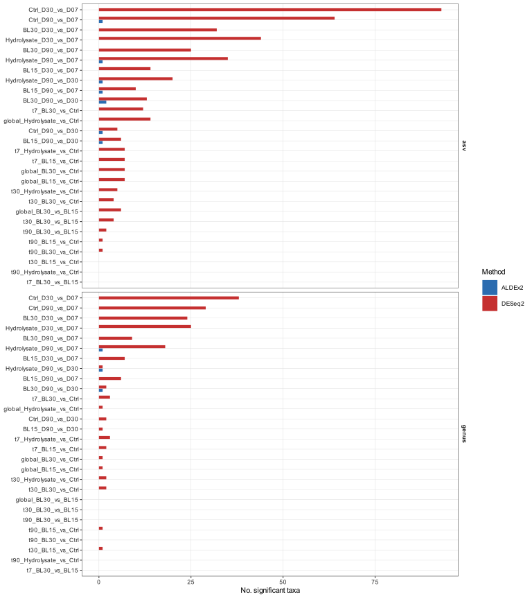
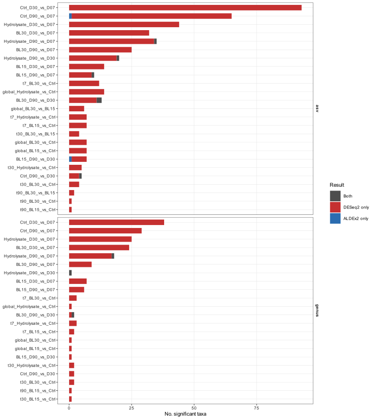

# 08. Differential abundance

## 1. Objetivo del bloque

Este bloque identifica taxones diferencialmente abundantes en la microbiota intestinal de rodaballo, comparando dietas, grupos agregados de hidrolizado y tiempos de muestreo. Los analisis se ejecutan por separado con DESeq2 y ALDEx2, sin imponer consenso entre metodos en esta fase.

## 2. Dataset y preprocesado

Se usa el dataset intestinal filtrado del bloque `02_filtering`. No se incluyen mocks ni muestras de pienso/feed, porque este bloque responde a preguntas biologicas sobre diferencias entre peces.

| Nivel | Muestras | Taxones | Reads |
|---|---:|---:|---:|
| asv | 133 | 169 | 6931390 |
| genus | 133 | 77 | 6931390 |

Los metodos trabajan sobre conteos crudos filtrados. No se rarefacciona. El filtrado previo reduce ASVs raras y baja prevalencia antes del contraste estadistico.

## 3. Metodos

- **DESeq2**: modelos de conteos negativos binomiales, size factors con `type = "poscounts"`, FDR `padj < 0.05` y `|log2FC| >= 1`.
- **ALDEx2**: inferencia composicional con Monte Carlo (`mc.samples = 128`), denominador `iqlr`, FDR `wi.eBH < 0.05` y `|effect| >= 1`.
- Los contrastes globales de DESeq2 se ajustan por tiempo. Los contrastes binarios de ALDEx2 se reportan como analisis composicionales independientes; la estratificacion por tiempo es la referencia principal para separar dieta y tiempo.
- La comparacion entre metodos se exporta como resumen descriptivo. No se usa para filtrar resultados.

## 4. Outputs principales

- Tablas DESeq2: [`../assets/results/08_differential_abundance/tables/deseq2/`](../assets/results/08_differential_abundance/tables/deseq2/)
- Tablas ALDEx2: [`../assets/results/08_differential_abundance/tables/aldex2/`](../assets/results/08_differential_abundance/tables/aldex2/)
- Comparacion descriptiva de metodos: [`../assets/results/08_differential_abundance/tables/method_comparison/`](../assets/results/08_differential_abundance/tables/method_comparison/)
- Volcano plots: [`../assets/results/08_differential_abundance/figures/volcano/`](../assets/results/08_differential_abundance/figures/volcano/)
- Heatmaps CLR z-score: [`../assets/results/08_differential_abundance/figures/heatmaps/`](../assets/results/08_differential_abundance/figures/heatmaps/)
- Figuras resumen: [`../assets/results/08_differential_abundance/figures/summary/`](../assets/results/08_differential_abundance/figures/summary/)

## 5. Resumen de taxones significativos

**Figura 1. Numero de taxones significativos por metodo, nivel taxonomico y contraste.** DESeq2 y ALDEx2 se muestran por separado para permitir una lectura independiente de cada enfoque.

| Metodo | Nivel | Contrastes con algun taxon significativo | Taxones significativos acumulados |
|---|---|---:|---:|
| DESeq2 | asv | 25 | 438 |
| DESeq2 | genus | 22 | 179 |
| ALDEx2 | asv | 7 | 8 |
| ALDEx2 | genus | 3 | 3 |

## 6. Comparacion descriptiva entre metodos

**Figura 2. Solapamiento descriptivo entre DESeq2 y ALDEx2.** La figura indica cuantos taxones aparecen solo con DESeq2, solo con ALDEx2 o con ambos metodos en cada contraste. Este solapamiento no se usa como filtro automatico.

Tabla completa: [`../assets/results/08_differential_abundance/tables/method_comparison/differential_method_overlap_summary.csv`](../assets/results/08_differential_abundance/tables/method_comparison/differential_method_overlap_summary.csv).

## 7. Modelos globales exploratorios

DESeq2 incluye modelos LRT para evaluar efectos globales ajustados por tiempo e interacciones dieta-tiempo o hidrolizado-tiempo.

| Nivel | Modelo | Taxones significativos |
|---|---|---:|
| asv | diet_adjusted_time | 1 |
| asv | hydro_adjusted_time | 1 |
| asv | diet_time_interaction | 2 |
| asv | hydro_time_interaction | 1 |
| genus | diet_adjusted_time | 1 |
| genus | hydro_adjusted_time | 1 |
| genus | diet_time_interaction | 1 |
| genus | hydro_time_interaction | 1 |

## 8. Figuras representativas

Ejemplos principales para revisar primero:

- DESeq2 ASV `Hydrolysate vs Ctrl`: [`../assets/results/08_differential_abundance/figures/volcano/deseq2/asv/volcano_global_Hydrolysate_vs_Ctrl.png`](../assets/results/08_differential_abundance/figures/volcano/deseq2/asv/volcano_global_Hydrolysate_vs_Ctrl.png)
- ALDEx2 ASV `Hydrolysate vs Ctrl`: [`../assets/results/08_differential_abundance/figures/volcano/aldex2/asv/volcano_global_Hydrolysate_vs_Ctrl.png`](../assets/results/08_differential_abundance/figures/volcano/aldex2/asv/volcano_global_Hydrolysate_vs_Ctrl.png)
- DESeq2 genus `Hydrolysate vs Ctrl`: [`../assets/results/08_differential_abundance/figures/volcano/deseq2/genus/volcano_global_Hydrolysate_vs_Ctrl.png`](../assets/results/08_differential_abundance/figures/volcano/deseq2/genus/volcano_global_Hydrolysate_vs_Ctrl.png)
- ALDEx2 genus `Hydrolysate vs Ctrl`: [`../assets/results/08_differential_abundance/figures/volcano/aldex2/genus/volcano_global_Hydrolysate_vs_Ctrl.png`](../assets/results/08_differential_abundance/figures/volcano/aldex2/genus/volcano_global_Hydrolysate_vs_Ctrl.png)
- Heatmap de medias ASV DESeq2: [`../assets/results/08_differential_abundance/figures/heatmaps/asv/heatmap_deseq2_asv_diet_time_means.png`](../assets/results/08_differential_abundance/figures/heatmaps/asv/heatmap_deseq2_asv_diet_time_means.png)
- Heatmap de medias ASV ALDEx2: [`../assets/results/08_differential_abundance/figures/heatmaps/asv/heatmap_aldex2_asv_diet_time_means.png`](../assets/results/08_differential_abundance/figures/heatmaps/asv/heatmap_aldex2_asv_diet_time_means.png)
- Heatmap de medias genero DESeq2: [`../assets/results/08_differential_abundance/figures/heatmaps/genus/heatmap_deseq2_genus_diet_time_means.png`](../assets/results/08_differential_abundance/figures/heatmaps/genus/heatmap_deseq2_genus_diet_time_means.png)
- En ALDEx2 a nivel de genero puede no generarse heatmap si los resultados significativos se concentran en un unico taxon.

## 9. Interpretacion inicial

Este bloque debe leerse como analisis de taxones candidatos. DESeq2 suele detectar cambios asociados a diferencias de conteos con mayor sensibilidad, mientras que ALDEx2 es mas conservador frente a la composicionalidad. Por eso se reportan ambos metodos de forma independiente.

La decision biologica final debe integrar: direccion del efecto, magnitud, consistencia entre niveles ASV/genero, coherencia con barplots de composicion, patrones de beta diversidad y plausibilidad biologica del taxon.

## 10. Limitaciones

- Los contrastes globales pueden mezclar trayectorias temporales; los resultados estratificados por tiempo son esenciales.
- Los taxones raros ya fueron filtrados; si un taxon de interes no aparece, revisar `02_filtering/tables/asv_filtering_status.csv`.
- DESeq2 y ALDEx2 no responden exactamente a la misma pregunta estadistica, por lo que las discrepancias no deben tratarse automaticamente como errores.
