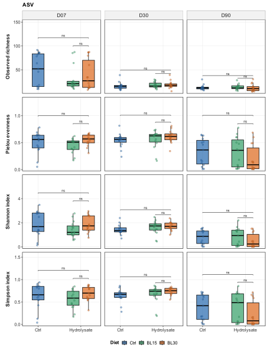
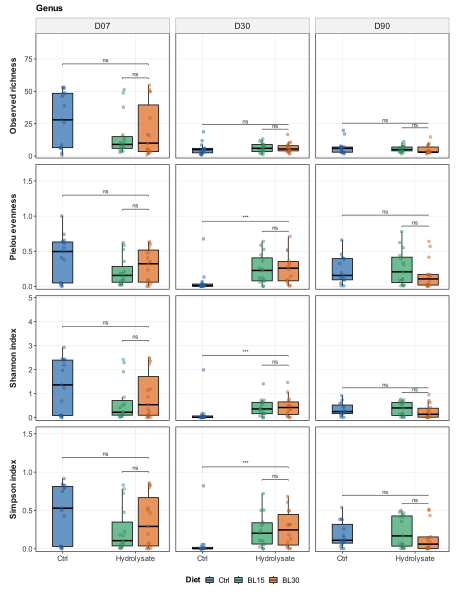
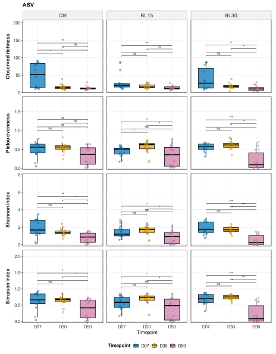
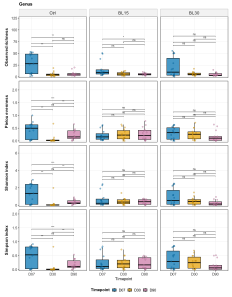
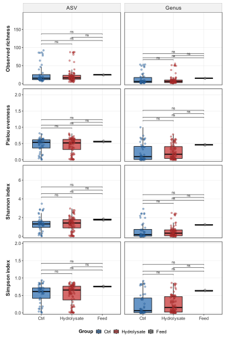

# Diversidad alfa

## Objetivos de análisis

Este bloque evalúa si la diversidad alfa de la microbiota intestinal cambia con la dieta, el nivel de hidrolizado y el tiempo de muestreo. Se analizan dos niveles taxonómicos, ASV y género, y tres métricas complementarias: **Observed richness**, **Shannon index** y **Simpson index**. Las definiciones, fórmulas e interpretación de cada índice se detallan en la sección siguiente.

El objetivo biológico es determinar si el hidrolizado modifica la complejidad interna de la comunidad intestinal, si existe una respuesta dependiente de dosis (`BL15` vs `BL30`) y si esos efectos dependen del tiempo.

## Métricas de diversidad alfa: definición e interpretación

La diversidad alfa resume la estructura de una comunidad **dentro de cada muestra**. En este análisis, cada muestra se representa como una tabla de abundancias de ASVs o de géneros. Si $n_i$ es el número de lecturas asignadas al taxón $i$ y $N$ es el total de lecturas de la muestra, la abundancia relativa de cada taxón se define como:

$$
N = \sum_{i=1}^{S} n_i, \qquad p_i = \frac{n_i}{N}
$$

donde $S$ representa el conjunto de taxones detectados en la matriz analizada. Todas las métricas se calcularon con `phyloseq::estimate_richness`, que para Shannon y Simpson utiliza las funciones de diversidad de `vegan` [@mcmurdie2013phyloseq; @oksanen2024vegan]. Por tanto, los valores deben interpretarse como diversidad de la **matriz filtrada y procesada**, no como una medida absoluta de toda la microbiota real.

### Observed richness

La riqueza observada es el número de taxones detectados en una muestra:

$$
S_{obs} = \sum_{i=1}^{S} \mathbf{1}(n_i > 0)
$$

En este proyecto, $S_{obs}$ se calcula por separado a nivel de **ASV** y de **género**. A nivel ASV mide cuántas variantes de secuencia quedan presentes tras el filtrado; a nivel género mide cuántos géneros se detectan después de agrupar ASVs por taxonomía.

Su interpretación es directa: valores mayores indican más taxones detectados. Sin embargo, también es la métrica más sensible a la profundidad de secuenciación, a la eliminación de ASVs raras, a la resolución taxonómica y a los filtros previos. Por eso, en este informe se interpreta como **riqueza observada tras filtrado**, no como riqueza ecológica absoluta. No se usaron estimadores de riqueza no observada, como Chao1, porque el objetivo del bloque era comparar los objetos finales usados downstream y no inferir el número total de taxones no detectados.

### Shannon index

El índice de Shannon procede de la teoría de la información y mide la incertidumbre asociada a predecir la identidad taxonómica de una lectura escogida al azar [@shannon1948mathematicalTheoryCommunication]. Se calcula como:

$$
H' = -\sum_{i=1}^{S_{obs}} p_i \ln(p_i)
$$

En la práctica, $H'$ aumenta cuando una muestra tiene más taxones y cuando sus abundancias están más equilibradas. Si una muestra está dominada por un único taxón, $H'$ se aproxima a 0. Si todos los taxones observados tienen la misma abundancia, el máximo teórico es:

$$
H'_{max} = \ln(S_{obs})
$$

Shannon index combina riqueza y equidad, pero conserva unidades logarítmicas. Por eso, una diferencia de Shannon no equivale directamente a “un taxón más” o “un género más”. Para una interpretación más intuitiva, Shannon puede transformarse en número efectivo de taxones mediante $\exp(H')$, que corresponde al número de taxones igualmente abundantes que producirían la misma diversidad [@hill1973diversityEvenness; @jost2006entropyDiversity]. En este bloque se reporta el valor clásico $H'$, no su transformación a número efectivo.

### Simpson index usado en este informe

El índice original de Simpson mide la probabilidad de que dos lecturas escogidas al azar pertenezcan al mismo taxón [@simpson1949measurementDiversity]:

$$
D = \sum_{i=1}^{S_{obs}} p_i^2
$$

En cambio, el valor que se reporta aquí como **Simpson index** corresponde al complemento de Simpson o **Gini-Simpson index**, que es lo que devuelve `vegan::diversity(index = "simpson")` y, por tanto, `phyloseq::estimate_richness` para la métrica `Simpson`:

$$
1 - D = 1 - \sum_{i=1}^{S_{obs}} p_i^2
$$

::: {.callout-important title="Interpretación de Simpson en este análisis"}
En este informe, **Simpson index no es el inverso de Simpson**. No corresponde a $1/D$ ni al número efectivo de taxones de orden 2. Es el índice **Gini-Simpson**, interpretable como la probabilidad de que dos lecturas tomadas al azar pertenezcan a taxones diferentes.
:::

Gini-Simpson toma valores entre 0 y un máximo cercano a 1. Valores bajos indican dominancia fuerte de uno o pocos taxones. Valores altos indican mayor equidad. En comparación con Shannon, Simpson/Gini-Simpson es menos sensible a taxones raros y responde más a cambios en los taxones abundantes. Por eso es especialmente útil para detectar situaciones de dominancia, como las observadas en algunos grupos dominados por `Vibrio` o Mycoplasmataceae.

### Lectura conjunta de las métricas

Las tres métricas se interpretan de forma complementaria:

| Métrica | Qué mide principalmente | Qué hace que aumente | Qué hace que disminuya | Lectura en este estudio |
|---|---|---|---|---|
| Observed richness | Número de taxones detectados | Más ASVs/géneros presentes tras filtrado | Pérdida de taxones raros, menor profundidad, dominancia extrema o filtrado estricto | Complejidad taxonómica observada, muy dependiente del procesamiento. |
| Shannon index | Riqueza + equidad | Más taxones y abundancias más equilibradas | Dominancia de pocos taxones | Diversidad general de la comunidad; útil para comparar complejidad ecológica. |
| Simpson index / Gini-Simpson | Equidad y dominancia de taxones abundantes | Menor dominancia, distribución más equilibrada | Dominancia fuerte de uno o pocos taxones | Señal de dominancia/equidad; ayuda a interpretar comunidades dominadas por `Vibrio` o Mycoplasmataceae. |

Cuando riqueza observada no cambia pero Shannon o Simpson sí lo hacen, la interpretación más probable es un cambio en **equidad** o **dominancia**, no necesariamente la aparición de nuevos taxones. En este bloque, esa distinción es importante porque la señal más clara del hidrolizado aparece en D30 a nivel género para Shannon index y Simpson index, pero no de forma equivalente para riqueza observada.

## Inputs, outputs y organización

### Inputs principales

-   Objeto ASV intestinal filtrado: [`ps_biological_final_silva_138_2.rds`](../../02_filtering/objects/ps_biological_final_silva_138_2.rds)
-   Objeto intestinal agregado a género: [`ps_biological_genus_silva_138_2.rds`](../../02_filtering/objects/ps_biological_genus_silva_138_2.rds)
-   Objeto global filtrado para la comparación complementaria con pienso: [`ps_final_silva_138_2.rds`](../../02_filtering/objects/ps_final_silva_138_2.rds)
-   Metadatos finales de profundidad intestinal: [`final_biological_sample_depths.csv`](../../02_filtering/tables/final_biological_sample_depths.csv)

### Tablas generadas

-   [`alpha_diversity.csv`](../assets/results/06_alpha_diversity/tables/alpha_diversity.csv): valores de diversidad alfa por muestra, con columna `tax_level`.
-   [`alpha_tests.csv`](../assets/results/06_alpha_diversity/tables/alpha_tests.csv): pruebas estadísticas para ASV y género.
-   [`alpha_diversity_ctrl_hydro_feed.csv`](../assets/results/06_alpha_diversity/tables/alpha_diversity_ctrl_hydro_feed.csv): valores alfa para la comparación complementaria `Ctrl`/`Hydrolysate`/`Feed`.
-   [`alpha_tests_ctrl_hydro_feed.csv`](../assets/results/06_alpha_diversity/tables/alpha_tests_ctrl_hydro_feed.csv): pruebas estadísticas de la comparación con pienso.

### Figuras generadas

Las figuras se exportan como `PDF` y `SVG` y se ordenan por comparación:

-   `figures/diet_time/`: dieta e hidrolizado dentro de cada tiempo.
-   `figures/time_diet/`: cambios temporales dentro de cada dieta.
-   `figures/hydro_time/`: contraste `Ctrl` vs `Hydrolysate` por tiempo.
-   `figures/ctrl_hydro_feed/`: comparación complementaria `Ctrl`/`Hydrolysate`/`Feed`.

## Métodos estadísticos

Se utilizaron pruebas no paramétricas:

1.  Wilcoxon rank-sum para comparaciones de dos grupos.
2.  Kruskal-Wallis para comparaciones con tres grupos o más.
3.  Wilcoxon por pares con ajuste BH cuando procede tras comparaciones multigrupo.

La notación integrada en las figuras sigue: `ns`, `*`, `**`, `***`.

> **Nota metodológica.** Observed richness debe interpretarse como riqueza tras filtrado, no como riqueza ecológica absoluta. Los objetos filtrados no contienen singletons, por lo que las estimaciones de riqueza son conservadoras y dependen del preprocesado aplicado.

## Resultados principales

### Efecto de dieta e hidrolizado dentro de cada tiempo

**Figura 1. Diversidad alfa por dieta y tiempo a nivel ASV.** Cada panel muestra una métrica de diversidad alfa por tiempo. `Ctrl` se compara con el bloque `Hydrolysate`, dentro del cual se desglosan `BL15` y `BL30`. La barra superior representa `Ctrl` vs `Hydrolysate`; la barra inferior representa `BL15` vs `BL30`.

**Figura 2. Diversidad alfa por dieta y tiempo a nivel género.** La misma estructura que la Figura 1, pero con ASVs agregados a género.

El análisis no muestra un efecto global estable de dieta ni de hidrolizado sobre la diversidad alfa cuando se combinan todos los tiempos. A nivel ASV, ni la riqueza observada ni Shannon index difieren de forma significativa entre `Ctrl`, `BL15` y `BL30`. Lo mismo ocurre para el contraste agregado `Ctrl` vs `Hydrolysate`. Simpson index confirma la misma lectura global: no hay efecto sostenido de dieta/hidrolizado al combinar todos los tiempos.

La señal más clara asociada al hidrolizado aparece en **D30 a nivel género**, especialmente en Shannon index y Simpson index. En ese punto, el efecto de dieta es significativo para Shannon index (`p = 0.0023`) y Simpson index (`p = 0.0020`). El contraste agregado `Ctrl` vs `Hydrolysate` también es significativo en D30 para Shannon index (`p = 0.00053`) y Simpson index (`p = 0.00044`) a nivel género. No se observa una señal comparable para riqueza observada.

**Tabla 1. Resumen estadístico de las comparaciones globales y de D30.**

| Nivel | Métrica | Comparación | Estrato | Test | Contraste | p |
|-----------|-----------|-----------|-----------|-----------|-----------|----------:|
| ASV | Observed richness | Dieta | Global | Kruskal-Wallis | `Ctrl`/`BL15`/`BL30` | 0.848 |
| ASV | Shannon index | Dieta | Global | Kruskal-Wallis | `Ctrl`/`BL15`/`BL30` | 0.789 |
| ASV | Simpson index | Dieta | Global | Kruskal-Wallis | `Ctrl`/`BL15`/`BL30` | 0.813 |
| ASV | Observed richness | Hidrolizado | Global | Wilcoxon | `Ctrl` vs `Hydrolysate` | 0.607 |
| ASV | Shannon index | Hidrolizado | Global | Wilcoxon | `Ctrl` vs `Hydrolysate` | 0.821 |
| ASV | Simpson index | Hidrolizado | Global | Wilcoxon | `Ctrl` vs `Hydrolysate` | 0.911 |
| Genus | Observed richness | Dieta | Global | Kruskal-Wallis | `Ctrl`/`BL15`/`BL30` | 0.832 |
| Genus | Shannon index | Dieta | Global | Kruskal-Wallis | `Ctrl`/`BL15`/`BL30` | 0.710 |
| Genus | Simpson index | Dieta | Global | Kruskal-Wallis | `Ctrl`/`BL15`/`BL30` | 0.661 |
| Genus | Observed richness | Hidrolizado | Global | Wilcoxon | `Ctrl` vs `Hydrolysate` | 0.973 |
| Genus | Shannon index | Hidrolizado | Global | Wilcoxon | `Ctrl` vs `Hydrolysate` | 0.431 |
| Genus | Simpson index | Hidrolizado | Global | Wilcoxon | `Ctrl` vs `Hydrolysate` | 0.373 |
| Genus | Shannon index | Dieta | D30 | Kruskal-Wallis | `Ctrl`/`BL15`/`BL30` | 0.0023 |
| Genus | Simpson index | Dieta | D30 | Kruskal-Wallis | `Ctrl`/`BL15`/`BL30` | 0.0020 |
| Genus | Shannon index | Hidrolizado | D30 | Wilcoxon | `Ctrl` vs `Hydrolysate` | 0.00053 |
| Genus | Simpson index | Hidrolizado | D30 | Wilcoxon | `Ctrl` vs `Hydrolysate` | 0.00044 |

Los resultados globales indican ausencia de un efecto estable de dieta/hidrolizado sobre diversidad alfa. La excepción principal es D30 a nivel género, donde Shannon index y Simpson index apuntan a una comunidad más equitativa en los grupos con hidrolizado que en `Ctrl`.

### Cambios temporales dentro de cada dieta

**Figura 3. Cambios temporales de diversidad alfa a nivel ASV.** Cada columna representa una dieta y cada fila una métrica. La barra superior muestra la comparación global entre tiempos; las barras inferiores muestran comparaciones por pares.

**Figura 4. Cambios temporales de diversidad alfa a nivel género.** La figura permite evaluar si la dinámica temporal se conserva tras agrupar ASVs por género.

El efecto del tiempo es el patrón más fuerte del análisis de diversidad alfa. La riqueza observada disminuye claramente desde D07 hacia D30 y/o D90. Este descenso se observa tanto a nivel ASV como género, y aparece dentro de varias dietas y también en el conjunto agregado `Hydrolysate`.

En ASV, el efecto global de tiempo es significativo para riqueza observada (`p < 0.001`), Shannon index (`p < 0.001`) y Simpson index (`p < 0.001`). La riqueza observada baja de D07 a D30 y D90, y Shannon/Simpson descienden especialmente en D90. A nivel género, la riqueza observada también cambia con el tiempo (`p < 0.001`) y las métricas de equidad muestran una señal temporal más moderada pero significativa: Shannon index (`p = 0.0032`) y Simpson index (`p = 0.0082`).

**Tabla 2. Medianas de diversidad alfa por dieta y tiempo.**

| Nivel | Dieta | Tiempo |   n | Observed median | Shannon median | Simpson median |
|-------|-------|--------|----:|----------------:|---------------:|---------------:|
| ASV   | Ctrl  | D07    |  15 |            56.0 |          1.713 |          0.661 |
| ASV   | Ctrl  | D30    |  15 |            15.0 |          1.349 |          0.671 |
| ASV   | Ctrl  | D90    |  15 |            13.0 |          0.879 |          0.418 |
| ASV   | BL15  | D07    |  15 |            24.0 |          1.208 |          0.587 |
| ASV   | BL15  | D30    |  15 |            17.0 |          1.736 |          0.740 |
| ASV   | BL15  | D90    |  15 |            14.0 |          0.945 |          0.485 |
| ASV   | BL30  | D07    |  15 |            30.0 |          1.741 |          0.698 |
| ASV   | BL30  | D30    |  14 |            18.5 |          1.707 |          0.751 |
| ASV   | BL30  | D90    |  14 |            10.5 |          0.244 |          0.081 |
| Genus | Ctrl  | D07    |  15 |            29.0 |          1.392 |          0.535 |
| Genus | Ctrl  | D30    |  15 |             5.0 |          0.016 |          0.004 |
| Genus | Ctrl  | D90    |  15 |             6.0 |          0.253 |          0.114 |
| Genus | BL15  | D07    |  15 |            10.0 |          0.225 |          0.107 |
| Genus | BL15  | D30    |  15 |             7.0 |          0.364 |          0.203 |
| Genus | BL15  | D90    |  15 |             5.0 |          0.473 |          0.191 |
| Genus | BL30  | D07    |  15 |            11.0 |          0.579 |          0.303 |
| Genus | BL30  | D30    |  14 |             6.5 |          0.427 |          0.247 |
| Genus | BL30  | D90    |  14 |             4.0 |          0.140 |          0.061 |

Las medianas muestran una caída pronunciada de riqueza desde D07, especialmente en controles. El patrón temporal domina sobre las diferencias globales entre dietas.

### Comparación complementaria con pienso

**Figura 5. Comparación global `Ctrl`/`Hydrolysate`/`Feed`.** Las muestras de pienso se incluyen como control complementario. Esta comparación no forma parte de la inferencia intestinal principal, pero ayuda a evaluar si el pienso tiene una diversidad alfa comparable a la microbiota de los peces.

La comparación `Ctrl`/`Hydrolysate`/`Feed` no muestra diferencias significativas en diversidad alfa a nivel ASV ni a nivel género. Tras conservar cloroplasto y mitocondria, las muestras de pienso muestran medianas de riqueza y equidad relativamente altas, especialmente a nivel género, pero el tamaño muestral del pienso es bajo (`n = 3`) y la diversidad alfa no evalúa identidad taxonómica compartida.

**Tabla 3. Resumen de la comparación `Ctrl`/`Hydrolysate`/`Feed`.**

| Nivel | Grupo       |   n | Observed median | Shannon median | Simpson median |
|-------|-------------|----:|----------------:|---------------:|---------------:|
| ASV   | Ctrl        |  45 |            16.0 |          1.325 |          0.610 |
| ASV   | Hydrolysate |  88 |            18.0 |          1.446 |          0.662 |
| ASV   | Feed        |   3 |            25.0 |          1.783 |          0.754 |
| Genus | Ctrl        |  45 |             7.0 |          0.191 |          0.087 |
| Genus | Hydrolysate |  88 |             7.0 |          0.345 |          0.153 |
| Genus | Feed        |   3 |            15.0 |          1.199 |          0.628 |

No se detectan diferencias significativas entre `Ctrl`, `Hydrolysate` y `Feed` para riqueza observada, Shannon index o Simpson index. Aun así, el patrón descriptivo del pienso es relevante porque ahora se conservan componentes como cloroplasto/mitocondria. La pregunta de si la microbiota intestinal contiene taxones del pienso debe abordarse principalmente con composición taxonómica, beta diversidad y análisis de solapamiento/core.

## Interpretación biológica

La lectura biológica principal es que la microbiota intestinal parece seguir un proceso de sucesión temporal o estabilización ecológica durante el experimento. En D07 las comunidades son más ricas y variables, lo que puede reflejar una microbiota aún poco estabilizada tras el inicio del ensayo, más sensible al ambiente, al manejo, al lote inicial o a la transición dietaria. Con el tiempo, especialmente hacia D90, la riqueza baja y las comunidades parecen más seleccionadas. Este patrón es compatible con filtrado ecológico por el huésped, la dieta y las condiciones del sistema.

El hidrolizado no parece aumentar ni reducir de forma general la diversidad alfa a lo largo de todo el ensayo. Su efecto es más específico y transitorio: en D30, los grupos `BL15` y `BL30` muestran mayor Shannon index y Simpson index a nivel género que `Ctrl`. Esto sugiere que, en esa ventana intermedia, el hidrolizado podría favorecer una comunidad más equilibrada entre géneros, con menor dominancia de unos pocos grupos. No implica necesariamente una ganancia fuerte de nuevos taxones, porque la señal es más clara en las métricas de equidad que en riqueza observada.

No se observa una respuesta dosis-dependiente clara entre `BL15` y `BL30`. Cuando aparece la señal de hidrolizado en D30, ambas dosis se comportan de forma similar y no difieren entre sí. Esto sugiere que, para diversidad alfa, la presencia de hidrolizado puede ser más importante que el porcentaje exacto, o que las métricas alfa no son suficientemente sensibles para separar las dos dosis.

La desaparición de diferencias entre dietas en D90 apunta a convergencia o adaptación de la microbiota. Si el hidrolizado induce cambios persistentes, es probable que se expresen más como cambios de composición taxonómica específica, estructura beta o abundancia diferencial que como cambios globales de riqueza o equidad.

## Conclusión del bloque

La diversidad alfa responde principalmente al tiempo. El hidrolizado muestra una señal puntual en D30 a nivel género, consistente con una comunidad más equitativa en `BL15` y `BL30` que en `Ctrl` según Shannon index y Simpson index, pero no se observa un efecto global sostenido ni una respuesta dosis-dependiente clara. Estos resultados apoyan continuar la interpretación con beta diversidad, composición taxonómica, solapamientos con pienso y abundancia diferencial para identificar qué taxones explican la señal observada en D30.