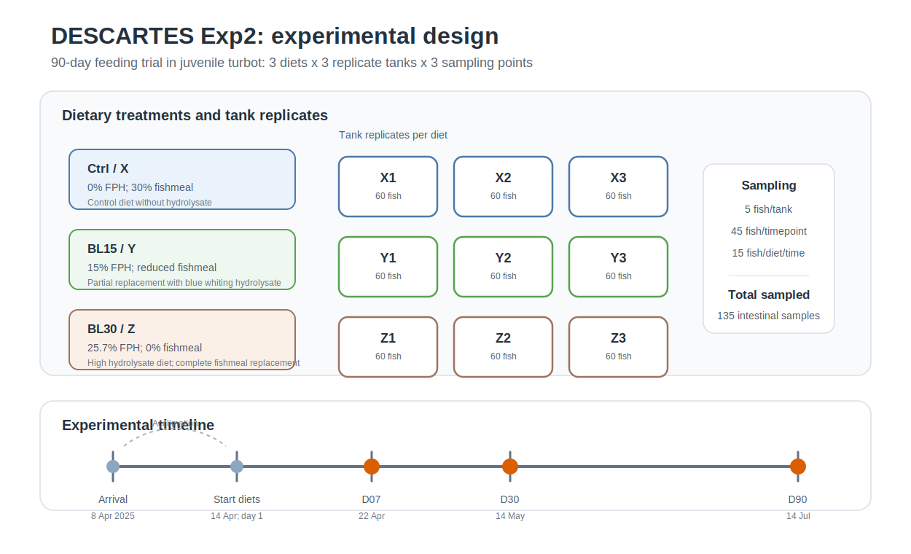

# Diseño experimental, animales de experimentación y dietas

## 1. Diseño experimental

El diseño experimental consistió en un ensayo nutricional longitudinal de 90 días con tres tratamientos dietéticos y tres réplicas por tratamiento.

| Factor                  | Descripción                       |
|-------------------------|-----------------------------------|
| Especie                 | Rodaballo, *Scophthalmus maximus* |
| Fase                    | Juveniles                         |
| Peso inicial aproximado | 10–20 g                           |
| Duración del ensayo     | 90 días                           |
| Número de dietas        | 3                                 |
| Réplicas por dieta      | 3 tanques                         |
| Tanques totales         | 9                                 |
| Peces por tanque        | 60                                |
| Peces totales estimados | 540                               |
| Muestreos               | Día 7, día 30 y día 90            |
| Ayuno previo            | 24 h antes de cada muestreo       |

> Nota importante: el documento del hito de microbiota menciona “720 rodaballos en 12 tanques”, pero eso parece arrastrado del Experimento 1. Para este Experimento 2, la planificación específica indica 3 dietas × 3 réplicas × 60 peces/tanque = 540 peces. Aquí el Excel mental del proyecto ganó al copia-pega, que venía con sueño.

El esquema general del ensayo se resume en la @fig-experimental-design. La figura muestra la disposición lógica de las réplicas por dieta y los tres puntos de muestreo usados para los análisis microbiológicos.

{#fig-experimental-design fig-alt="Esquema del diseño experimental con tres dietas, nueve tanques y tres puntos temporales de muestreo."}

## 2. Calendario experimental

| Evento | Fecha | Descripción |
|----------------------|----------------------------:|----------------------|
| Llegada de los peces | 8 abril 2025 | Entrada de los rodaballos en las instalaciones |
| Aclimatación | 8–13 abril 2025 | Periodo previo al inicio de las dietas experimentales |
| Inicio del experimento | 14 abril 2025 | Día 1; inicio de alimentación con las nuevas dietas |
| Muestreo 1 | 22 abril 2025 | Día 7 de alimentación experimental |
| Muestreo 2 | 14 mayo 2025 | Día 30 de alimentación experimental |
| Muestreo 3 | 14 julio 2025 | Día 90 de alimentación experimental |

El día anterior a cada muestreo se retiró la toma de alimento de las 16:00 h para garantizar un ayuno de 24 h antes de la toma de muestras. :contentReference[oaicite:2]{index="2"}

## 3. Dietas experimentales

Las dietas se formularon utilizando hidrolizado proteico de lirio de bajo peso molecular, 1–2 kDa. Este hidrolizado procede de descartes de *Micromesistius poutassou* y se incorporó como ingrediente proteico alternativo a la harina de pescado.

Se utilizaron tres dietas:

| Código de muestreo | Nombre | Descripción conceptual |
|------------------------|------------------------|------------------------|
| X | Control | Dieta con harina de pescado, sin hidrolizado |
| Y | BL15 | Dieta con inclusión intermedia de hidrolizado |
| Z | BL30 | Dieta con inclusión alta de hidrolizado y sustitución total de la harina de pescado |

## 4. Composición general de las dietas

| Dieta | Hidrolizado de lirio | Harina de pescado | Interpretación |
|-----------------|------------------:|------------------:|-----------------|
| CTRL / X | 0 % | 30 % | Control sin hidrolizado |
| BL15 / Y | 15 % | reducida | Sustitución parcial |
| BL30 / Z | alta inclusión | 0 % | Sustitución completa de harina de pescado |

En la formulación detallada, la dieta BL15 se diseñó para ser comparable a la dieta con 15 % de hidrolizado del Experimento 1, mientras que BL30 fue planteada para llevar la sustitución de harina de pescado al máximo nivel ensayado. :contentReference[oaicite:3]{index="3"}

## 5. Composición completa de los piensos

Tamaño de pellet: 2,5 mm\
Cantidad producida por dieta: 14 kg

| Ingrediente (%)             |        CTRL |        BL15 |        BL30 |
|-----------------------------|------------:|------------:|------------:|
| Fishmeal Super Prime        |      30,000 |      12,400 |       0,000 |
| Krill meal                  |       5,000 |       5,000 |       5,000 |
| FPH-Lirio                   |       0,000 |      15,000 |      25,700 |
| Poultry meal                |       5,700 |       5,700 |       5,700 |
| Soy protein concentrate     |      14,500 |      14,500 |      14,500 |
| Pea protein concentrate     |       4,800 |       4,800 |       4,800 |
| Wheat gluten                |      13,500 |      13,500 |      13,500 |
| Wheat meal                  |       8,880 |       9,780 |      10,280 |
| Faba beans, low tannins     |       4,000 |       4,000 |       4,000 |
| Vitamin and mineral premix  |       1,000 |       1,000 |       1,000 |
| Choline chloride 50 %       |       0,200 |       0,200 |       0,200 |
| Antioxidant                 |       0,200 |       0,200 |       0,200 |
| Sodium propionate           |       0,100 |       0,100 |       0,100 |
| MAP, monoammonium phosphate |       0,300 |       0,300 |       0,300 |
| Yttrium oxide               |       0,020 |       0,020 |       0,020 |
| Rapeseed oil                |       5,800 |       7,500 |       8,700 |
| Fish oil                    |       6,000 |       6,000 |       6,000 |
| **Total**                   | **100,000** | **100,000** | **100,000** |

## 6. Composición proximal de los piensos

| Composición              | CTRL | BL15 | BL30 |
|--------------------------|-----:|-----:|-----:|
| Proteína bruta, % pienso | 53,1 | 53,1 | 53,1 |
| Grasa bruta, % pienso    | 17,1 | 17,1 | 17,1 |

Las tres dietas fueron formuladas para ser isoproteicas e isolipídicas, manteniendo el mismo porcentaje de proteína y grasa bruta. Esto es importante porque permite atribuir las posibles diferencias observadas principalmente al cambio en la fuente proteica, y no a diferencias groseras de composición nutricional. :contentReference[oaicite:4]{index="4"}

## 7. Animales de experimentación

Los rodaballos juveniles llegaron el 8 de abril de 2025 con un peso aproximado de 10–20 g. Inicialmente se distribuyeron en dos tanques durante la llegada/aclimatación y posteriormente se repartieron en nueve tanques independientes.

Cada tanque contenía 60 peces. Las dietas fueron distribuidas aleatoriamente entre los tanques, asegurando una dispersión adecuada de las réplicas para evitar sesgos por posición o tanque.

| Dieta   | Réplica 1 | Réplica 2 | Réplica 3 |
|---------|-----------|-----------|-----------|
| Control | X1        | X2        | X3        |
| BL15    | Y1        | Y2        | Y3        |
| BL30    | Z1        | Z2        | Z3        |

## 8. Condiciones de mantenimiento

Los peces se mantuvieron bajo condiciones controladas durante todo el ensayo.

| Parámetro             | Condición                                 |
|-----------------------|-------------------------------------------|
| Fotoperiodo           | Natural                                   |
| Temperatura           | 17 °C                                     |
| Alimentación          | Dos tomas diarias                         |
| Horarios              | 9:00 y 16:00 h                            |
| Régimen               | Ad libitum controlado                     |
| Estimación de ingesta | Pesada del pienso ofrecido y del sobrante |

Para cada toma se prepararon botes de pienso equivalentes al 1,5 % del peso de los peces. El alimento se ofreció hasta que los peces dejaron de subir a por los gránulos. Posteriormente se pesó el pienso sobrante para calcular la ingesta diaria. :contentReference[oaicite:5]{index="5"}

## 9. Esquema de muestreo

Se realizaron tres muestreos:

| Punto      |         Fecha | Tiempo con dieta experimental |
|------------|--------------:|------------------------------:|
| Muestreo 1 | 22 abril 2025 |                         Día 7 |
| Muestreo 2 |  14 mayo 2025 |                        Día 30 |
| Muestreo 3 | 14 julio 2025 |                        Día 90 |

En cada muestreo se tomaron 5 peces por tanque:

| Cálculo                     | Valor |
|-----------------------------|------:|
| Peces por tanque y muestreo |     5 |
| Tanques totales             |     9 |
| Peces por muestreo          |    45 |
| Peces por dieta y muestreo  |    15 |
| Muestreos totales           |     3 |
| Peces muestreados en total  |   135 |

El orden previsto de muestreo fue:

\`\`\`text X1 → Y1 → Z1 → X2 → Y2 → Z2 → X3 → Y3 → Z3
