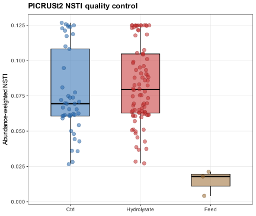
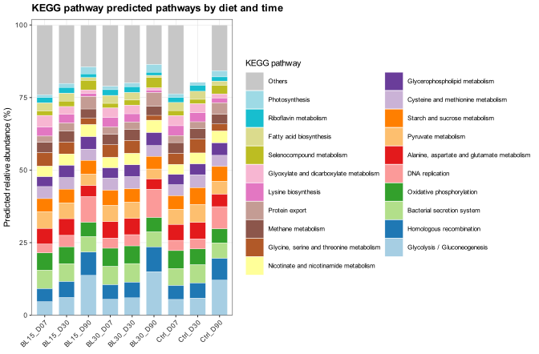
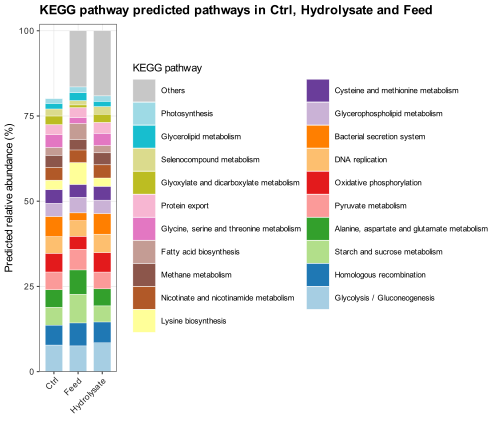
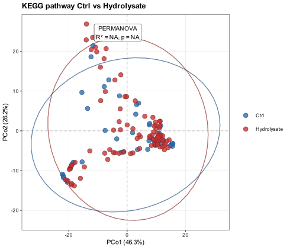
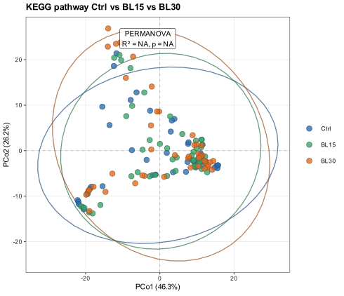
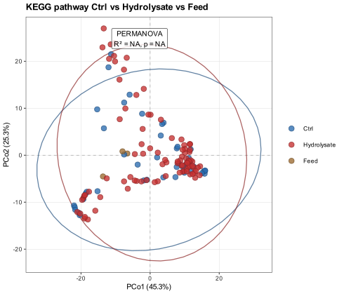
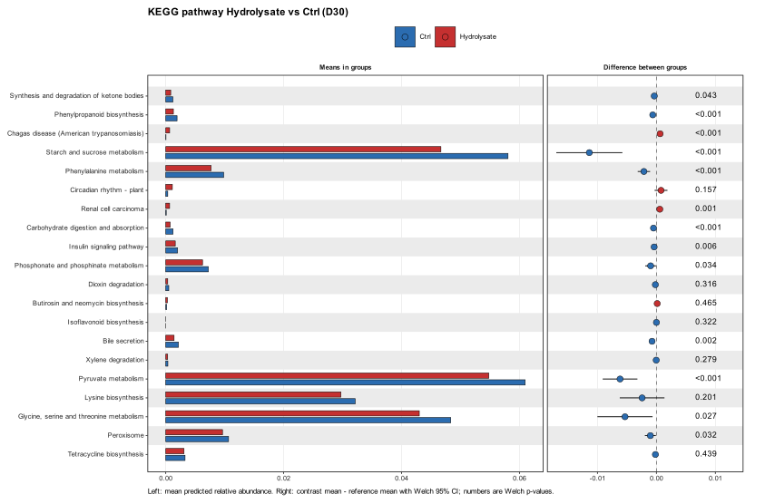
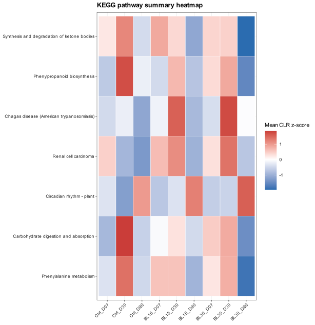

# Functional prediction report

## 1. Objetivo

Este bloque evalua el potencial funcional de la microbiota intestinal a partir de perfiles 16S. La lectura principal se centra en rutas KEGG interpretables, porque los codigos KO, EC o MetaCyc aislados no son suficientemente utiles para discutir los objetivos biologicos del ensayo.

El bloque queda consolidado en PICRUSt2. La comparacion con Feed se conserva como contexto descriptivo, mientras que los tests diferenciales centrales se restringen a las muestras intestinales.

## 2. Organizacion del bloque

```text
09_functional_prediction/
├── picrust2/
│   ├── inputs/
│   ├── native/
│   ├── tables/
│   ├── figures/
│   ├── objects/
│   └── logs/
└── reports/
```

## 3. PICRUSt2: inputs y QC

Se prepararon 136 muestras y 160 ASVs para PICRUSt2. Se excluyeron 10 ASVs clasificadas como cloroplasto o mitocondria, que acumulan 119235 lecturas en las muestras consideradas. Esta exclusion se aplica solo a la inferencia funcional, porque estas secuencias no representan genomas bacterianos utiles para PICRUSt2.

Tabla 1. Resumen de construccion del input de PICRUSt2.

`../../assets/results/09_functional_prediction/picrust2/tables/picrust2_input_summary.csv`

Tabla 2. Retencion de lecturas por muestra tras excluir cloroplasto y mitocondria para PICRUSt2.

`../../assets/results/09_functional_prediction/picrust2/tables/picrust2_read_retention_by_sample.csv`

La mediana del NSTI ponderado por abundancia fue 0.073 en las muestras incluidas. Este valor resume la proximidad filogenetica de las ASVs a genomas de referencia y debe considerarse antes de interpretar el potencial funcional.



**Figura 1.** Distribucion del NSTI ponderado por abundancia en los grupos incluidos en PICRUSt2.

## 4. Anotacion e interpretacion funcional

PICRUSt2 produce EC, KO y rutas MetaCyc nativas. Esas capas se conservan en tablas para trazabilidad y consulta, pero las figuras finales se limitan a `kegg_pathway`. Esta capa se deriva desde KO usando los mapas KEGG incluidos en PICRUSt2. Cuando un KO pertenece a varias rutas, su abundancia se reparte entre ellas antes de sumar, evitando inflar artificialmente rutas con muchos solapamientos.

Tabla 3. Mapa KO a rutas KEGG usado para construir la capa `kegg_pathway`.

`../../assets/results/09_functional_prediction/picrust2/tables/annotations/ko_to_kegg_pathways.csv`

Tabla 4. Anotaciones funcionales completas conservadas para EC, KO, KEGG pathway y MetaCyc.

`../../assets/results/09_functional_prediction/picrust2/tables/annotations/functional_feature_annotations.csv`

## 5. Composicion funcional descriptiva

Los barplots resumen las rutas KEGG mas abundantes por dieta-tiempo y la comparacion contextual Ctrl/Hydrolysate/Feed. Feed se interpreta como referencia del potencial funcional bacteriano asociado al pienso, no como grupo biologico equivalente al intestino.



**Figura 2.** Rutas KEGG predichas mas abundantes agregadas por dieta y tiempo en muestras intestinales.



**Figura 3.** Rutas KEGG predichas en Ctrl, Hydrolysate y Feed como comparacion descriptiva.

## 6. Ordenacion funcional

Las ordenaciones Bray y Aitchison se generan solo para rutas KEGG. Se priorizan tres preguntas: separacion global Ctrl vs Hydrolysate, separacion por nivel de inclusion (Ctrl, BL15, BL30) y posicion del Feed como contexto externo.

El resultado central es que el potencial funcional agregado no se separa de forma significativa entre Ctrl e Hydrolysate en intestino. Tampoco aparece una separacion significativa cuando el hidrolizado se desglosa en BL15 y BL30. Esto apunta a redundancia funcional: puede haber cambios taxonomicos, pero el repertorio funcional predicho a escala de rutas KEGG permanece bastante conservado.

En PERMANOVA, Ctrl vs Hydrolysate no fue significativo ni con Bray (R2 = 0.006; p = 0.414) ni con Aitchison (R2 = 0.006; p = 0.473). El desglose Ctrl vs BL15 vs BL30 tampoco fue significativo (Bray R2 = 0.009; p = 0.623; Aitchison R2 = 0.011; p = 0.646). Las pruebas betadisper asociadas no fueron significativas, por lo que no hay evidencia de que estos resultados esten dominados por diferencias de dispersion entre grupos.

Feed si se desplaza respecto a las muestras intestinales en Aitchison, lo que encaja con que el pienso es una matriz externa con fuerte componente vegetal y de hidrolizado de pescado. Esta comparacion se interpreta como contexto de entrada dietaria, no como contraste biologico principal frente al intestino.

La comparacion Ctrl/Hydrolysate/Feed fue significativa con Aitchison (R2 = 0.038; p = 0.006) y quedo cerca del umbral con Bray (R2 = 0.035; p = 0.066), sin betadisper significativo. Esto sugiere que el perfil funcional predicho del pienso contiene una senal distinguible, especialmente en geometria composicional, pero no debe mezclarse con la inferencia central sobre peces.



**Figura 4.** Ordenacion Aitchison de rutas KEGG para Ctrl frente a Hydrolysate en muestras intestinales.



**Figura 5.** Ordenacion Aitchison de rutas KEGG comparando Ctrl, BL15 y BL30.



**Figura 6.** Ordenacion Aitchison de rutas KEGG incluyendo Feed como contexto descriptivo.

Tabla 5. Resultados PERMANOVA de las ordenaciones funcionales y pruebas betadisper asociadas.

`../../assets/results/09_functional_prediction/picrust2/tables/ordination/functional_permanova_results.csv`

`../../assets/results/09_functional_prediction/picrust2/tables/ordination/functional_betadisper_results.csv`

## 7. Rutas KEGG diferenciales

Los contrastes diferenciales se limitan a las siete comparaciones clave: Hydrolysate vs Ctrl global, BL15 vs Ctrl global, BL30 vs Ctrl global, BL30 vs BL15 global, y Hydrolysate vs Ctrl dentro de D07, D30 y D90. El modelo usa abundancias CLR y limma; los graficos tipo STAMP muestran medias por grupo, diferencia de medias e intervalo de confianza del 95%.

Las comparaciones con mas rutas KEGG diferenciales fueron D30_Hydrolysate_vs_Ctrl (7); global_BL30_vs_Ctrl (1); global_Hydrolysate_vs_Ctrl (1); global_BL15_vs_Ctrl (0); global_BL30_vs_BL15 (0) .

La senal interpretable se concentra en D30_Hydrolysate_vs_Ctrl. Las rutas metabolicas mas defendibles biologicamente son synthesis and degradation of ketone bodies, phenylalanine metabolism y phenylpropanoid biosynthesis, todas reducidas en Hydrolysate en D30. Esta direccion sugiere una menor capacidad funcional predicha para procesar compuestos aromaticos y metabolitos energeticos alternativos en la microbiota intestinal de peces alimentados con hidrolizado en ese momento intermedio.

En concreto, synthesis and degradation of ketone bodies disminuyo en Hydrolysate (logFC = -0.548; q = 0.010), phenylalanine metabolism tambien disminuyo (logFC = -0.502; q = 0.040) y phenylpropanoid biosynthesis mostro una reduccion similar (logFC = -0.642; q = 0.010). Estas tres rutas son las que sostienen la lectura biologica principal del bloque funcional.

El resto de rutas significativas en D30 incluyen etiquetas KEGG menos adecuadas para interpretar microbiota intestinal 16S, como categorias de enfermedades humanas u organismal systems. Carbohydrate digestion and absorption tambien aparece reducida, pero se interpreta con cautela porque es una ruta KEGG de contexto hospedador/organismal, no una funcion microbiana directa en sentido estricto.

Una interpretacion plausible es que el hidrolizado, al aportar peptidos y aminoacidos mas facilmente disponibles, modifique temporalmente el sustrato que alcanza el intestino distal y reduzca la necesidad de metabolismo microbiano de aminoacidos aromaticos o compuestos fenolicos/vegetales. Esto no demuestra actividad metabolica real, pero propone una hipotesis coherente con la composicion de piensos y con la idea de que el efecto funcional del hidrolizado es temporal y no una reprogramacion global estable.

Las rutas KEGG etiquetadas como enfermedades humanas u organismal systems se conservan en tablas por trazabilidad, pero no sostienen la interpretacion biologica principal en microbiota de rodaballo.



**Figura 7.** Rutas KEGG con mayor cambio en la comparacion Hydrolysate vs Ctrl en D30.



**Figura 8.** Heatmap resumen de rutas KEGG relevantes por medias dieta-tiempo.

Tabla 6. Resultados limma/CLR para las comparaciones funcionales finales.

`../../assets/results/09_functional_prediction/picrust2/tables/differential/limma_final_pairwise_results.csv`

Tabla 7. Tablas tipo STAMP para rutas KEGG finales.

`../../assets/results/09_functional_prediction/picrust2/tables/effect_plots/stamp_effect_kegg_pathway_final_results.csv`

## 8. Interpretacion biologica integrada

La lectura conjunta es potente: la dieta con hidrolizado no parece desplazar de forma masiva el potencial funcional global de la comunidad intestinal, pero si deja una huella metabolica puntual en D30. Esto encaja con una comunidad con redundancia funcional, donde distintos taxones pueden sostener funciones parecidas, y con un posible periodo de adaptacion de la microbiota al cambio de matriz proteica.

La reduccion de phenylalanine metabolism y phenylpropanoid biosynthesis en D30 puede conectarse con el procesamiento microbiano de compuestos aromaticos. En nutricion acuicola, esto es interesante porque los piensos combinan fracciones animales y vegetales: las rutas de phenylpropanoid biosynthesis remiten a compuestos de origen vegetal, mientras que phenylalanine metabolism conecta con disponibilidad y transformacion de aminoacidos aromaticos. La ruta de ketone bodies apunta a diferencias en uso de acetil-CoA y metabolismo energetico alternativo.

Por tanto, la historia biologica no seria que el hidrolizado cambia todo el metabolismo microbiano, sino que produce una modulacion temporal y selectiva de rutas asociadas al tipo de sustrato que queda disponible para la microbiota. Esta hipotesis deberia contrastarse despues con abundancia diferencial taxonomica, contribuciones por ASV/genero y, si fuera posible, metabolomica o medidas de digestibilidad.

## 9. Limitaciones

Estos resultados son predicciones funcionales inferidas desde 16S, no metagenomica shotgun. Deben interpretarse como potencial funcional esperado y conectarse con composicion taxonomica, diversidad beta y abundancia diferencial. Las rutas KEGG permiten una lectura biologica mas directa que KO/EC aislados, pero dependen de la calidad de la asignacion filogenetica y de la cobertura de genomas de referencia.

El siguiente paso mas util es cruzar las rutas D30 con las contribuciones por ASV/genero y con la abundancia diferencial taxonomica. Si las rutas reducidas se explican por taxones concretos que tambien cambian en D30, la historia biologica gana coherencia y permite plantear candidatos mecanisticos para discusion.

